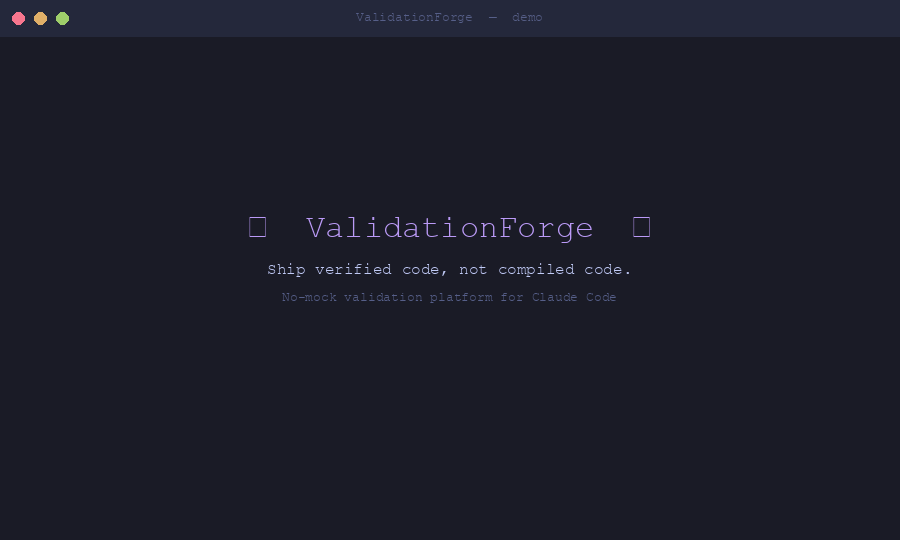

# ValidationForge

**No-mock functional validation for Claude Code and OpenCode.** Ship verified code, not "it compiled" code.

> **52 skills | 19 commands | 7 registered hooks | 7 agents | 9 rules | 26 shell scripts (20 core + 6 benchmark) | Dual-platform: Claude Code plugin + OpenCode plugin**

## The Iron Rule

```
IF the real system doesn't work, FIX THE REAL SYSTEM.
NEVER create mocks, stubs, test doubles, or test files.
ALWAYS validate through the same interfaces real users experience.
ALWAYS capture evidence. ALWAYS review evidence. ALWAYS write verdicts.
```

ValidationForge enforces this through hooks that block test file creation, skills that guide real-system validation, and agents that capture and review evidence through actual user interfaces.



## Self-Validation Case Study

> ValidationForge ran its own 7-phase pipeline against itself. **Result: PASS — 6/6 journeys, 13/13 criteria, 0 fix attempts.**

We applied VF's methodology to VF's own codebase: hooks invoked directly, scripts syntax-checked, configs parsed, cross-references verified, install script audited. Every verdict cites specific command output. No evidence was fabricated.

Key findings:
- `block-test-files.js` produces the exact deny JSON structure Claude Code reads to block test file creation
- All 52 skills, 19 commands, 7 agents, and 9 rules exist on disk — cross-references resolve
- `install.sh` passes `bash -n` and contains `git clone`, rules install loop, and config write
- `detect-platform.sh` correctly classifies VF itself as `generic` (meta-tool, no framework)

Full case study: `docs/case-studies/self-validation.md`
Evidence: `e2e-evidence/self-validation/report.md`

## Why Not Unit Tests?

Unit tests verify code in isolation with mocks. Mocks drift from reality. ValidationForge verifies **systems in production** through the same interfaces your users experience.

| Scenario | Unit Tests | ValidationForge |
|----------|:----------:|:---------------:|
| API field renamed (`users` -> `data`) | PASS (mock returns old field) | **FAIL** (curl shows new field, frontend crashes) |
| JWT expiry reduced to 15 min | PASS (mock time, never wait) | **FAIL** (real token expires, refresh fails) |
| iOS deep link after nav refactor | PASS (mock URL handler) | **FAIL** (simctl openurl -> wrong screen) |
| DB migration with duplicate emails | PASS (clean in-memory DB) | **FAIL** (real migration fails on duplicates) |
| CSS grid overflow on small screens | PASS (no visual rendering) | **FAIL** (Playwright screenshot shows overflow) |

These are design scenarios where mock-based testing is structurally blind. ValidationForge targets exactly these gaps by validating against live systems.

## Works With Other Plugins

ValidationForge is designed to complement other Claude Code plugins, not replace them.

| Plugin | What it does | Integration Guide |
|--------|--------------|-------------------|
| **oh-my-claudecode (OMC)** | Multi-agent orchestration and execution modes (ralph, autopilot, team) | [vf-with-omc.md](./docs/integrations/vf-with-omc.md) |
| **everything-claude-code (ECC)** | Multi-language rules, TDD workflow, security review | [vf-with-ecc.md](./docs/integrations/vf-with-ecc.md) |
| **Superpowers** | Slash command framework and extensibility primitives | [vf-with-superpowers.md](./docs/integrations/vf-with-superpowers.md) |

Use OMC or ECC to **build** features with agent orchestration and language-specific rules; use ValidationForge to **verify** those features actually work through real system interaction and evidence-backed verdicts.

## Installation

ValidationForge installs as a Claude Code plugin via marketplace, curl installer, or by cloning into `.opencode/plugins/` for OpenCode.

> **Important:** After installation, **restart Claude Code** before running `/vf-setup`. Plugins are loaded at session startup — hooks, skills, and commands are not active in the session where you installed them.

### Claude Code — Marketplace (recommended)

The canonical Claude Code install path. Three commands, then restart.

```text
# 1. Add the ValidationForge marketplace
/plugin marketplace add krzemienski/validationforge

# 2. Install the plugin
/plugin install validationforge@validationforge

# 3. Restart Claude Code (Cmd/Ctrl-Q, then reopen) so the plugin loads

# 4. Initialize for the current project (interactive)
/vf-setup
```

What each step does:

| Step | What it does |
|------|-------------|
| `marketplace add krzemienski/validationforge` | Registers the marketplace defined in `.claude-plugin/marketplace.json`. No files are written outside `~/.claude/`. |
| `install validationforge@validationforge` | Caches the plugin to `~/.claude/plugins/cache/validationforge/validationforge/<version>/`, registers it in `~/.claude/installed_plugins.json`, and arms `hooks/hooks.json`. |
| Restart | Claude Code re-scans plugins on session start; required for hooks, skills, agents, and commands to register. |
| `/vf-setup` | Interactive wizard — detects your project platform, picks an enforcement level, copies rules to `.claude/rules/`, scaffolds `e2e-evidence/`, writes `~/.claude/.vf-config.json`. Re-run any time. |

Updating: `/plugin update validationforge@validationforge` then restart. Uninstalling: `/plugin uninstall validationforge@validationforge`.

### Claude Code — install.sh (curl)

For users who prefer a shell installer (e.g. CI provisioning, headless setups):

```bash
# Quick install via curl
curl -fsSL https://raw.githubusercontent.com/krzemienski/validationforge/main/install.sh | bash

# Or manual clone from GitHub
git clone --depth 1 https://github.com/krzemienski/validationforge ~/.claude/plugins/validationforge
```

The installer clones the repo to `~/.claude/plugins/validationforge`, symlinks the plugin cache so Claude Code's loader can find it, copies 9 rules to `~/.claude/rules/vf-*.md`, creates `e2e-evidence/` (when inside a git repo), and writes `~/.claude/.vf-config.json`. After installing, restart Claude Code and run `/vf-setup`.

Environment variables: `VF_SOURCE` (override repo URL), `VF_INSTALL_DIR` (override install path; must be under `$HOME` or temp).

### OpenCode (opencode.json)

> **Note:** The OpenCode plugin has not been verified in a live OpenCode session. See [Known Limitations](#known-limitations).

```bash
# Clone into your project's .opencode/plugins/ directory
mkdir -p .opencode/plugins
git clone --depth 1 https://github.com/krzemienski/validationforge .opencode/plugins/validationforge
# Or symlink shared skills/commands
bash scripts/sync-opencode.sh
```

The OpenCode plugin (`index.ts`) registers `permission.ask`, `tool.execute.after`, and `shell.env` hooks along with two custom tools (`vf_validate`, `vf_check_evidence`). Patterns are imported directly from `patterns.ts`.

### Initialize for Your Project

After installing via any method above and restarting Claude Code, run `/vf-setup` in your project directory:

```text
/vf-setup                    # Interactive setup wizard (recommended)
/vf-setup --strict           # Skip prompts, use strict enforcement
/vf-setup --standard         # Skip prompts, use standard enforcement
/vf-setup --permissive       # Skip prompts, use permissive enforcement
/vf-setup --global           # Install rules to ~/.claude/ for all projects
/vf-setup --force            # Re-run even if already configured
```

`/vf-setup` resolves the plugin install dir from `${CLAUDE_PLUGIN_ROOT}` first (set by Claude Code for marketplace installs) and falls back to the `installDir` recorded in `~/.claude/.vf-config.json` (written by `install.sh`). Either install path produces the same project layout: rules in `.claude/rules/`, evidence in `e2e-evidence/`, active enforcement profile in `.vf/active-config.json`.

### Uninstall

```bash
# Marketplace install
/plugin uninstall validationforge@validationforge

# install.sh install
bash uninstall.sh
```

Both remove the plugin and rules. Your project's `e2e-evidence/` directory is preserved.

### Uninstall

```bash
bash uninstall.sh
```

The uninstaller removes `~/.claude/plugins/validationforge`, deletes all copied rules (`~/.claude/rules/vf-*.md`), and removes the config file (`~/.claude/.vf-config.json`). Your project's `e2e-evidence/` directory is preserved.

## Quick Start

### Validation Commands

```bash
/validate                    # Full pipeline: detect -> plan -> execute -> verdict
/validate-plan               # Plan only (no execution)
/validate-audit              # Read-only audit with severity classification
/validate-fix                # Fix FAIL verdicts and re-validate (3-strike limit)
/validate-ci                 # Non-interactive CI/CD mode with exit codes
/validate-team               # Multi-agent parallel platform validation
/validate-sweep              # Autonomous fix-and-revalidate loop until PASS
/validate-benchmark          # Measure validation posture (coverage, evidence, speed)
/validate-consensus          # Multi-agent CONSENSUS validation with synthesized verdict and confidence scoring
/validate-dashboard          # Generate evidence summary dashboard (HTML + markdown)
```

The `/validate-dashboard` command aggregates the most recent validation run into a single, reviewable summary. It reads journey verdicts and evidence from `e2e-evidence/` and writes two artifacts: `e2e-evidence/dashboard.md` (plain-text summary suitable for PR comments and CI logs) and `e2e-evidence/dashboard.html` (a self-contained HTML page with clickable evidence links and per-journey PASS/FAIL badges). Run it after `/validate` to share validation results with reviewers.

### Forge Commands

```bash
/forge-setup                 # Initialize VF for current project
/forge-plan                  # Generate validation plan with journey discovery
/forge-execute               # [planned V2.0] Run journeys with fix-and-retry loop (3-strike)
/forge-team                  # Multi-agent parallel validation across platforms
/forge-benchmark             # Measure posture across 5 dimensions
/forge-install-rules         # Install rules to .claude/rules/
```

### Skills

Skills are loaded automatically by Claude Code based on SKILL.md frontmatter triggers. See [SKILLS.md](./SKILLS.md) for the complete index of all 52 skills across 8 categories.

### Hooks

Hooks enforce discipline automatically. See [ARCHITECTURE.md](./ARCHITECTURE.md) for the full hook lifecycle.

| Hook | Event | Matcher | Effect |
|------|-------|---------|--------|
| `block-test-files.js` | PreToolUse | Write\|Edit\|MultiEdit | Blocks 15 test/mock patterns: `*.test.*`, `*.spec.*`, `_test.go`, `test_*.py`, `*Tests.swift`, `__tests__/`, `__mocks__/`, etc. |
| `evidence-gate-reminder.js` | PreToolUse | TaskUpdate | Injects evidence checklist on task completion |
| `validation-not-compilation.js` | PostToolUse | Bash | Reminds that build success is not validation |
| `completion-claim-validator.js` | PostToolUse | Bash | Catches claims without functional evidence |
| `validation-state-tracker.js` | PostToolUse | Bash | Tracks validation activity, reminds to capture evidence |
| `mock-detection.js` | PostToolUse | Edit\|Write\|MultiEdit | Warns on `jest.mock`, `sinon.stub`, `unittest.mock`, etc. |
| `evidence-quality-check.js` | PostToolUse | Edit\|Write\|MultiEdit | Warns on empty evidence files |
| `patterns.js` | (bridge) | (none) | CommonJS bridge: loads `patterns.ts` for CC hooks via `vm` sandbox |

## The 7-Phase Pipeline

```
0. RESEARCH   -> Standards, best practices, applicable criteria
1. PLAN       -> Journeys, PASS criteria, evidence requirements
2. PREFLIGHT  -> Build compiles, services running, MCP servers available
3. EXECUTE    -> Run journeys against real system, capture evidence
4. ANALYZE    -> Root cause investigation for FAILs (sequential thinking)
5. VERDICT    -> Evidence-backed PASS/FAIL per journey, unified report
6. SHIP       -> Production readiness audit, deploy decision
```

### Command Pipeline Matrix

| Command | Research | Plan | Preflight | Execute | Analyze | Verdict | Ship |
|---------|:--------:|:----:|:---------:|:-------:|:-------:|:-------:|:----:|
| `/validate` | yes | yes | yes | yes | yes | yes | no |
| `/validate-plan` | yes | yes | yes | -- | -- | -- | -- |
| `/validate-audit` | yes | -- | yes | read-only | yes | yes | -- |
| `/validate-fix` | -- | -- | -- | yes | yes | yes | -- |
| `/validate-ci` | yes | yes | yes | yes | yes | yes | -- |
| `/validate-team` | yes | yes | yes | parallel | yes | unified | -- |
| `/validate-sweep` | -- | -- | -- | loop | loop | loop | -- |
| `/validate-benchmark` | -- | -- | -- | -- | score | report | -- |
| `/validate-consensus` | -- | reuse | yes | N validators | disagreement | synthesized | -- |

## Platform Auto-Detection

| Platform | Detection Signals | Validation Approach |
|----------|-------------------|---------------------|
| **iOS** | `.xcodeproj`, `.xcworkspace`, `Package.swift` | `xcodebuild` -> simulator -> `idb` screenshots -> deep links |
| **CLI** | `Cargo.toml [[bin]]`, `go.mod + main.go`, `package.json "bin"` | Build binary -> execute with args -> capture stdout/stderr |
| **API** | Route handlers, OpenAPI spec, Express/FastAPI/Gin | Start server -> health check -> `curl` endpoints -> verify JSON |
| **Web** | React/Vue/Svelte/Next, `vite.config.*` | Dev server -> Playwright/Chrome DevTools -> screenshots |
| **Fullstack** | Web + API signals combined | Bottom-up: Database -> API -> Frontend UI |
| **Design** | `DESIGN.md`, Stitch project, Figma tokens | Visual diff, token audit, design system compliance |

Override with `--platform <type>` if auto-detection picks wrong.

## Team Validation

For multi-platform projects, spawn coordinated validators with `/validate-team`:

```
Lead (you)
+-- Web Validator    -> e2e-evidence/web/
+-- API Validator    -> e2e-evidence/api/
+-- iOS Validator    -> e2e-evidence/ios/
+-- Design Validator -> e2e-evidence/design/
+-- Verdict Writer   -> e2e-evidence/report.md
```

Each validator owns its evidence directory exclusively. The lead synthesizes per-validator verdicts into a unified report.

## Configuration

Three enforcement levels control how aggressively ValidationForge enforces discipline:

| Profile | Test Files | Mock Detection | Evidence | Best For |
|---------|:---------:|:--------------:|:--------:|----------|
| **strict** | Blocked | Blocked | Mandatory | Production, compliance |
| **standard** | Blocked | Blocked | Recommended | Most projects |
| **permissive** | Warned | Warned | Optional | Transitioning teams |

Select during `/vf-setup` or override with `--strict`/`--permissive` flags.

## Evidence Standards

Evidence is captured to `e2e-evidence/` and **must be reviewed, not just captured**:

| Evidence Type | Good | Bad |
|---------------|------|-----|
| Screenshots | "Shows 3 sessions with green status badges" | "Screenshot exists" |
| API responses | `{"total": 41, "items": [...]}` | `200 OK` |
| CLI output | `Processed 150 files in 2.3s` | `Done` |
| Build logs | `Build Succeeded (47 targets)` | "Build passed" |

**Capturing evidence without reviewing it is WORSE than not capturing it.**

## Benchmarking

> **Design intent — not yet empirically verified.** The scoring algorithm is implemented in `scripts/benchmark/` and `/validate-benchmark` wires it together, but the command has never been executed against a real project. The dimension weights, grade thresholds, and metric formulas below are design targets, not measured or validated values. See [Verification Status](#verification-status).

`/validate-benchmark` is designed to score your project across four dimensions:

| Dimension | Weight (design target) | What It Measures |
|-----------|------------------------|-----------------|
| Coverage | 35% | Validated journeys / Total discoverable features |
| Evidence Quality | 30% | Evidence citations, observation quality, verdict rigor |
| Enforcement | 25% | Hooks installed, no mocks, no test files, rules active |
| Speed | 10% | Validation time relative to project size |

Designed grade thresholds (pending empirical calibration): A (90+), B (80–89), C (70–79), D (60–69), F (<60).

## Inventory

| Primitive | Count | Location |
|-----------|------:|----------|
| Skills | 52 | `skills/*/SKILL.md` |
| Commands | 19 | `commands/*.md` |
| CC Hooks | 7 registered + 3 support .js | `hooks/*.js` + `hooks/hooks.json` |
| Agents | 7 | `agents/*.md` |
| Rules | 9 | `rules/*.md` |
| Shell Scripts | 26 | 20 in `scripts/*.sh` + 6 in `scripts/benchmark/*.sh` |
| OC Plugin Files | 2 | `.opencode/plugins/validationforge/{index.ts,patterns.ts}` |
| Config Profiles | 3 | `config/*.json` |
| Report Templates | 7 | `templates/*.md` |
| Integration Guides | 3 | `docs/integrations/vf-with-{omc,ecc,superpowers}.md` |
| Installer | 1 | `install.sh` |

Full indexes: [SKILLS.md](./SKILLS.md) | [COMMANDS.md](./COMMANDS.md) | [ARCHITECTURE.md](./ARCHITECTURE.md) | [Integrations Hub](./docs/integrations/README.md)

## File Structure

```
validationforge/
+-- .claude-plugin/plugin.json        Plugin manifest
+-- .opencode/plugins/validationforge/ OpenCode plugin
|   +-- index.ts                      Plugin entry (hooks, tools, env)
|   +-- patterns.ts                   Shared regex patterns (source of truth)
|   +-- package.json                  Package manifest
|   +-- tsconfig.json                 TypeScript config
+-- skills/                           52 skills (SKILL.md frontmatter), incl. 3 consensus-engine + evidence-dashboard
+-- commands/                         19 slash commands (incl. /validate-consensus, /validate-dashboard)
+-- hooks/                            7 enforcement hooks + 1 patterns bridge
|   +-- hooks.json                    Hook registration manifest
|   +-- patterns.js                   CommonJS bridge to patterns.ts
+-- agents/                           7 specialist agents (incl. consensus-validator, consensus-synthesizer)
+-- rules/                            8 enforcement rules
+-- config/                           3 enforcement profiles
+-- templates/                        7 report templates
+-- scripts/                          core + benchmark shell scripts
+-- docs/integrations/                3 integration guides + hub (OMC, ECC, Superpowers)
+-- install.sh                        Global installer (curl-pipe safe)
+-- CLAUDE.md                         Master reference document
+-- README.md                         This file
+-- ARCHITECTURE.md                   Pipeline and platform details
+-- SKILLS.md                         Complete skills index
+-- COMMANDS.md                       Complete commands index
```

## Verification Status

What has actually been verified about ValidationForge, and what has not:

| Area | Status |
|------|--------|
| File inventory (52 skills, 19 commands, 7 hooks, 7 agents, 9 rules) | Verified on disk |
| Hook syntax and functional behavior (all 7) | Verified — syntax PASS, functional tests PASS |
| Cross-references (commands → skills, agents, rules) | Verified — zero broken references |
| Plugin manifest format | Verified — matches ECC 1.8.0 and OMC patterns |
| VF methodology against real project (2/18 posts) | Verified — PASS on all 6 criteria |
| VF methodology expanded (18/18 posts + responsive + errors) | Verified — PASS on 7/7 criteria |
| Plugin loaded in live Claude Code session | **Not verified** — requires session restart after install |
| `/validate` command as automated pipeline | **Not verified** — manual execution only |
| `${CLAUDE_PLUGIN_ROOT}` resolution | **Not verified** — standard pattern, untested end-to-end |
| Benchmark scoring | **Not verified** — algorithm implemented, never executed |
| Skill content quality (all 45) | **Partially verified** — 5 deep-reviewed, remainder spot-checked |

## Known Limitations

These are honest disclosures about what ValidationForge has **not** been verified to do, based on direct testing:

1. **Plugin requires session restart to load** — After installation, Claude Code must be fully restarted before the plugin is recognized. Installation in a live session does not activate hooks, skills, or commands. This behavior is architectural (plugins load at session startup), not a bug, but it means the "install and immediately use" experience shown in the Quick Start has not been verified end-to-end in a single session.

2. **`/validate` is a skill/guide, not an automated pipeline** — The `/validate` command is a markdown skill file that instructs Claude to follow the 7-phase pipeline. It does not programmatically orchestrate tools, spawn subprocesses, or enforce phase gates. Each phase requires Claude to interpret and execute the guidance. The command has never been run via the plugin in a live Claude Code session; all VF methodology testing was performed by manually following the pipeline.

3. **`${CLAUDE_PLUGIN_ROOT}` hook variable resolution not verified** — Hook commands in `hooks.json` reference `${CLAUDE_PLUGIN_ROOT}` to locate hook scripts at runtime. This is the documented Claude Code pattern (ECC 1.8.0), but end-to-end resolution — from installed plugin to hook execution with the correct path — has not been observed in a live session.

4. **Benchmark scoring not empirically tested** — The scoring algorithm in `scripts/benchmark/` and the `/validate-benchmark` command have never been executed against a real project. Dimension weights (Coverage 35%, Evidence Quality 30%, Enforcement 25%, Speed 10%) and grade thresholds (A/B/C/D/F) are design targets derived from the specification, not calibrated from observed outputs.

5. **Skill content quality partially verified** — Of the 48 skill directories, 5 were deep-reviewed (frontmatter, content accuracy, cross-reference validity) and the remaining 40 were spot-checked for file presence and frontmatter structure. Content correctness and trigger accuracy for the unreviewed skills is assumed, not confirmed.

6. **OpenCode plugin not verified in live OpenCode session** — The OpenCode plugin (`index.ts`) compiles without errors and follows the documented plugin interface, but has never been loaded into a running OpenCode session. Hook registration (`permission.ask`, `tool.execute.after`, `shell.env`) and custom tool availability (`vf_validate`, `vf_check_evidence`) are unconfirmed at runtime.

## Troubleshooting

### Hooks not firing

1. Verify the plugin is registered: check `~/.claude/installed_plugins.json` contains the validationforge path.
2. Confirm `hooks/hooks.json` exists and `${CLAUDE_PLUGIN_ROOT}` resolves to the install directory.
3. Run a hook manually to check syntax: `echo '{"tool_name":"Write","tool_input":{"file_path":"foo.test.ts"}}' | node hooks/block-test-files.js`

### Skills not discovered

1. Skills require `SKILL.md` with valid YAML frontmatter (`name`, `description`, `triggers`).
2. Verify the skill directory exists under `skills/` and contains a `SKILL.md`.
3. Restart the Claude Code session after plugin installation.

### OpenCode plugin not loading

1. Verify `.opencode/plugins/validationforge/index.ts` exists in your project root.
2. Check `package.json` lists `@opencode-ai/plugin` as a dependency.
3. Run `npm install` inside `.opencode/plugins/validationforge/`.

### Evidence directory missing

1. Run `/vf-setup` or `mkdir -p e2e-evidence` in your project root.
2. The installer creates this automatically if you run it inside a git repository.

### patterns.js bridge failure

If CC hooks log `[ValidationForge] patterns.js: Could not load ...`, the bridge falls back to inline patterns. Check that `patterns.ts` exists at `.opencode/plugins/validationforge/patterns.ts` relative to the project root. The bridge uses `vm.runInNewContext` to strip TypeScript syntax at runtime.

## Privacy & Telemetry

Telemetry is **opt-in** and **disabled by default**. No data is collected unless you explicitly enable it.

When enabled, the following anonymized metrics are collected: command name, platform type, pipeline phase, pass/fail verdict, VF version, and a random anonymous UUID — no PII, no file paths, no source code. See [PRIVACY.md](./PRIVACY.md) for full details.

```bash
vf telemetry enable    # Opt in — displays disclosure before activating
vf telemetry disable   # Opt out at any time
vf telemetry status    # Show current status
vf telemetry show      # Preview exact payload without sending
```

## License

MIT
