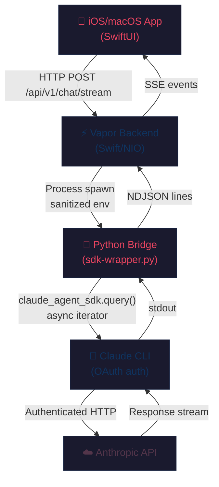

# Claude iOS Streaming Bridge

[](https://github.com/krzemienski/agentic-development-guide)

## Related Post

**Featured in the Agentic Development Blog series — Post #4: The 5-Layer SSE Bridge — Building a Native iOS Client for Claude Code**

- Send date: Thu Jun 11, 2026
- LinkedIn: _link added on send day_
- Canonical blog post: https://ai.hack.ski/blog/<slug-set-on-send-day>
- Series hub: [agentic-development-guide](https://github.com/krzemienski/agentic-development-guide)

---


[](https://github.com/krzemienski/agentic-dev-guide)
[](https://swift.org)
[](https://developer.apple.com)
[](LICENSE)

A production-grade Swift Package for connecting iOS and macOS apps to Claude Code via Server-Sent Events (SSE) streaming. Built from battle-tested code powering [ILS](https://github.com/krzemienski/ils-ios), a native iOS client for Claude Code.

> **Part 1** of the [Agentic Development with Claude Code](https://github.com/krzemienski/agentic-dev-guide) blog series.

## Architecture

The bridge connects your SwiftUI app to Claude through five layers, each solving a specific impedance mismatch:



### Why Five Layers?

| Layer | Why It Exists |
|-------|--------------|
| **iOS App → Vapor** | Standard HTTP/SSE. The only layer that worked on the first try. |
| **Vapor → Python** | Swift SDK uses RunLoop; Vapor uses NIO EventLoop. Publisher emissions are silently dropped. Process spawn with GCD avoids the mismatch. |
| **Python Bridge** | `claude-agent-sdk` provides clean async iteration. 8-line isolation boundary — if the SDK changes, only this script updates. |
| **Claude CLI** | Claude Code uses OAuth, not API keys. The CLI is the only interface that handles the token chain. |
| **Anthropic API** | The destination. Never a problem. |

## Installation

### Swift Package Manager

Add to your `Package.swift`:

```swift
dependencies: [
    .package(url: "https://github.com/krzemienski/claude-ios-streaming-bridge.git", from: "1.0.0")
]
```

Or in Xcode: File → Add Package Dependencies → paste the repository URL.

### Python Bridge

```bash
pip install claude-agent-sdk
```

## Quick Start

### 1. Configure the Bridge

```swift
import StreamingBridge

let config = BridgeConfiguration(
    backendURL: "http://localhost:9999",
    sdkWrapperPath: "/path/to/sdk-wrapper.py"
)
```

### 2. Connect the SSE Client

```swift
let sseClient = SSEClient(configuration: config)

// Start streaming a conversation
try await sseClient.connect(
    sessionId: "my-session",
    options: ChatOptions(model: "sonnet")
)

// Observe messages reactively (SSEClient is @Observable)
for message in sseClient.messages {
    switch message {
    case .assistant(let msg):
        print(msg.text)
    case .result(let result):
        print("Done! Cost: $\(result.usage.totalCost)")
    default:
        break
    }
}
```

### 3. Use the Executor Directly (No Backend)

```swift
let executor = ClaudeExecutorService(
    bridgePath: "/path/to/sdk-wrapper.py"
)

let stream = executor.executeSDK(
    prompt: "Explain async/await in Swift",
    model: "sonnet"
)

for try await event in stream {
    // Handle StreamMessage events
}
```

### 4. Run the Python Bridge Standalone

```bash
python3 scripts/sdk-wrapper.py '{"prompt":"What is 2+2?","options":{}}'
```

## Key Components

### SSEClient

The `SSEClient` is an `@Observable` class that manages the SSE connection lifecycle:

- **Two-tier timeouts**: 30s for initial connection, 5 minutes total
- **Heartbeat watchdog**: Detects stalled connections via `LastActivityTracker` using `OSAllocatedUnfairLock`
- **Exponential backoff**: Reconnection delay doubles on each failure, capped at 30s
- **Background handling**: Cancels streams when app enters background on iOS
- **Network restoration**: Automatically reconnects when network returns

### ClaudeExecutorService

An actor that spawns the Python bridge as a subprocess:

- **Environment sanitization**: Strips `CLAUDECODE` and `CLAUDE_CODE_*` env vars to prevent nesting detection failures
- **GCD-based stdout reading**: No RunLoop dependency (critical for Vapor/NIO compatibility)
- **Process lifecycle**: Always calls `waitUntilExit()` before `terminationStatus` to prevent `NSInvalidArgumentException`
- **NDJSON parsing**: Line-by-line JSON decoding with buffer management

### StreamingTypes

Complete type system for the streaming protocol:

- `StreamMessage` — Union type: `.system`, `.assistant`, `.user`, `.result`, `.error`
- `ContentBlock` — Text, code, tool use, tool result with streaming deltas
- `StreamDelta` — Incremental updates during streaming
- `UsageInfo` — Token counts and cost tracking

## Critical Patterns

### Environment Variable Stripping

```swift
// Without this, Claude CLI silently refuses execution inside Claude Code sessions
var env = ProcessInfo.processInfo.environment
for key in env.keys where key.hasPrefix("CLAUDE") {
    env.removeValue(forKey: key)
}
process.environment = env
```

This fix took 10 hours to discover. The symptom: "works in terminal, fails inside Claude Code."

### Text Duplication Prevention

```swift
// Assistant events contain ACCUMULATED text, not deltas
message.text = textBlock.text  // ✅ Assignment
message.text += textBlock.text // ❌ Doubles the text
```

### Process Termination Safety

```swift
// stdout EOF does NOT mean process has exited
process.waitUntilExit()           // MUST call first
let status = process.terminationStatus // Safe now
```

### Python stdout Flushing

```python
sys.stdout.write(json.dumps(event) + "\n")
sys.stdout.flush()  # Critical: without this, streaming appears broken
```

## Performance

| Path | Latency | Notes |
|------|---------|-------|
| Direct API (hypothetical) | ~1-3s | If API key auth were available |
| Python bridge, cold start | ~12s | Process spawn + interpreter + SDK init |
| Python bridge, warm | ~2-3s | Subsequent calls in same session |
| Cost per query | ~$0.04 | Claude Sonnet, typical chat message |

## Project Structure

```
claude-ios-streaming-bridge/
├── Package.swift                              # SPM manifest
├── Sources/StreamingBridge/
│   ├── StreamingTypes.swift                   # Complete type system
│   ├── Configuration.swift                    # Bridge configuration
│   ├── SSEClient.swift                        # SSE client with watchdog
│   └── ClaudeExecutorService.swift            # Process executor
├── scripts/
│   └── sdk-wrapper.py                         # Python bridge
└── Example/
    ├── Package.swift                          # Example app manifest
    └── Sources/ExampleApp/
        ├── ExampleApp.swift                   # App entry point
        ├── ChatViewModel.swift                # ViewModel with streaming
        └── ChatView.swift                     # SwiftUI chat interface
```

## Related Posts

This repo is the companion code for **Part 1** of the Agentic Development series:

1. **[Building a Native iOS Client for Claude Code](https://github.com/krzemienski/agentic-dev-guide/tree/main/01-ils-ios-client)** ← You are here
2. [The Claude Agent SDK Bridge: Why I Needed 5 Layers](https://github.com/krzemienski/agentic-dev-guide/tree/main/02-agent-sdk-bridge)
3. [Auto-Claude: Git Worktree Orchestration](https://github.com/krzemienski/agentic-dev-guide/tree/main/03-auto-claude-worktrees)
4. [Multi-Agent Consensus Architecture](https://github.com/krzemienski/agentic-dev-guide/tree/main/04-multi-agent-consensus)
5. [The Prompt Engineering Stack](https://github.com/krzemienski/agentic-dev-guide/tree/main/05-prompt-engineering-stack)
6. [Ralph: The Orchestrator Pattern](https://github.com/krzemienski/agentic-dev-guide/tree/main/06-ralph-orchestrator)
7. [Functional Validation over Unit Testing](https://github.com/krzemienski/agentic-dev-guide/tree/main/07-functional-validation)
8. [Code Tales: When AI Writes Its Own Story](https://github.com/krzemienski/agentic-dev-guide/tree/main/08-code-tales)
9. [Stitch: From Design to Code in One Prompt](https://github.com/krzemienski/agentic-dev-guide/tree/main/09-stitch-design-to-code)
10. [Building an AI Development Operating System](https://github.com/krzemienski/agentic-dev-guide/tree/main/10-ai-dev-operating-system)

## Troubleshooting

### "Works in terminal, fails inside Claude Code"
The Claude CLI detects nesting via `CLAUDECODE` and `CLAUDE_CODE_*` environment variables. Strip them before spawning:
```swift
var env = ProcessInfo.processInfo.environment
for key in env.keys where key.hasPrefix("CLAUDE") {
    env.removeValue(forKey: key)
}
process.environment = env
```

### Python bridge shows no output
Ensure `flush=True` on every `sys.stdout.write()`. Without explicit flushing, Python buffers output and the parent process sees nothing for seconds.

### NSInvalidArgumentException on process.terminationStatus
Always call `process.waitUntilExit()` before reading `terminationStatus`. stdout EOF does not guarantee process exit.

### SSE connection drops after 30 seconds
The default initial timeout is 30s. For slow networks, increase `BridgeConfiguration.initialTimeout`. The total timeout (default 5 min) is separate.

## License

MIT — see [LICENSE](LICENSE).
