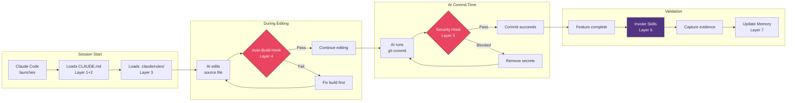

# Claude Prompt Stack

[](https://github.com/krzemienski/agentic-development-guide)

## Related Post

**Featured in the Agentic Development Blog series — Post #7: The 7-Layer Prompt Engineering Stack**

- Send date: Thu May 29, 2026
- LinkedIn: _link added on send day_
- Canonical blog post: https://ai.hack.ski/blog/<slug-set-on-send-day>
- Series hub: [agentic-development-guide](https://github.com/krzemienski/agentic-development-guide)

---


[](https://github.com/krzemienski)

**A 7-layer defense-in-depth prompt engineering system for Claude Code.**

Turn an AI coding assistant from a code generator into a disciplined development partner. The prompt stack enforces build verification, blocks secrets, validates through real systems, and persists lessons across sessions — automatically, on every edit, on every commit.

> Companion repo for [The Prompt Engineering Stack: CLAUDE.md, Rules, Skills, and Hooks](https://github.com/krzemienski) — Part 5 of the Agentic Development series.

---

## Quick Start

```bash
# Clone and run setup in your project
git clone https://github.com/krzemienski/claude-prompt-stack.git
cd claude-prompt-stack
bash setup.sh --target /path/to/your/project

# Or use as a GitHub template
# Click "Use this template" above
```

Then customize:
1. Edit `CLAUDE.md` — replace `[PLACEHOLDER]` values with your project info
2. Edit `.claude/rules/project.md` — fill in your tech stack and build commands
3. Edit `.claude/hooks/auto-build-check.sh` — configure build commands for your language
4. Start a Claude Code session — the stack loads automatically

---

## The 7 Layers

Each layer catches failures that slip through the layers above. Together, they create a compound defense that makes AI development reliable by design.

```mermaid
graph TB
    subgraph "Defense-in-Depth: 7 Layers"
        L1["Layer 1: Global CLAUDE.md<br/><i>~/.claude/CLAUDE.md</i><br/>Cross-project standards, agent orchestration"]
        L2["Layer 2: Project CLAUDE.md<br/><i>./CLAUDE.md</i><br/>Project mandates, validation rules"]
        L3["Layer 3: Rules Files<br/><i>.claude/rules/*.md (9 files)</i><br/>Domain context: build, security, workflow"]
        L4["Layer 4: Auto-Build Hook<br/><i>.claude/hooks/auto-build-check.sh</i><br/>Immediate build verification on every edit"]
        L5["Layer 5: Pre-Commit Security Hook<br/><i>.claude/hooks/pre-commit-check.sh</i><br/>Block secrets, credentials, sensitive data"]
        L6["Layer 6: Skills<br/><i>skills/*.md</i><br/>Composable validation workflows"]
        L7["Layer 7: Project Memory<br/><i>MEMORY.md</i><br/>Cross-session knowledge persistence"]
    end

    L1 --> L2 --> L3 --> L4 --> L5 --> L6 --> L7

    style L1 fill:#1a1a2e,stroke:#e94560,color:#fff
    style L2 fill:#1a1a2e,stroke:#e94560,color:#fff
    style L3 fill:#16213e,stroke:#0f3460,color:#fff
    style L4 fill:#16213e,stroke:#0f3460,color:#fff
    style L5 fill:#0f3460,stroke:#533483,color:#fff
    style L6 fill:#0f3460,stroke:#533483,color:#fff
    style L7 fill:#533483,stroke:#e94560,color:#fff
```



---

## Layer-by-Layer Guide

### Layer 1: Global CLAUDE.md (`~/.claude/CLAUDE.md`)

**Why it matters:** Sets cross-project defaults that apply everywhere — agent orchestration, model routing, delegation rules.

This file lives in your home directory and is loaded for every Claude Code session regardless of project. Use it for standards you want enforced universally.

**This repo provides:** A project-level CLAUDE.md template (Layer 2). Your global CLAUDE.md is personal to your workflow.

---

### Layer 2: Project CLAUDE.md (`./CLAUDE.md`)

**Why it matters:** Contains your project's non-negotiable rules. The AI reads this at session start and cannot ignore it.

```markdown
# Key mandates in the template:

## Functional Validation Mandate
NEVER: write mocks, stubs, test doubles, or fake implementations
ALWAYS: build and run the real system, capture evidence

## Working Style
- Implement immediately (don't over-plan)
- One change, one verify (don't batch)
- Stay focused (no scope creep)
```

**File:** [`CLAUDE.md`](./CLAUDE.md) — Edit the `[PLACEHOLDER]` values for your project.

---

### Layer 3: Rules Files (`.claude/rules/*.md`)

**Why it matters:** Deep domain context prevents the AI from guessing. Nine files cover every aspect of development.

| File | Purpose |
|------|---------|
| [`project.md`](.claude/rules/project.md) | Tech stack, directory structure, build commands, key constants |
| [`agents.md`](.claude/rules/agents.md) | Agent roster, parallel execution, multi-perspective analysis |
| [`development-workflow.md`](.claude/rules/development-workflow.md) | Plan → Build → Validate → Review → Commit workflow |
| [`git-workflow.md`](.claude/rules/git-workflow.md) | Commit format, PR workflow, branch naming |
| [`auto-build-hook.md`](.claude/rules/auto-build-hook.md) | How the auto-build system works and what it means for AI sessions |
| [`feature-gate.md`](.claude/rules/feature-gate.md) | Feature gating patterns — never bypass the gate system |
| [`ci-cd.md`](.claude/rules/ci-cd.md) | CI/CD pipelines, deployment environments, secrets management |
| [`performance.md`](.claude/rules/performance.md) | Model selection strategy, context window management |
| [`security.md`](.claude/rules/security.md) | Security scanning rules, blocked patterns, code-level practices |

---

### Layer 4: Auto-Build Hook (`.claude/hooks/auto-build-check.sh`)

**Why it matters:** Eliminates the most common AI coding failure — making multiple changes without verifying any of them build.

The hook fires automatically after every source file edit. It detects the file type, runs the appropriate build command, and blocks the AI from continuing if the build fails.

```bash
# Supports: TypeScript, Python, Rust, Go, Swift, C/C++
# Easily extensible for other languages
```

**File:** [`.claude/hooks/auto-build-check.sh`](.claude/hooks/auto-build-check.sh) — Edit the build functions for your stack.

---

### Layer 5: Pre-Commit Security Hook (`.claude/hooks/pre-commit-check.sh`)

**Why it matters:** Last line of defense before code leaves your machine. Blocks API keys, database files, and credentials from ever reaching the repository.

**Blocks (commit rejected):**
- API keys: `sk-*`, `AKIA*`, `ghp_*`, `glpat-*`
- Database files: `.sqlite`, `.db`
- Environment files: `.env`, `.env.*`
- Private keys: PEM, PKCS12 files
- Hardcoded Bearer tokens

**Warns (commit proceeds):**
- Hardcoded absolute paths (`/Users/`, `/home/`)
- Hardcoded passwords
- TODO/FIXME markers

**File:** [`.claude/hooks/pre-commit-check.sh`](.claude/hooks/pre-commit-check.sh)

---

### Layer 6: Skills (`skills/*.md`)

**Why it matters:** Composable validation workflows that enforce real-system testing through actual UI interaction and evidence capture.

| Skill | Purpose |
|-------|---------|
| [`functional-validation.md`](skills/functional-validation.md) | Build → Run → Exercise → Capture → Verify workflow |
| [`ios-validation-runner.md`](skills/ios-validation-runner.md) | iOS-specific: simulator boot, app install, screenshot capture |

Skills compose hierarchically. A high-level skill orchestrates lower-level skills, each adding specific capabilities.

---

### Layer 7: Project Memory (`MEMORY.md`)

**Why it matters:** Prevents the AI from repeating past mistakes. Records validated patterns, known pitfalls, and architecture decisions that persist across sessions.

```markdown
# What to record:
- Key architecture decisions and their rationale
- Patterns verified to work in this project
- Pitfalls discovered during debugging
- Lessons learned from failed approaches
```

**File:** [`MEMORY.md`](./MEMORY.md) — Update as you work with Claude Code.

---

## How the Layers Compose



---

## Project Structure

```
claude-prompt-stack/
├── CLAUDE.md                        # Layer 2: Project instructions template
├── .claude/
│   ├── rules/
│   │   ├── project.md               # Project quick reference
│   │   ├── agents.md                # Agent orchestration rules
│   │   ├── development-workflow.md  # Dev workflow
│   │   ├── git-workflow.md          # Commit format, PR workflow
│   │   ├── auto-build-hook.md       # Auto-build documentation
│   │   ├── feature-gate.md          # Feature gating patterns
│   │   ├── ci-cd.md                 # CI/CD configuration
│   │   ├── performance.md           # Model selection, context mgmt
│   │   └── security.md              # Security scanning rules
│   ├── hooks/
│   │   ├── auto-build-check.sh      # Layer 4: Post-edit build hook
│   │   └── pre-commit-check.sh      # Layer 5: Pre-commit security
│   └── settings.local.json          # Hook configuration
├── skills/
│   ├── functional-validation.md     # Layer 6: Validation workflow
│   └── ios-validation-runner.md     # Layer 6: iOS validation
├── MEMORY.md                        # Layer 7: Project memory template
├── setup.sh                         # One-command setup script
├── README.md                        # This file
├── LICENSE                          # MIT
└── .gitignore
```

---

## Customization Guide

### For a TypeScript/React Project

1. In `CLAUDE.md`: Set build command to `npm run build`, run command to `npm run dev`
2. In `.claude/rules/project.md`: List your components, API routes, state management
3. In `.claude/hooks/auto-build-check.sh`: The TypeScript section already works — just ensure `tsconfig.json` exists
4. Remove `ios-validation-runner.md` from skills (iOS-specific)

### For a Python/Django Project

1. In `CLAUDE.md`: Set build to `python manage.py check`, run to `python manage.py runserver`
2. In `.claude/rules/project.md`: List your apps, models, URL patterns
3. In `.claude/hooks/auto-build-check.sh`: The Python section uses `mypy` — ensure it's installed
4. Add Django-specific skills as needed

### For a Rust Project

1. In `CLAUDE.md`: Set build to `cargo build`, run to `cargo run`
2. In `.claude/rules/project.md`: List your crates, binary targets, feature flags
3. In `.claude/hooks/auto-build-check.sh`: The Rust section uses `cargo check`
4. Add Rust-specific linting rules to security.md

---

## The Compound Effect

Any single layer provides marginal improvement. The compound effect of all 7 layers is transformative:

- The AI **cannot forget** the build command (Layer 3 documents it, Layer 4 runs it automatically)
- The AI **cannot skip validation** (Layer 2 mandates it, Layer 6 provides the workflow)
- The AI **cannot ship broken code** (Layer 4 catches it on every edit)
- The AI **cannot leak secrets** (Layer 5 blocks them at commit time)
- The AI **cannot repeat past mistakes** (Layer 7 remembers them)

The investment is front-loaded — building the stack takes real effort. But once built, it pays dividends on every AI interaction, across every session, for the lifetime of the project.

---

## Series

This is **Part 5** of the [Agentic Development](https://github.com/krzemienski) series:

| Part | Topic | Repo |
|------|-------|------|
| 1 | AI-Native iOS Streaming | [claude-ios-streaming-bridge](https://github.com/krzemienski/claude-ios-streaming-bridge) |
| 2 | Agent SDK Bridge | [claude-sdk-bridge](https://github.com/krzemienski/claude-sdk-bridge) |
| 3 | Git Worktree Isolation | [auto-claude-worktrees](https://github.com/krzemienski/auto-claude-worktrees) |
| 4 | Multi-Agent Consensus | [multi-agent-consensus](https://github.com/krzemienski/multi-agent-consensus) |
| **5** | **Prompt Engineering Stack** | **This repo** |
| 6 | Ralph Orchestrator | [ralph-orchestrator-guide](https://github.com/krzemienski/ralph-orchestrator-guide) |

---

## Troubleshooting

### Template variables not replaced
Variables use `{variable}` syntax. Ensure your YAML prompt files define all referenced variables in the `variables` section, or pass them via CLI flags.

### `prompt-stack` command not found
Run `pip install -e .` in the repo root. The entry point is defined in `pyproject.toml` under `[project.scripts]`.

### YAML parsing errors
Ensure prompt files use valid YAML syntax. Multi-line prompts should use YAML block scalars (`|` or `>`). Avoid unquoted special characters.

### Setup script fails
Run `chmod +x setup.sh` first, then `./setup.sh`. The script creates the default prompt library directory and copies template files.

### Chained prompts lose context
When piping output between stages, each stage runs independently. Use the `context` field in your stack configuration to pass previous stage outputs as variables.

## License

MIT — see [LICENSE](./LICENSE).
