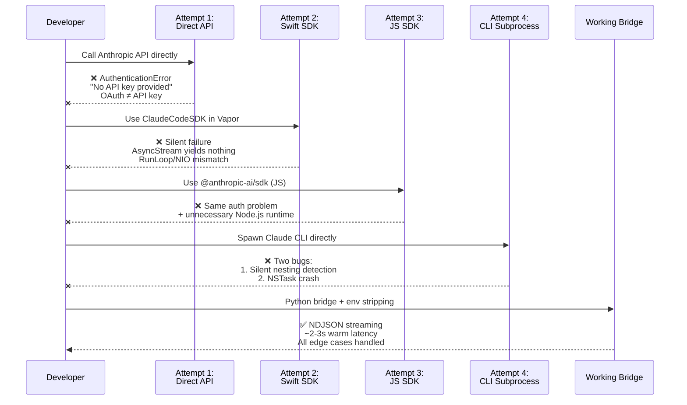
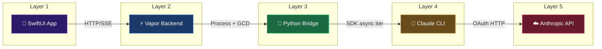

# Claude SDK Bridge

[](https://github.com/krzemienski/agentic-development-guide)

## Related Post

**Featured in the Agentic Development Blog series — Post #5: 5 Layers to Call an API — A Polyglot SDK Bridge**

- Send date: Mon Jun 1, 2026
- LinkedIn: _link added on send day_
- Canonical blog post: https://ai.hack.ski/blog/<slug-set-on-send-day>
- Series hub: [agentic-development-guide](https://github.com/krzemienski/agentic-development-guide)

---


[](https://github.com/krzemienski/agentic-dev-guide)
[](https://python.org)
[](https://swift.org)
[](LICENSE)

Reference implementation of the 5-layer bridge pattern for connecting native apps to Claude Code. Includes 4 documented failure cases with real code and the production solution that emerged.

> **Part 2** of the [Agentic Development with Claude Code](https://github.com/krzemienski/agentic-dev-guide) blog series.

## Why Not Just Use the SDK Directly?

Because there isn't one that works for this use case. The path from "iOS app" to "Claude API" has four obstacles:

1. **No API key** — Claude Code uses OAuth, not `ANTHROPIC_API_KEY`
2. **RunLoop/NIO mismatch** — The Swift SDK uses Combine + RunLoop; Vapor uses NIO EventLoop
3. **Nesting detection** — Claude CLI silently refuses execution inside parent Claude Code sessions
4. **Process lifecycle** — Reading stdout EOF doesn't mean the process has exited

Each failed attempt discovered one of these. The working bridge handles all four.

## The Journey: 4 Failures → 1 Solution



## Quick Start

### Install

```bash
cd working-bridge
pip install -e .
```

### Run the Bridge

```bash
# Direct invocation
python3 working-bridge/bridge.py --prompt "What is 2+2?"

# With full config
python3 working-bridge/bridge.py '{"prompt": "Explain recursion", "options": {"model": "sonnet"}}'

# As installed package
claude-bridge '{"prompt": "Hello!", "options": {}}'
```

### Use from Swift

```swift
let executor = BridgeExecutor(bridgePath: "/path/to/bridge.py")
let stream = executor.execute(prompt: "What is 2+2?")

for try await event in stream {
    if let type = event["type"] as? String, type == "assistant" {
        print(event["text"] ?? "")
    }
}
```

## Project Structure

```
claude-sdk-bridge/
├── failed-attempts/
│   ├── 01-direct-api/
│   │   ├── attempt.py          # Real Python code that fails with AuthenticationError
│   │   └── FAILURE.md          # OAuth vs API key — architectural dead end
│   ├── 02-claude-code-sdk/
│   │   ├── attempt.swift       # Real Swift code — SDK in Vapor route handler
│   │   └── FAILURE.md          # RunLoop/NIO mismatch — silent data loss
│   ├── 03-js-sdk/
│   │   ├── attempt.js          # Real JS code — Node.js SDK attempt
│   │   └── FAILURE.md          # Same auth wall + unnecessary runtime
│   └── 04-cli-subprocess/
│       ├── attempt.swift       # Real Swift code — shows both bug and fix
│       └── FAILURE.md          # Nesting detection + NSTask crash
├── working-bridge/
│   ├── bridge.py               # Production Python bridge (pip-installable)
│   ├── executor.swift          # Swift Process spawner with env sanitization
│   ├── pyproject.toml          # Package config for pip install
│   └── README.md               # Quick start and critical details
└── docs/
    ├── architecture.md         # 5-layer architecture deep dive
    └── failure-modes.md        # Comprehensive failure mode catalog (7 modes)
```

## Failure Mode Catalog

Each failure mode is documented with exact symptoms, root cause, and fix:

| # | Failure Mode | Severity | Discovery Time |
|---|-------------|----------|----------------|
| 1 | [RunLoop/NIO Deadlock](docs/failure-modes.md#1-runloopnio-deadlock) | Fatal | 8 hours |
| 2 | [Nesting Detection Env Vars](docs/failure-modes.md#2-nesting-detection-environment-variables) | Fatal (dev only) | 10 hours |
| 3 | [NSTask terminationStatus Crash](docs/failure-modes.md#3-nstask-terminationstatus-crash) | Crash | 2 hours |
| 4 | [Python stdout Buffering](docs/failure-modes.md#4-python-stdout-buffering) | UX-breaking | 1 hour |
| 5 | [Text Duplication](docs/failure-modes.md#5-text-duplication-p2-bug) | Data corruption | 3 hours |
| 6 | [OAuth Authentication Boundary](docs/failure-modes.md#6-oauth-authentication-boundary) | Architectural | 4 hours |
| 7 | [Port Collision](docs/failure-modes.md#7-port-collision) | Hours of debugging | 2 hours |

Total debugging time across all failure modes: **~30 hours**.

## 5-Layer Architecture



Six serialization boundaries exist in the full round trip. Each is a potential source of bugs. The [text duplication P2 bug](docs/failure-modes.md#5-text-duplication-p2-bug) was caused by incorrect accumulation semantics at boundary 5 (NDJSON → Swift struct).

## Performance Profile

| Metric | Value |
|--------|-------|
| Cold start latency | ~12s (process spawn + Python interpreter + SDK init) |
| Warm latency | ~2-3s (subsequent calls, same session) |
| Cost per query | ~$0.04 (Claude Sonnet, typical chat) |
| Serialization boundaries | 6 |
| Lines of bridge code | ~50 (Python) + ~210 (Swift) |

The cold start penalty is real but acceptable for a chat interface where the user is reading the previous response.

## Key Lessons

1. **Silent failures are worse than crashes.** The RunLoop/NIO mismatch and nesting detection both produced zero errors, zero output. At least a crash gives you a stack trace.

2. **Environment inheritance is a landmine.** Child processes inherit everything. When your tool sets env vars for its own detection, every subprocess sees them too.

3. **EOF ≠ Exit.** Reading end-of-file from a pipe does not mean the process has terminated. Always `waitUntilExit()` before `terminationStatus`.

4. **Accumulated text ≠ delta text.** Some streaming APIs send the full text so far; others send just the new token. Using `+=` on accumulated text doubles everything.

5. **Python buffers by default.** When stdout goes to a pipe (not a TTY), Python buffers output. `flush=True` is not optional for real-time streaming.

## Related Posts

This repo is the companion code for **Part 2** of the Agentic Development series:

1. [Building a Native iOS Client for Claude Code](https://github.com/krzemienski/agentic-dev-guide/tree/main/01-ils-ios-client)
2. **[The Claude Agent SDK Bridge: Why I Needed 5 Layers](https://github.com/krzemienski/agentic-dev-guide/tree/main/02-agent-sdk-bridge)** ← You are here
3. [Auto-Claude: Git Worktree Orchestration](https://github.com/krzemienski/agentic-dev-guide/tree/main/03-auto-claude-worktrees)
4. [Multi-Agent Consensus Architecture](https://github.com/krzemienski/agentic-dev-guide/tree/main/04-multi-agent-consensus)
5. [The Prompt Engineering Stack](https://github.com/krzemienski/agentic-dev-guide/tree/main/05-prompt-engineering-stack)
6. [Ralph: The Orchestrator Pattern](https://github.com/krzemienski/agentic-dev-guide/tree/main/06-ralph-orchestrator)
7. [Functional Validation over Unit Testing](https://github.com/krzemienski/agentic-dev-guide/tree/main/07-functional-validation)
8. [Code Tales: When AI Writes Its Own Story](https://github.com/krzemienski/agentic-dev-guide/tree/main/08-code-tales)
9. [Stitch: From Design to Code in One Prompt](https://github.com/krzemienski/agentic-dev-guide/tree/main/09-stitch-design-to-code)
10. [Building an AI Development Operating System](https://github.com/krzemienski/agentic-dev-guide/tree/main/10-ai-dev-operating-system)

## Troubleshooting

### `pip install -e .` fails with build backend error
Ensure your `pyproject.toml` uses `setuptools.build_meta` as the build backend:
```toml
[build-system]
requires = ["setuptools>=68.0", "wheel"]
build-backend = "setuptools.build_meta"
```

### `ModuleNotFoundError: claude_agent_sdk`
Install the Claude Agent SDK: `pip install claude-agent-sdk`. The bridge uses lazy imports — it loads without the SDK but fails at runtime.

### NDJSON lines arriving out of order
The bridge processes stdout line-by-line. Ensure each JSON event is a single line (no pretty-printing) and ends with `\n`.

### Environment variable conflicts
When running inside a Claude Code session, the CLI's nesting detection blocks execution. Strip `CLAUDECODE` and `CLAUDE_CODE_*` vars from the subprocess environment.

## License

MIT — see [LICENSE](LICENSE).
