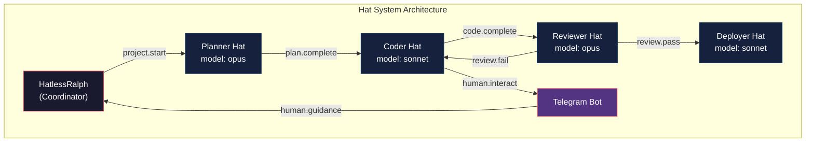
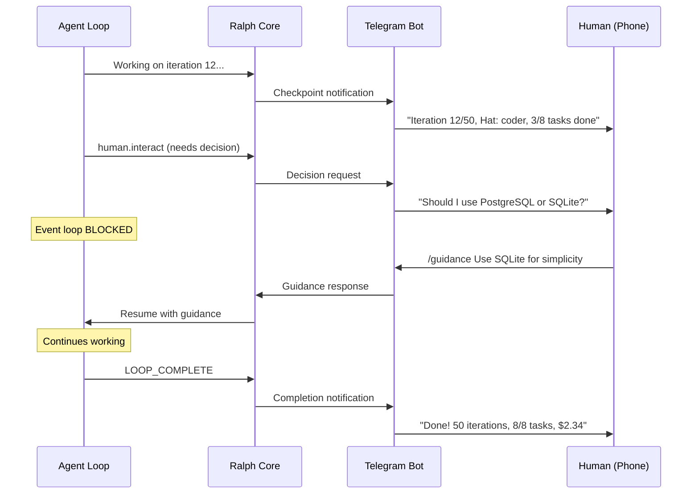

# Ralph Orchestrator Guide

[](https://github.com/krzemienski/agentic-development-guide)

## Related Post

**Featured in the Agentic Development Blog series — Post #8: Ralph Orchestrator — A Rust Platform for AI Agent Fleets**

- Send date: Thu Jun 18, 2026
- LinkedIn: _link added on send day_
- Canonical blog post: https://ai.hack.ski/blog/<slug-set-on-send-day>
- Series hub: [agentic-development-guide](https://github.com/krzemienski/agentic-development-guide)

---


[](https://github.com/krzemienski)

**Getting started guide and example configurations for [Ralph Orchestrator](https://github.com/mikeyobrien/ralph-orchestrator) — a Rust platform for coordinating fleets of AI coding agents.**

Ralph treats AI agents the way Kubernetes treats containers: isolated environments, clear objectives, and a structured way to hand off results. This repo provides hat configurations, example loops, Telegram integration, and documentation to get you from zero to running agents in 5 minutes.

> Companion repo for [Ralph Orchestrator: Building a Rust Platform for AI Agent Armies](https://github.com/krzemienski) — Part 6 of the Agentic Development series.

---

## Quick Start (5 Minutes)

### 1. Install Ralph

```bash
# Via cargo
cargo install ralph-orchestrator

# Or via npm
npm install -g @ralph-orchestrator/ralph

# Verify
ralph --version
```

### 2. Clone This Guide

```bash
git clone https://github.com/krzemienski/ralph-orchestrator-guide.git
cd ralph-orchestrator-guide
```

### 3. Run Your First Loop

```bash
# Navigate to your project directory
cd /path/to/your/project

# Run a basic loop with a task
ralph run \
  --config /path/to/ralph-orchestrator-guide/examples/basic-loop/loop.toml \
  "Fix the login page CSS alignment"
```

That's it. Ralph will iterate until the task is complete or the iteration limit is reached.

---

## Architecture

### The Hat System

Ralph's most distinctive feature: agents wear **hats** — focused roles that define their capabilities, context, and event subscriptions for each iteration.



Each hat carries:
- **Subscriptions**: Events that trigger this hat
- **Publications**: Events this hat can emit
- **Instructions**: Specialized prompt for the role
- **Model**: Which AI model to use (opus for planning, sonnet for coding)

See [docs/hat-system.md](docs/hat-system.md) for the full deep dive.

---

### Telegram Control Plane

Monitor and steer agents from your phone.



**Commands:** `/status`, `/pause`, `/resume`, `/approve`, `/reject`, `/metrics`, `/kill`, `/guidance`, `/logs`

See [docs/telegram-setup.md](docs/telegram-setup.md) for setup instructions.

---

## The Six Tenets

| # | Tenet | Principle |
|---|-------|-----------|
| 1 | **The Boulder Never Stops** | Loops persist across sessions — if tasks remain, the agent continues |
| 2 | **Hats Define Capability** | Focused roles produce specialist-quality output |
| 3 | **The Plan Is Disposable** | Regenerating costs one iteration — never fight a failing plan |
| 4 | **Telegram as Control Plane** | Remote monitoring and steering from your phone |
| 5 | **Worktrees as Isolation** | Each parallel agent gets its own git worktree |
| 6 | **QA Is Non-Negotiable** | Backpressure gates reject bad work automatically |

See [docs/tenets.md](docs/tenets.md) for detailed explanations with practical examples.

---

## Hat Configurations

Pre-built hat configs for common project types:

| Hat | File | Best For |
|-----|------|----------|
| Web Frontend | [`configs/web-frontend.toml`](configs/web-frontend.toml) | React, Next.js, Vue, TypeScript |
| Systems | [`configs/systems.toml`](configs/systems.toml) | Rust, Go, Python backends, APIs |
| Data Pipeline | [`configs/data-pipeline.toml`](configs/data-pipeline.toml) | ETL, pandas, dbt, SQL |
| iOS Mobile | [`configs/ios-mobile.toml`](configs/ios-mobile.toml) | Swift, SwiftUI, Xcode |

```bash
# Use a hat config
ralph run --hat configs/web-frontend.toml "Build the dashboard components"
ralph run --hat configs/systems.toml "Implement the auth service"
```

---

## Examples

### Basic Loop
The simplest configuration — one agent, one task, iterate until done.
```bash
ralph run --config examples/basic-loop/loop.toml "Fix the bug"
```
See [`examples/basic-loop/`](examples/basic-loop/)

### Parallel Agents
Run multiple agents in isolated git worktrees with an event-sourced merge queue.
```bash
python examples/parallel-agents/task-splitter.py "Build auth system" -o tasks.jsonl
ralph run --config examples/parallel-agents/parallel.toml --parallel 4 --tasks tasks.jsonl
```
See [`examples/parallel-agents/`](examples/parallel-agents/)

### Telegram Bot
Remote control plane for monitoring and steering loops from your phone.
```bash
ralph run --config examples/basic-loop/loop.toml \
  --telegram examples/telegram-bot/bot-config.toml "Build the feature"
```
See [`examples/telegram-bot/`](examples/telegram-bot/)

### Persistence Loop
Survives session restarts — "the boulder never stops."
```bash
ralph run --config examples/persistence-loop/persistence.toml "Complete all tasks"
python examples/persistence-loop/state-manager.py status
```
See [`examples/persistence-loop/`](examples/persistence-loop/)

---

## Project Structure

```
ralph-orchestrator-guide/
├── configs/
│   ├── web-frontend.toml           # Hat: React/Next.js development
│   ├── systems.toml                # Hat: Backend/systems work
│   ├── data-pipeline.toml          # Hat: Data engineering
│   └── ios-mobile.toml             # Hat: iOS/macOS development
├── examples/
│   ├── basic-loop/                 # Minimal loop config
│   ├── parallel-agents/            # Multi-worktree parallel execution
│   ├── telegram-bot/               # Remote control via Telegram
│   └── persistence-loop/           # Session-surviving loops
├── docs/
│   ├── tenets.md                   # 6 tenets with practical examples
│   ├── hat-system.md               # Hat system deep dive
│   └── telegram-setup.md           # Step-by-step Telegram setup
├── README.md                       # This file
├── LICENSE                         # MIT
└── .gitignore
```

---

## Key Concepts

### Backpressure Gates

Define quality gates in your TOML config. They run automatically after every iteration:

```toml
[loop.backpressure]
build = "cargo build"              # Must compile
lint = "cargo clippy -- -D warnings"  # Must pass linting
test = "cargo test"                # Must pass tests
```

The agent has freedom in implementation but zero tolerance for quality failures.

### Memory System

Memories persist across iterations in `.ralph/agent/memories.md`:

| Type | Purpose |
|------|---------|
| **Patterns** | How this codebase does things |
| **Decisions** | Why something was chosen |
| **Fixes** | Solutions to recurring problems |
| **Context** | Project-specific knowledge |

### Merge Queue

For parallel agents, an event-sourced JSONL log at `.ralph/merge-queue.jsonl`:

```
1. Worktree completes → Queued
2. Primary loop picks up → Merging
3. Git merge succeeds → Merged (commit SHA)
4. Or fails → Failed (error message)
```

---

## Attribution

Ralph Orchestrator is created by [mikeyobrien](https://github.com/mikeyobrien/ralph-orchestrator). This guide provides configuration examples and documentation for getting started.

---

## Series

This is **Part 6** of the [Agentic Development](https://github.com/krzemienski) series:

| Part | Topic | Repo |
|------|-------|------|
| 1 | AI-Native iOS Streaming | [claude-ios-streaming-bridge](https://github.com/krzemienski/claude-ios-streaming-bridge) |
| 2 | Agent SDK Bridge | [claude-sdk-bridge](https://github.com/krzemienski/claude-sdk-bridge) |
| 3 | Git Worktree Isolation | [auto-claude-worktrees](https://github.com/krzemienski/auto-claude-worktrees) |
| 4 | Multi-Agent Consensus | [multi-agent-consensus](https://github.com/krzemienski/multi-agent-consensus) |
| 5 | Prompt Engineering Stack | [claude-prompt-stack](https://github.com/krzemienski/claude-prompt-stack) |
| **6** | **Ralph Orchestrator** | **This repo** |

---

## Troubleshooting

### Ralph loop never terminates
Check that `check_completion()` returns `True` when all tasks are done. If using `max_iterations`, ensure it's set to a reasonable value (default: 10).

### State file corruption
Ralph persists state as JSON. If the state file becomes corrupted (e.g., from a crash during write), delete it and restart. State files are in the working directory.

### Task callbacks not executing
Ensure your task runner function matches the expected signature: `def runner(task: RalphTask) -> bool`. Return `True` for success, `False` for failure.

### Duration formatting shows 0s
The timer starts when `ralph.start()` is called. If iterating manually, ensure you call `start()` before the first `iterate()`.

## License

MIT — see [LICENSE](./LICENSE).
