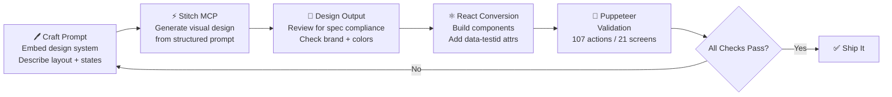

# stitch-design-to-code

[](https://github.com/krzemienski/agentic-development-guide)

## Related Post

**Featured in the Agentic Development Blog series — Post #10: 21 AI-Generated Screens, Zero Figma Files**

- Send date: Mon Jun 15, 2026
- LinkedIn: _link added on send day_
- Canonical blog post: https://ai.hack.ski/blog/<slug-set-on-send-day>
- Series hub: [agentic-development-guide](https://github.com/krzemienski/agentic-development-guide)

---


[](https://github.com/krzemienski)
[](LICENSE)
[](https://nodejs.org)

**A complete workflow template for AI-powered design-to-code using Stitch MCP + React + Puppeteer validation.**

Turn natural language design prompts into production-ready React components — with automated visual validation proving every screen renders correctly. Zero Figma files. Zero hand-written CSS. 21 screens. 107 validation actions.

---

## The Cycle



---

## Design System

The brutalist-cyberpunk aesthetic that makes this system distinctive:

| Token | Value | Swatch |
|-------|-------|--------|
| Background | `#000000` | ⬛ Pure black |
| Primary Accent | `#e050b0` | 🟣 Hot pink |
| Secondary Accent | `#4dacde` | 🔵 Cyan |
| Surface | `#111111` | ⬛ Dark cards |
| Surface Alt | `#1a1a1a` | ⬛ Elevated |
| Text Primary | `#ffffff` | ⬜ White |
| Text Secondary | `#a0a0a0` | 🔘 Gray |
| Border | `#2a2a2a` | ▪️ Subtle |

**Typography:** JetBrains Mono — used exclusively at all sizes and weights.

**Border Radius:** `0px` everywhere. No exceptions. Brutalist by design.

**Component Library:** shadcn/ui primitives, styled with custom CVA variants.

---

## Session Economics

| Metric | Value |
|--------|-------|
| Screens generated | 21 |
| Puppeteer validation actions | 107 |
| Figma files opened | 0 |
| CSS written by hand | 0 lines |
| Design tokens | 47 |
| shadcn/ui components | 5 |
| Example components | 4 |
| Session transcript | ~13,432 lines |

---

## Directory Structure

```
stitch-design-to-code/
│
├── design-system/
│   ├── tokens.json              # 47 design tokens (colors, type, spacing, shadows)
│   ├── tailwind-preset.js       # Tailwind theme consuming tokens.json
│   └── README.md                # Token reference + installation guide
│
├── prompts/
│   ├── README.md                # Prompt engineering guide + A/B/C strategy
│   ├── public-screens.md        # 7 screens: Home, Resources, Search, About, Categories (2)
│   ├── auth-screens.md          # 3 screens: Login, Register, Forgot Password
│   ├── user-screens.md          # 4 screens: Profile, Bookmarks, Favorites, History
│   ├── admin-screens.md         # 2 screens: Admin Dashboard (20 tabs), Suggest Edit
│   └── legal-screens.md         # 2 screens: Privacy Policy, Terms of Service
│
├── validation/
│   ├── puppeteer-checks.js      # 107-action check suite (21 screens)
│   ├── run-validation.js        # Puppeteer runner with pass/fail reporting
│   └── README.md                # Methodology, action types, CI integration
│
├── components/
│   ├── ui/
│   │   ├── button.tsx           # 7 variants (default, outline, ghost, link, secondary...)
│   │   ├── card.tsx             # Card system (header, title, desc, content, footer)
│   │   ├── input.tsx            # Input + Textarea + SearchInput
│   │   ├── tabs.tsx             # Radix tabs + ScrollableTabs for 20-tab admin
│   │   └── badge.tsx            # 13 variants (primary, secondary, status, role...)
│   │
│   ├── home-hero.tsx            # Hero section + StatsBar
│   ├── resource-card.tsx        # ResourceCard + ResourceGrid
│   ├── auth-form.tsx            # Unified login/register/forgot-password form
│   └── admin-tabs.tsx           # 20-tab admin dashboard with content placeholders
│
├── docs/
│   ├── branding-checklist.md    # The "Awesome Lists vs Video Dashboard" bug + prevention
│   └── workflow-guide.md        # Step-by-step: design system → prompts → Stitch → React → validate
│
├── package.json
├── .gitignore
├── LICENSE
└── README.md
```

---

## Quick Start

### Prerequisites

- Node.js 18+
- npm 9+

### 1. Clone and install

```bash
git clone https://github.com/krzemienski/stitch-design-to-code.git
cd stitch-design-to-code
npm install
```

### 2. Start the dev server

```bash
npm run dev
# Visit http://localhost:3000
```

### 3. Run the validation suite

```bash
# In a second terminal (while dev server runs)
npm run validate
```

### 4. View results

- Pass/fail output in terminal
- Screenshots in `./screenshots/`
- Full report in `./validation-report.json`

---

## Using the Design System

### In your own project

```bash
# Copy design-system/ to your project
cp -r design-system/ your-project/

# Install dependencies
npm install tailwindcss class-variance-authority clsx tailwind-merge @fontsource/jetbrains-mono
```

```js
// tailwind.config.js
module.exports = {
  presets: [require('./design-system/tailwind-preset')],
  content: ['./src/**/*.{ts,tsx}'],
}
```

```ts
// In your root layout
import '@fontsource/jetbrains-mono/400.css';
import '@fontsource/jetbrains-mono/700.css';
```

### Using the prompt templates

Open any file in `prompts/` and use the embedded prompt blocks with Stitch MCP. Each prompt:
- Embeds the full design system spec inline
- Describes layout, key elements, and interactive states
- Can be used as-is or adapted for your own product

---

## Writing Your Own Prompts

The critical rule: **embed the full design system in every prompt.**

```
Design a [SCREEN NAME] for "Your Product" — [one-line description].

DESIGN SYSTEM:
- Background: #000000 (pure black)
- Primary Accent: #e050b0 (hot pink)
- Secondary Accent: #4dacde (cyan)
- Surface/Card: #111111 background, #1a1a1a elevated
- Text: #ffffff primary, #a0a0a0 secondary
- Font: JetBrains Mono, monospaced, used everywhere
- Border radius: 0px — brutalist aesthetic
- Component library: shadcn/ui
- Borders: 1px solid #2a2a2a

LAYOUT:
[Describe structure here]

KEY ELEMENTS:
[List all UI elements with specifics]
```

See `prompts/README.md` for the full guide including A/B/C variation testing strategy.

---

## Validation

The Puppeteer suite validates 21 screens with 107 actions:

| Group | Screens | Checks |
|-------|---------|--------|
| Public | Home, Resources, Search, About, Categories, Category Detail, Resource Detail | 36 |
| Auth | Login, Register, Forgot Password | 14 |
| User | Profile, Bookmarks, Favorites, History | 18 |
| Admin | Admin Dashboard (20 tabs), Suggest Edit | 29 |
| Legal | Privacy Policy, Terms of Service | 16 |
| **Total** | **21** | **107** |

The Admin Dashboard alone accounts for 25 checks — one per tab plus KPI validation.

---

## Avoiding the Branding Bug

This template includes a documented case study of AI-generated branding drift. See `docs/branding-checklist.md` for:
- What went wrong (product name substitution across screens)
- Why it happens in long AI sessions
- An automated grep-based prevention script
- Treating brand name as a design token

**TL;DR:** Run this after every generation session:
```bash
grep -rn "Video Dashboard\|Placeholder\|lorem ipsum" src/ components/ app/
```

---

## Related Resources

- [`design-system/README.md`](design-system/README.md) — Token reference and Tailwind setup
- [`prompts/README.md`](prompts/README.md) — Prompt engineering guide
- [`validation/README.md`](validation/README.md) — Puppeteer methodology
- [`docs/workflow-guide.md`](docs/workflow-guide.md) — Complete step-by-step workflow
- [`docs/branding-checklist.md`](docs/branding-checklist.md) — Branding bug prevention

---

## Troubleshooting

### `npm run validate` fails with "Cannot connect to server"
Start the Next.js dev server first: `npm run dev`. The validation suite needs a running server at `http://localhost:3000`.

### Puppeteer browser launch fails
Run `npx puppeteer browsers install chrome` to install the required browser. In CI, use `--ci` mode: `npm run validate:ci`.

### Screenshots not matching expected layout
Ensure your viewport is set correctly. The validation suite uses a default viewport of 1280x720. Custom viewports can be set per-check in `puppeteer-checks.js`.

### Missing `@/lib/utils` import error
This is expected for the template repo. The `@/` path alias resolves via `tsconfig.json` paths when the full Next.js project is built.

### Design tokens not applying
Verify `design-system/tokens.json` is imported correctly. All 47 tokens use the brutalist palette (borderRadius: 0px is intentional).

## License

MIT © Nick Krzemienski

Part of the [Agentic Development Series](https://github.com/krzemienski) — building production software with AI agents.
