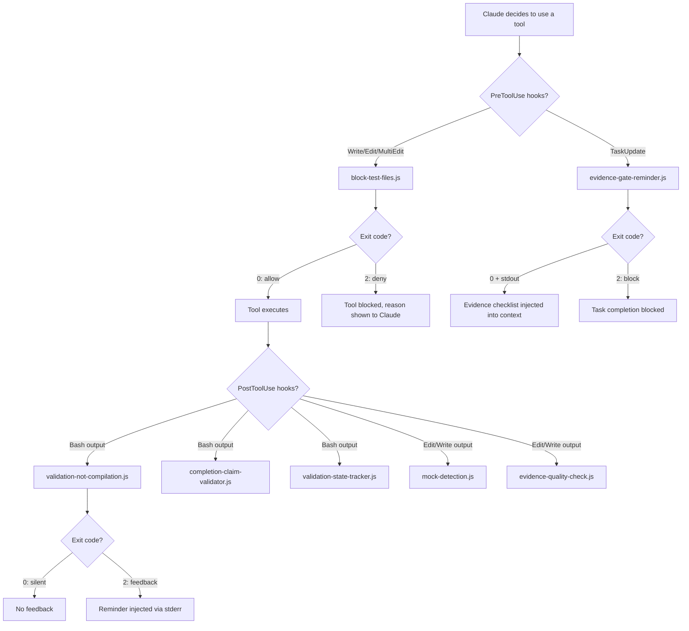
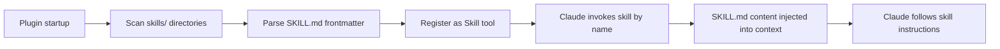
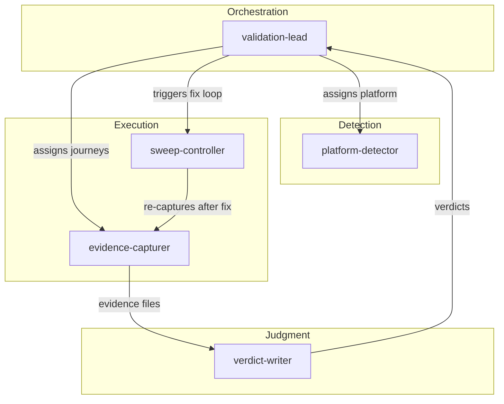
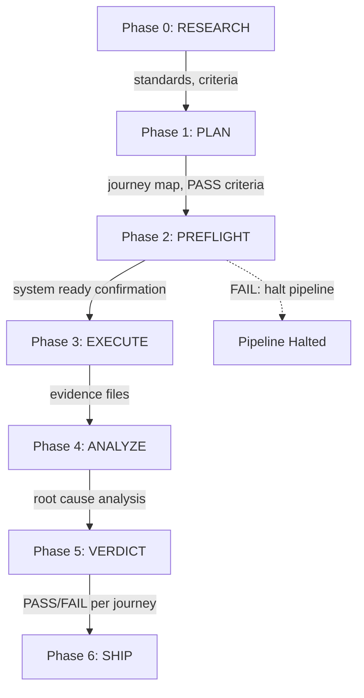
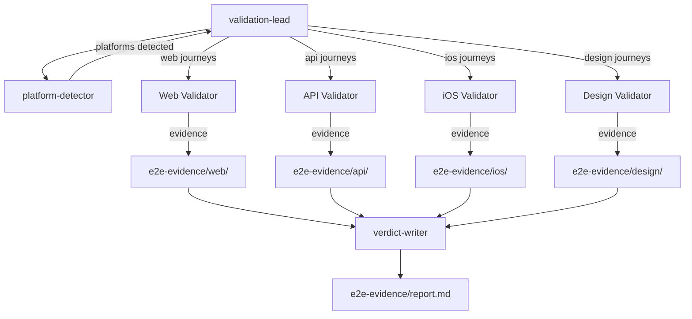

# ValidationForge Architecture

Technical architecture of ValidationForge, a Claude Code plugin that enforces evidence-based validation through hooks, skills, agents, and commands.

## System Overview

ValidationForge extends Claude Code by injecting validation discipline into the agent's workflow. It operates through four extension points that Claude Code provides:

- **Hooks** intercept tool calls (PreToolUse/PostToolUse) to block prohibited patterns and inject reminders
- **Skills** provide context-rich instructions that Claude loads when performing validation tasks
- **Commands** expose slash commands (`/validate`, `/forge-execute`, etc.) that trigger validation workflows
- **Agents** are specialized sub-agents dispatched for specific roles (evidence capture, verdict writing, etc.)

ValidationForge does not run as a separate process. It is a collection of static files (markdown, JSON, JavaScript) that Claude Code discovers and integrates into its runtime behavior.

## Plugin Lifecycle

```
Install (git clone or marketplace)
  │
  ├── .claude-plugin/plugin.json    ← Plugin manifest (name, version, author)
  ├── .claude-plugin/marketplace.json ← Marketplace metadata
  │
  ▼
Claude Code startup
  │
  ├── Discovers plugin in ~/.claude/plugins/validationforge/
  ├── Reads plugin.json for metadata
  ├── Merges hooks/hooks.json into hook pipeline
  ├── Indexes skills/ directories (each with SKILL.md)
  ├── Registers commands/ as slash commands
  ├── Registers agents/ as available sub-agents
  └── Loads rules/ into active rule set
```

The `install.sh` script additionally copies `rules/*.md` to `~/.claude/rules/` with a `vf-` prefix so they persist across sessions without requiring the plugin to be active in every project.

## Hook Execution Flow

Hooks are the enforcement mechanism. They run as Node.js scripts invoked by Claude Code before or after tool use.



### Hook Data Flow

Each hook script receives the tool call as JSON on stdin:

```json
{
  "tool_name": "Write",
  "tool_input": {
    "file_path": "/path/to/file.test.ts",
    "content": "..."
  }
}
```

The script processes this input and responds through exit codes and output streams:

| Exit Code | Meaning | Output Channel |
|-----------|---------|---------------|
| 0 | Allow / no-op | stdout (context injection for PreToolUse) |
| 2 | Block (PreToolUse) or Feedback (PostToolUse) | stderr (reason shown to Claude) |

### Hook Protocol Details

**PreToolUse: Blocking a tool call**

`block-test-files.js` checks the `file_path` against test/mock/stub patterns. On match, it outputs JSON with a deny decision and exits with code 2:

```json
{
  "hookSpecificOutput": {
    "permissionDecision": "deny"
  }
}
```

Files matching `e2e-evidence/` or `validation-evidence/` are allowlisted and pass through.

**PreToolUse: Injecting context**

`evidence-gate-reminder.js` detects TaskUpdate completions and writes an evidence checklist to stdout, then exits 0. Claude receives this as additional context before proceeding.

**PostToolUse: Providing feedback**

`validation-not-compilation.js` scans Bash output for build success patterns (`build succeeded`, `compiled successfully`, `webpack compiled`, etc.). When detected, it writes a reminder to stderr and exits 2, which injects the message into Claude's context as feedback.

**PostToolUse: Silent pass-through**

When a PostToolUse hook finds nothing noteworthy, it exits 0 with no output. Claude does not see anything.

### Portability

All hook paths use `${CLAUDE_PLUGIN_ROOT}` instead of absolute paths:

```json
{
  "type": "command",
  "command": "${CLAUDE_PLUGIN_ROOT}/hooks/block-test-files.js"
}
```

Claude Code resolves this variable at runtime to the plugin's install directory.

## Skill Lifecycle

Skills are directories under `skills/` containing a `SKILL.md` file. Claude Code discovers them at startup.

```
skills/
  api-validation/
    SKILL.md          ← Frontmatter + instructions
  ios-validation/
    SKILL.md
  functional-validation/
    SKILL.md
  ... (40 total)
```

### Discovery and Invocation



Each `SKILL.md` has YAML frontmatter defining metadata (description, triggers, allowed tools). When Claude invokes a skill, the full markdown content is loaded into the context window, providing domain-specific instructions, checklists, and decision trees.

Skills do not execute code. They are context documents that shape Claude's behavior for a specific task type.

## Command Architecture

Commands are markdown files in `commands/` with YAML frontmatter:

```yaml
---
name: validate
description: Run full end-to-end validation -- detect, plan, execute, verdict.
allowed-tools: "Read, Write, Edit, Bash, Glob, Grep, Agent"
---
```

Key frontmatter fields:

| Field | Purpose |
|-------|---------|
| `name` | Slash command name (e.g., `validate` becomes `/validate`) |
| `description` | One-line description shown in command listing |
| `allowed-tools` | Comma-separated list of tools the command may use |
| `triggers` | Optional keyword triggers for automatic invocation |

The markdown body below the frontmatter contains the instructions Claude follows when the command is invoked. Commands can dispatch agents, invoke skills, and orchestrate multi-step workflows.

## Agent Architecture

Five agents handle distinct phases of the validation pipeline. Each agent is defined as a markdown file in `agents/` with frontmatter specifying capabilities.



### Agent Roles

**platform-detector** -- Analyzes the codebase to determine platform type. Examines file extensions, framework configs (`.xcodeproj`, `package.json`, `Cargo.toml`), and directory structures. Returns a platform classification with confidence score. Used by the pipeline to route to platform-specific validation skills.

**evidence-capturer** -- Interacts with the real running system. Takes screenshots via browser automation or simulator, captures API responses, collects console logs. Writes evidence files to `e2e-evidence/{journey-slug}/` with sequential naming. Never writes to another validator's evidence directory.

**verdict-writer** -- Reads evidence files and writes PASS/FAIL verdicts. Operates as a skeptical reviewer: does not trust claims, only reads evidence files directly. Each verdict must cite specific evidence (file path, what was observed, why it constitutes a pass or fail).

**validation-lead** -- Orchestrates multi-agent validation. Decomposes the validation scope into independent journey clusters, assigns them to platform-specific validators, monitors progress, and produces the unified report at `e2e-evidence/report.md`.

**sweep-controller** -- Manages the autonomous fix-and-revalidate loop. When verdicts contain FAILs, it analyzes root causes, applies fixes to the real system, and triggers re-validation. Tracks attempt count per journey and stops at the 3-strike limit.

### Dispatch Pattern

Commands and skills dispatch agents using Claude Code's `Agent` tool. The dispatching command provides:
- The agent's markdown definition (loaded from `agents/`)
- Task-specific context (journey list, evidence directory, platform type)
- File scope (which directories the agent may read/write)

Agents run as sub-agents with their own context window. They communicate results through the file system (evidence files, report files) rather than through message passing.

## Validation Pipeline

The 7-phase pipeline is the core workflow. Data flows through phases sequentially; each phase reads artifacts from the previous phase and writes its own.



### Phase Artifacts

| Phase | Reads | Writes |
|-------|-------|--------|
| RESEARCH | Codebase, framework docs | Applicable standards and criteria |
| PLAN | Standards, codebase structure | Journey definitions, PASS criteria, evidence requirements |
| PREFLIGHT | Build config, service configs | Build output, service health checks |
| EXECUTE | Journey definitions | `e2e-evidence/{journey}/step-*.{png,json,txt}` |
| ANALYZE | Evidence files, source code | Root cause analysis per FAIL |
| VERDICT | Evidence files, analysis | `e2e-evidence/report.md` with PASS/FAIL per journey |
| SHIP | Verdict report | Deploy/no-deploy decision |

## Evidence Chain of Custody

Evidence files are the single source of truth for verdicts. The chain is strict:

1. **evidence-capturer** (or platform-specific validator) writes evidence files to `e2e-evidence/{journey-slug}/`
2. Each file is named sequentially: `step-01-description.png`, `step-02-description.json`
3. An `evidence-inventory.txt` in each journey directory lists all captured files
4. **verdict-writer** reads evidence files directly -- it does not accept descriptions of evidence
5. Each verdict cites evidence by file path and describes what was observed
6. The `evidence-quality-check` hook warns if any evidence file is 0 bytes
7. Evidence from a previous validation run is never reused; each run captures fresh

### Evidence Validity

| Valid | Invalid |
|-------|---------|
| Screenshot with description of what is visible | "Screenshot captured successfully" |
| API response body + headers + status code | Status code alone |
| Build output quoting the success/failure line | "Build passed" |
| Console log with timestamps | Log excerpt without context |
| Non-empty file with structured content | 0-byte file |

## Team Validation

For projects spanning multiple platforms (e.g., web frontend + API backend + iOS app), the `validation-lead` agent spawns parallel validators:



### Coordination Rules

- Each validator owns its evidence subdirectory exclusively
- No validator writes to another validator's directory
- The validation-lead waits for all validators before requesting verdicts
- The verdict-writer reads across all evidence directories to produce a unified report
- Partial verdicts are never produced -- all validators must complete

## Configuration Architecture

Three enforcement presets control hook behavior and gate strictness:

| Setting | Strict | Standard | Permissive |
|---------|--------|----------|------------|
| `block_test_files` | true | true | false |
| `block_mock_patterns` | true | true | false |
| `require_evidence_on_completion` | true | true | false |
| `require_validation_plan` | true | false | false |
| `require_preflight` | true | false | false |
| `require_baseline` | true | false | false |
| `max_recovery_attempts` | 3 | 3 | 5 |
| `fail_on_missing_evidence` | true | false | false |
| `require_screenshot_review` | true | false | false |

Hooks operate in two modes based on config:
- **enabled** -- Hook executes its full logic (block or inject)
- **warn** -- Hook logs a warning but does not block (used in permissive mode)

Config is selected during `/vf-setup` and stored at `~/.claude/.vf-config.json`.

## Directory Structure

```
validationforge/
├── .claude-plugin/
│   ├── plugin.json              # Plugin manifest
│   └── marketplace.json         # Marketplace listing
├── agents/                      # 5 agent definitions
│   ├── evidence-capturer.md
│   ├── platform-detector.md
│   ├── sweep-controller.md
│   ├── validation-lead.md
│   └── verdict-writer.md
├── commands/                    # 15 slash commands
│   ├── validate.md
│   ├── validate-audit.md
│   ├── validate-benchmark.md
│   ├── validate-ci.md
│   ├── validate-fix.md
│   ├── validate-plan.md
│   ├── validate-sweep.md
│   ├── validate-team.md
│   ├── vf-setup.md
│   ├── forge-benchmark.md
│   ├── forge-execute.md
│   ├── forge-install-rules.md
│   ├── forge-plan.md
│   ├── forge-setup.md
│   └── forge-team.md
├── config/                      # Enforcement presets
│   ├── strict.json
│   ├── standard.json
│   └── permissive.json
├── hooks/                       # 7 hook scripts + manifest
│   ├── hooks.json
│   ├── block-test-files.js
│   ├── evidence-gate-reminder.js
│   ├── validation-not-compilation.js
│   ├── completion-claim-validator.js
│   ├── validation-state-tracker.js
│   ├── mock-detection.js
│   └── evidence-quality-check.js
├── rules/                       # 8 rule files
│   ├── validation-discipline.md
│   ├── execution-workflow.md
│   ├── evidence-management.md
│   ├── platform-detection.md
│   ├── team-validation.md
│   ├── benchmarking.md
│   ├── forge-execution.md
│   └── forge-team-orchestration.md
├── skills/                      # 40 skill directories
│   ├── functional-validation/
│   ├── ios-validation/
│   ├── web-validation/
│   ├── api-validation/
│   └── ... (40 total)
├── templates/                   # Report and plan templates
├── scripts/                     # Utility scripts
├── install.sh                   # Installer script
├── package.json                 # npm metadata
├── CLAUDE.md                    # Plugin instructions for Claude
└── README.md                    # Project README
```
