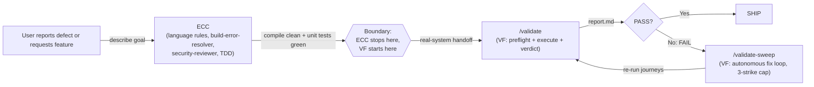

# Using ValidationForge with everything-claude-code (ECC)

ECC excels at language-specific best practices, build-error resolution, and security review. VF validates that the resulting system behaves correctly under real conditions. Together: clean code that actually works. ECC's 29 rule sets (TypeScript, Python, Go, Swift, Java, plus nine common rules) enforce idiomatic code and catch static defects inside the editor; ValidationForge then proves that the running application — compiled, deployed, and reachable — returns the right responses, renders the right pixels, and behaves the way the user expects, with screenshots, API bodies, and logs to back every PASS or FAIL.

The two plugins hold the same philosophy from different angles, and that framing is important enough to name up front: **ECC encourages writing tests; VF's Iron Rule 2 forbids creating test files during validation.** That is not a contradiction, and this guide treats it as a feature of the stack rather than a conflict to paper over. ECC handles the unit-test layer — the programmer-owned safety net that lives next to the code and proves individual functions do what the programmer intended. VF handles the system-validation layer — the evidence-based proof that the code, the services it depends on, and the environment it runs in actually behave correctly end-to-end. You want both. Mocks pass, integrations break; type-checkers are quiet, deployments misbehave. ECC makes the unit layer disciplined; VF makes the system layer verifiable. They are stages of the same pipeline, not competing strategies.

This guide assumes ECC v1.7.0 or later and ValidationForge v1.x. Inventory numbers are as of April 2026.

## Quick Reference

Use this table to decide which plugin owns which phase of the loop. The rule of thumb: ECC owns everything up to "the code compiles and the unit tests are green"; VF owns everything from "prove it works against the real system" onward.

| Task | Use ECC | Use VF | Use Both |
|------|:-------:|:------:|:--------:|
| Enforce TypeScript/Python/Go/Swift/Java language rules (29 rule sets) | ✅ | | |
| Resolve build errors with `build-error-resolver` | ✅ | | |
| Security review (secret detection, input validation, injection checks) | ✅ | | |
| Red/Green TDD loop with 80% coverage mandate | ✅ | | |
| Produce `e2e-evidence/` with cited screenshots, API bodies, and verdicts | | ✅ | |
| Detect the platform and route to the right validators (iOS, Web, API, CLI, Design) | | ✅ | |
| Autonomous fix-and-revalidate loop with a 3-strike cap (`/validate-sweep`) | | ✅ | |
| Benchmark validation posture (coverage, evidence quality, enforcement, speed) | | ✅ | |
| Ship a TypeScript API that passes `tsc --strict` **and** behaves correctly end-to-end | | | ✅ |
| Fix a build error **and** prove the fix doesn't regress runtime behavior | | | ✅ |
| Security-review a Python service **and** validate it rejects malformed input at runtime | | | ✅ |

## Combined Workflow

The handoff lives at the "ECC's static and unit gates are green" boundary. ECC owns the compile-and-lint pipeline up to that point; VF owns the validate-against-the-real-system pipeline after it. The explicit boundary: **ECC stops at compile + unit-pass. VF starts at real-system behavior.**



**Step-by-step annotation:**

1. **describe goal** (User → ECC) — The user either reports a defect or requests a new feature. ECC's proactive-trigger hooks activate the right agents: `build-error-resolver` for red builds, `security-reviewer` for new endpoints, language-specialist agents (`golang-patterns`, `swift-concurrency`, `python-typing`, etc.) for idiomatic enforcement, and `tdd-guide` for the red/green/improve loop.
2. **compile clean + unit tests green** (ECC → Boundary) — ECC iterates until the build compiles, the language rules are satisfied, the security scan is clean, and the unit tests pass with ≥80% coverage. At this point ECC considers the task complete.
3. **real-system handoff** (Boundary → `/validate`) — This is the line VF was built for. Compile success is not validation (Iron Rule 8). ECC does not boot the service, hit endpoints, render UI, or compare against a real database. VF's `/validate` takes over: `platform-detector` identifies the stack, validators run real journeys, and `verdict-writer` synthesizes evidence into `e2e-evidence/report.md`.
4. **report.md** (`/validate` → PASS?) — VF writes PASS/FAIL verdicts per journey, each backed by cited evidence (response bodies, screenshots, logs with timestamps).
5. **Yes** (PASS? → SHIP) — A PASS verdict moves to the production-readiness audit and the feature ships.
6. **No: FAIL** (PASS? → `/validate-sweep`) — A FAIL verdict triggers VF's autonomous fix loop, which fixes the real system in place (no mocks) with a 3-strike cap per journey.
7. **re-run journeys** (`/validate-sweep` → `/validate`) — After each fix attempt, the sweep re-invokes the validate pipeline against the real system and captures fresh evidence under `e2e-evidence/attempt-N/`.

## Installation and Configuration

ECC is installed by cloning its repository and running `install.sh` with a target (`claude` or `cursor`) and a list of languages. VF is installed via its own `install.sh`. Install ECC first so its hooks and rules register before VF's stricter gates take precedence.

### Install both plugins (side-by-side)

```bash
# 1. Install ECC — pick only the languages your project actually uses
git clone https://github.com/everything-claude-code/everything-claude-code.git
cd everything-claude-code
./install.sh --target claude typescript python
cd -

# 2. Install ValidationForge — installs LAST so VF's PreToolUse hooks are authoritative
curl -fsSL https://raw.githubusercontent.com/krzemienski/validationforge/main/install.sh | bash
# Or the local-symlink path when the repo is not yet public:
# ln -s /path/to/local/validationforge ~/.claude/plugins/validationforge

# 3. Run VF setup so platform detection and e2e-evidence scaffolding are ready
/vf-setup
```

Restart Claude Code after both installs — plugins (hooks, skills, commands, rules) are loaded at session startup and will not be active in the session where you ran the installers.

### Sample `.claude/settings.json` with both plugins registered

Both plugins merge their hook definitions into Claude Code's hook pipeline. The two name fields (`everything-claude-code` vs `validationforge`) keep them from colliding:

```json
{
  "plugins": [
    { "name": "everything-claude-code", "path": "~/.claude/plugins/everything-claude-code" },
    { "name": "validationforge",        "path": "~/.claude/plugins/validationforge" }
  ],
  "hooks": {
    "PreToolUse": [
      { "plugin": "everything-claude-code", "matcher": "Write|Edit|MultiEdit" },
      { "plugin": "validationforge",        "matcher": "Write|Edit|MultiEdit" }
    ],
    "PostToolUse": [
      { "plugin": "everything-claude-code", "matcher": "Write|Edit|MultiEdit|Bash" },
      { "plugin": "validationforge",        "matcher": "Write|Edit|MultiEdit|Bash" }
    ]
  }
}
```

### Rule directories

ECC installs its 29 rules under `.claude/rules/` with a per-language split (9 common rules, plus language-specific files like `typescript-strict.md`, `python-typing.md`, `go-error-handling.md`). VF installs its 8 rules under `.claude/rules/` too, namespaced as `vf-*.md`. A quick audit after both installs:

```bash
ls -1 .claude/rules/ | sort
# Expected output (trimmed): ECC rules (common-*, <language>-*) + vf-* rules, no overlap
```

Filenames do not collide in the current audit, but users running both plugins should spot-check for accidental overwrites if either plugin updates its rule set.

### Enforcement level

If ECC's `tdd-guide` is going to write test files during this session, run VF in `permissive` mode so test-file writes produce warnings rather than hard blocks:

```bash
/vf-setup --config permissive
```

Switch to `standard` or `strict` once the ECC-owned TDD phase is complete and you are ready for VF's gates to be fully binding. See [Troubleshooting](#troubleshooting) for the full set of resolutions to the test-file-gate conflict.

## Worked Example

Feature: a defect report comes in saying the `POST /api/projects` endpoint returns a 500 instead of a 400 when the request body is missing the `name` field. The defect has two layers — a TypeScript validation bug (ECC territory) and a runtime HTTP contract bug (VF territory).

### Phase 1 — ECC fixes the language-layer defect

```bash
# ECC's proactive triggers pick up the red build when the user pastes the defect report
/build-error-resolver

# Once the build is green, ECC's security-reviewer runs on the changed file
/security-review
```

Illustrative session output — ECC's `build-error-resolver`:

```text
# Illustrative session output — ECC /build-error-resolver
[ecc][typescript-strict] src/routes/projects.ts:14: Property 'name' is possibly 'undefined'.
[ecc][build-error-resolver] Patched handler to narrow `body.name` with a Zod schema.
[ecc][typescript-strict] Rebuild: `pnpm tsc --noEmit` → 0 errors.
[ecc][security-reviewer]  No injection vectors; body is parsed through Zod before DB write.
[ecc][tdd-guide] Generated tests/projects.spec.ts with 6 cases (80% branch coverage).
[ecc] Done. Hand off to validation.
```

ECC has fixed the TypeScript error and added unit tests. **It has not booted the server, hit the endpoint, or captured any runtime evidence.** The unit tests pass, but the HTTP contract bug (500 vs 400) may still be present — the unit tests mock the request parser, so they cannot see the Express-level behavior.

### Phase 2 — VF proves the endpoint actually returns 400

```bash
/validate --platform api
```

VF's `platform-detector` identifies the service as an API platform, loads `api-validation`, and produces a plan with journeys like `create-project-happy-path`, `create-project-missing-name`, and `create-project-malformed-json`. Preflight boots the dev server and runs each journey against the live process.

If the 500-vs-400 bug is still present (for example because the Zod schema runs inside a handler that doesn't properly format the HTTP error), VF catches it:

```text
# Illustrative session output — /validate --platform api
[validate][phase 3 execute]
  ✗ create-project-missing-name  POST → 500 Internal Server Error, body "ZodError: Required"
     Expected: 400 with {error: "validation_failed", issues: [...]}
     Observed: 500 with raw ZodError string
     Evidence: e2e-evidence/create-project-missing-name/step-02-response-500.json
```

This is the exact class of defect ECC could not detect — compile clean, unit tests green, **still broken at the HTTP layer**. VF's `/validate-sweep` then fixes the real handler (add the error-formatting middleware, or wrap the Zod parse in a try/catch that translates to 400) and re-runs until the journey PASSes.

### Phase 3 — Ship

Once `report.md` shows all PASS, the production-readiness audit runs and the feature ships. `e2e-evidence/` is the contract — ECC's unit test file (`tests/projects.spec.ts`) lives in the unit-test layer; VF's `e2e-evidence/create-project-missing-name/step-02-response-400.json` lives in the system-validation layer. Both layers are preserved; neither overwrites the other.

## Evidence of Coexistence

The snippets below show both plugins active in the same session. They are illustrative, copy-pasteable reconstructions grounded in documented ECC and VF behavior, not live runtime captures.

### Both command sets available

```text
> /help
Available commands:

ECC:
  /build-error-resolver  Resolve compile errors with language-aware patches
  /security-review       Scan for secrets, injection, unsafe input handling
  /tdd-guide             Red/Green/Improve TDD loop
  /e2e-runner            Generic Playwright e2e runner
  ... (33 more)

ValidationForge:
  /vf-setup              Initialize ValidationForge
  /validate              Full validation pipeline
  /validate-plan         Plan only (no execution)
  /validate-audit        Read-only audit with severity classification
  /validate-fix          Fix FAIL verdicts (3-strike)
  /validate-sweep        Autonomous fix-and-revalidate loop
  /validate-benchmark    Measure validation posture
  ... (8 more)
```

### Shared filesystem

```bash
$ ls -la
.claude/
  rules/                 # ECC: common-*.md, typescript-*.md, etc. + VF: vf-*.md
  settings.json          # Merged hook registrations (ECC + VF)
tests/                   # ECC's unit-test layer (owned by tdd-guide)
e2e-evidence/            # VF's system-validation layer (owned by /validate)
src/                     # Application source (both plugins read/write here)
```

ECC writes unit tests under `tests/`; VF writes system evidence under `e2e-evidence/`. The two directories never collide — they are different layers of the same pipeline.

## Troubleshooting

### ECC's `tdd-guide` writes test files that VF blocks

**Symptom:** `/tdd-guide` fails with `PreToolUse hook 'block-test-files' denied Write: tests/projects.spec.ts` (VF Iron Rule 2).

**This is the single most important conflict between the two plugins, and it is expected.** ECC's `tdd-guide` is opinionated about writing unit test files; VF's `block-test-files` hook is opinionated about never creating test files during the validation phase. Resolutions, in order of preference:

1. **Phase separation (recommended).** Run ECC's TDD cycle *before* invoking VF. ECC produces compile-clean code with passing unit tests; VF then validates the running system. The two layers do not need to be interleaved.
2. **Worktree isolation.** Let ECC's TDD loop run in a dedicated git worktree where VF is not installed, merge the resulting code into main, and validate with `/validate` on main.
3. **Permissive mode.** `/vf-setup --config permissive` downgrades `block-test-files` from a hard block to a warning for the duration of the ECC TDD phase. Switch back to `standard` before running `/validate`.
4. **Skip `tdd-guide`.** If the team prefers to rely on VF's evidence-based journeys in place of unit tests, simply do not invoke `/tdd-guide`. ECC's language rules, `build-error-resolver`, and `security-reviewer` still add value without the TDD phase.

### Both plugins ship an e2e runner

ECC has a generic `e2e-runner` agent built on Playwright; VF has `playwright-validation` built on the same engine. They coexist — ECC's runner is generic, VF's runner writes into `e2e-evidence/` with the Iron Rule constraints applied. The guides-level policy: use VF's runner for anything that produces the final PASS/FAIL verdict; use ECC's runner only for exploratory scripts that are not meant to ship as evidence.

### Rules directory audit after both installs

**Symptom:** A rule file seems to have been overwritten after re-running one of the installers.

**Resolution:** Run `ls -1 .claude/rules/` and spot-check for unexpected changes. ECC installs 29 files under common / per-language names; VF installs 8 files under the `vf-*.md` namespace. If any ECC file is missing a `common-` or `<language>-` prefix, or any VF file is missing its `vf-` prefix, re-run the corresponding installer to restore it.

### Hook ordering is wrong after a manual settings edit

**Symptom:** A test file slips through VF's gate because ECC's later hook allowed the write.

**Resolution:** Re-run `/vf-setup` — it reorders VF's hooks to the end of the relevant hook lists. Alternatively, edit `.claude/settings.json` manually so VF's entries appear after ECC's under each hook event.

## Related Resources

- [everything-claude-code repository](https://github.com/everything-claude-code) — ECC source, install script, language rule reference, and agent catalog.
- [ValidationForge competitive analysis](../competitive-analysis.md) — Side-by-side feature matrix of VF, OMC, and ECC, plus recommended complementary usage.
- [ValidationForge architecture](../ARCHITECTURE.md) — Hook execution flow, evidence data model, and how `/validate-sweep`'s fix loop preserves per-attempt evidence.
- [ValidationForge README](../../README.md) — Full command, skill, agent, hook, and rule inventory, including the eight Iron Rules that govern VF's validation phase.
- [Ecosystem integrations index](./README.md) — Companion guides for pairing VF with [OMC](./vf-with-omc.md) and [Superpowers](./vf-with-superpowers.md).
