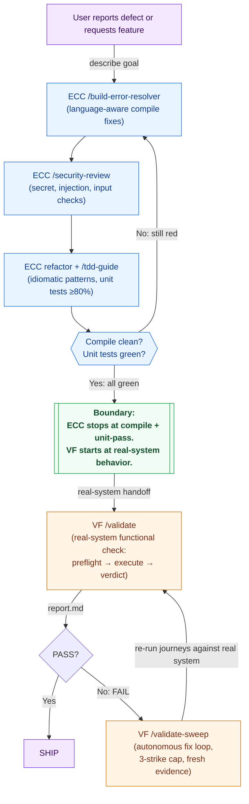

# Using ValidationForge with everything-claude-code (ECC)

ECC excels at language-specific best practices, build-error resolution, and security review. VF validates that the resulting system behaves correctly under real conditions. Together: clean code that actually works. ECC's 29 rule sets (TypeScript, Python, Go, Swift, Java, plus nine common rules) enforce idiomatic code and catch static defects inside the editor; ValidationForge then proves that the running application — compiled, deployed, and reachable — returns the right responses, renders the right pixels, and behaves the way the user expects, with screenshots, API bodies, and logs to back every PASS or FAIL.

The two plugins hold the same philosophy from different angles, and that framing is important enough to name up front: **ECC encourages writing tests; VF's Iron Rule 2 forbids creating test files during validation.** That is not a contradiction, and this guide treats it as a feature of the stack rather than a conflict to paper over. ECC handles the unit-test layer — the programmer-owned safety net that lives next to the code and proves individual functions do what the programmer intended. VF handles the system-validation layer — the evidence-based proof that the code, the services it depends on, and the environment it runs in actually behave correctly end-to-end. You want both. Mocks pass, integrations break; type-checkers are quiet, deployments misbehave. ECC makes the unit layer disciplined; VF makes the system layer verifiable. They are stages of the same pipeline, not competing strategies.

This guide assumes ECC v1.7.0 or later and ValidationForge v1.x. Inventory numbers are as of April 2026.

## Quick Reference

Use this table to decide which plugin owns which phase of the loop. The rule of thumb: ECC owns everything up to "the code compiles and the unit tests are green"; VF owns everything from "prove it works against the real system" onward.

| Task | Use ECC | Use VF | Use Both |
|------|:-------:|:------:|:--------:|
| Enforce TypeScript/Python/Go/Swift/Java language rules (29 rule sets) | ✅ | | |
| Resolve build errors with `build-error-resolver` | ✅ | | |
| Security review (secret detection, input validation, injection checks) | ✅ | | |
| Red/Green TDD loop with 80% coverage mandate | ✅ | | |
| Produce `e2e-evidence/` with cited screenshots, API bodies, and verdicts | | ✅ | |
| Detect the platform and route to the right validators (iOS, Web, API, CLI, Design) | | ✅ | |
| Autonomous fix-and-revalidate loop with a 3-strike cap (`/validate-sweep`) | | ✅ | |
| Benchmark validation posture (coverage, evidence quality, enforcement, speed) | | ✅ | |
| Ship a TypeScript API that passes `tsc --strict` **and** behaves correctly end-to-end | | | ✅ |
| Fix a build error **and** prove the fix doesn't regress runtime behavior | | | ✅ |
| Security-review a Python service **and** validate it rejects malformed input at runtime | | | ✅ |

## Combined Workflow

The handoff lives at the "ECC's static and unit gates are green" boundary. ECC owns the compile-and-lint pipeline up to that point; VF owns the validate-against-the-real-system pipeline after it. The explicit boundary: **ECC stops at compile + unit-pass. VF starts at real-system behavior.**



**Step-by-step annotation:**

1. **describe goal** (User → ECC `/build-error-resolver`) — The user either reports a defect or requests a new feature. ECC's proactive-trigger hooks activate `build-error-resolver` for red builds first; it parses compiler diagnostics and applies language-aware patches (TypeScript narrowings, Python typing fixes, Go error-wrapping, Swift concurrency annotations, etc.).
2. **ECC fix loop** (`/build-error-resolver` → `/security-review` → refactor + `/tdd-guide`) — Once the build is green, `/security-review` scans for secrets, injection, and unsafe input handling. Language-specialist agents (`golang-patterns`, `swift-concurrency`, `python-typing`, etc.) refactor toward idiomatic patterns, and `/tdd-guide` runs the red/green/improve loop to ≥80% unit-test coverage. If the gate detects a still-red build or failing tests, control returns to `/build-error-resolver` and the loop repeats.
3. **Boundary: ECC stops at compile + unit-pass. VF starts at real-system behavior.** — When the compile is clean *and* the unit tests are green, ECC considers the task complete. This is the explicit handoff line. Compile success is not validation (Iron Rule 8). ECC does not boot the service, hit endpoints, render UI, or compare against a real database.
4. **real-system handoff** (Boundary → VF `/validate`) — VF's `/validate` takes over as a real-system functional check: `platform-detector` identifies the stack, preflight boots the service, validators run real journeys against the live process, and `verdict-writer` synthesizes evidence into `e2e-evidence/report.md`.
5. **report.md** (`/validate` → PASS?) — VF writes PASS/FAIL verdicts per journey, each backed by cited evidence (response bodies, screenshots, logs with timestamps).
6. **Yes** (PASS? → SHIP) — A PASS verdict moves to the production-readiness audit and the feature ships.
7. **No: FAIL** (PASS? → VF `/validate-sweep`) — A FAIL verdict triggers VF's autonomous fix loop, which fixes the real system in place (no mocks) with a 3-strike cap per journey.
8. **re-run journeys against real system** (`/validate-sweep` → `/validate`) — After each fix attempt, the sweep re-invokes the validate pipeline against the real system and captures fresh evidence under `e2e-evidence/attempt-N/`.

## Installation and Configuration

ECC is installed by cloning its repository and running `install.sh` with a target (`claude` or `cursor`) and a list of languages. VF is installed via its own `install.sh`. Install ECC first so its hooks and rules register before VF's stricter gates take precedence.

### Install both plugins (side-by-side)

```bash
# 1. Install ECC — pick only the languages your project actually uses
git clone https://github.com/everything-claude-code/everything-claude-code.git
cd everything-claude-code
./install.sh --target claude typescript python
cd -

# 2. Install ValidationForge — installs LAST so VF's PreToolUse hooks are authoritative
curl -fsSL https://raw.githubusercontent.com/krzemienski/validationforge/main/install.sh | bash
# Or the local-symlink path when the repo is not yet public:
# ln -s /path/to/local/validationforge ~/.claude/plugins/validationforge

# 3. Run VF setup so platform detection and e2e-evidence scaffolding are ready
/vf-setup
```

Restart Claude Code after both installs — plugins (hooks, skills, commands, rules) are loaded at session startup and will not be active in the session where you ran the installers.

### Sample `.claude/settings.json` with both plugins registered

Both plugins merge their hook definitions into Claude Code's hook pipeline. The two name fields (`everything-claude-code` vs `validationforge`) keep them from colliding:

```json
{
  "plugins": [
    { "name": "everything-claude-code", "path": "~/.claude/plugins/everything-claude-code" },
    { "name": "validationforge",        "path": "~/.claude/plugins/validationforge" }
  ],
  "hooks": {
    "PreToolUse": [
      { "plugin": "everything-claude-code", "matcher": "Write|Edit|MultiEdit" },
      { "plugin": "validationforge",        "matcher": "Write|Edit|MultiEdit" }
    ],
    "PostToolUse": [
      { "plugin": "everything-claude-code", "matcher": "Write|Edit|MultiEdit|Bash" },
      { "plugin": "validationforge",        "matcher": "Write|Edit|MultiEdit|Bash" }
    ]
  }
}
```

### Rule directories

ECC installs its 29 rules under `.claude/rules/` with a per-language split (9 common rules, plus language-specific files like `typescript-strict.md`, `python-typing.md`, `go-error-handling.md`). VF installs its 8 rules under `.claude/rules/` too, namespaced as `vf-*.md`. A quick audit after both installs:

```bash
ls -1 .claude/rules/ | sort
# Expected output (trimmed): ECC rules (common-*, <language>-*) + vf-* rules, no overlap
```

Filenames do not collide in the current audit, but users running both plugins should spot-check for accidental overwrites if either plugin updates its rule set.

### Enforcement level

If ECC's `tdd-guide` is going to write test files during this session, run VF in `permissive` mode so test-file writes produce warnings rather than hard blocks:

```bash
/vf-setup --config permissive
```

Switch to `standard` or `strict` once the ECC-owned TDD phase is complete and you are ready for VF's gates to be fully binding. See [Configuration — resolving the test-file-blocking conflict](#configuration--resolving-the-test-file-blocking-conflict) below for the full set of resolutions and an allowlist-based hybrid, and [Troubleshooting](#troubleshooting) for session-time symptoms.

## Configuration — resolving the test-file-blocking conflict

The single sharpest edge between the two plugins is this: **ECC's `tdd-guide` writes test files; VF's `block-test-files` hook blocks them.** The hook is wired into the `PreToolUse` pipeline for `Write|Edit|MultiEdit` (see `hooks/hooks.json`), so any attempt to create a path matching the test-file pattern is denied before it reaches the filesystem. The two enforcement levels shipped with VF make the tension explicit:

- `config/standard.json` — `block_test_files: true` and `hooks.block-test-files: "enabled"` (hard block).
- `config/permissive.json` — `block_test_files: false` and `hooks.block-test-files: "warn"` (warning only).

Pick one of the three resolution paths below based on how you want the two plugins to share a working tree.

### Path (a) — Session or project isolation (recommended for teams that want both strict modes)

Run ECC's `/tdd-guide` in a session or project where VF is **not installed**, then merge the resulting code (plus any unit-test files) into the project where VF lives. This keeps both plugins in their strictest configurations:

```bash
# Session A — ECC-only project, no VF plugin registered
git clone https://github.com/everything-claude-code/everything-claude-code.git
cd everything-claude-code
./install.sh --target claude typescript python
cd -

# Do the ECC TDD cycle here — tests/*.spec.ts freely created
/tdd-guide

# Commit the resulting code + tests, then move to the VF-enabled project
git add src tests && git commit -m "ECC TDD cycle complete"
```

```bash
# Session B — ValidationForge-enabled project, installed with strict defaults
curl -fsSL https://raw.githubusercontent.com/krzemienski/validationforge/main/install.sh | bash
/vf-setup --config standard

# Pull the ECC-authored branch and validate the running system — no new test files needed
git pull origin ecc-tdd-cycle
/validate
```

The TDD files were written in Session A where no VF hook existed; Session B never sees a `Write` tool call targeting `tests/`, so `block-test-files` never fires. Both plugins stay at their intended strictness.

### Path (b) — Hybrid: keep `block-test-files` enabled, but allowlist the ECC test output

If you want a single session/project where both plugins run simultaneously, add an explicit allowlist to VF's config so ECC's test-output directories are exempt from the block. This preserves the hook's protective intent (it still blocks *ad hoc* test-file writes by the model) while carving out the directory ECC owns.

Below is a suggested modification to `config/permissive.json` — copy it into `.vf/config.json` or edit the shipped file in place. The `block_test_files_allowlist` entry adds explicit glob patterns that the hook should exempt. Patterns follow the same conventions as ECC's `tdd-guide` scaffolding (`tests/`, `__tests__/`, `spec/`, plus the Go idiom of `_test.go` suffixes).

```json
{
  "name": "permissive-ecc-hybrid",
  "description": "Permissive VF config with ECC's tdd-guide output directories allowlisted so unit tests coexist with system validation.",
  "strictness": "permissive",
  "evidence_dir": "e2e-evidence",
  "ci_mode": false,
  "rules": {
    "block_test_files": true,
    "block_test_files_allowlist": [
      "tests/**/*.spec.ts",
      "tests/**/*.spec.js",
      "tests/**/*.spec.py",
      "tests/**/*_test.go",
      "__tests__/**/*",
      "spec/**/*.spec.*"
    ],
    "block_mock_patterns": true,
    "require_evidence_on_completion": true,
    "require_validation_plan": false,
    "require_preflight": false,
    "require_baseline": false,
    "max_recovery_attempts": 3,
    "fail_on_missing_evidence": false,
    "require_screenshot_review": false
  },
  "hooks": {
    "block-test-files": "enabled",
    "evidence-gate-reminder": "enabled",
    "validation-not-compilation": "enabled",
    "completion-claim-validator": "enabled",
    "mock-detection": "enabled"
  }
}
```

Install both plugins, drop this config into place, and run `/vf-setup` so VF picks up the new allowlist on next session start:

```bash
# 1. ECC first
git clone https://github.com/everything-claude-code/everything-claude-code.git
cd everything-claude-code && ./install.sh --target claude typescript python && cd -

# 2. ValidationForge second (installs last so its hooks are authoritative)
curl -fsSL https://raw.githubusercontent.com/krzemienski/validationforge/main/install.sh | bash

# 3. Drop the hybrid config in place and re-run setup
mkdir -p .vf && cp config/permissive.json .vf/config.json
# …then edit .vf/config.json to add the block_test_files_allowlist patterns above.
/vf-setup --config .vf/config.json
```

The allowlist is additive — anything outside the glob patterns still trips the hard block, so the model cannot sneak test files under an unrelated path like `src/__tests__/inline.spec.ts` unless you explicitly allow it. Keep the allowlist tight: every new pattern is one more place a stray test can appear.

### Path (c) — Sequential workflow: ECC first, then enable VF

If your team is comfortable treating TDD and validation as serial phases, run ECC's TDD loop with VF's `block-test-files` hook disabled, then switch VF into its gated configuration for the validation phase. This is the simplest bash-only resolution:

```bash
# 1. Install both plugins (both install.sh invocations)
git clone https://github.com/everything-claude-code/everything-claude-code.git
cd everything-claude-code && ./install.sh --target claude typescript python && cd -
curl -fsSL https://raw.githubusercontent.com/krzemienski/validationforge/main/install.sh | bash

# 2. ECC phase — VF in permissive mode so tdd-guide can write test files freely
/vf-setup --config permissive
/build-error-resolver
/security-review
/tdd-guide                       # writes tests/*.spec.ts, block-test-files is a warn only

# 3. Commit the ECC-authored code + tests before flipping strictness
git add src tests && git commit -m "ECC phase: compile-clean + unit tests green"

# 4. VF phase — switch to standard (or strict) so block-test-files is a hard block again
/vf-setup --config standard
/validate                        # no new test files written; real-system evidence captured
```

The flip between `permissive` and `standard` is a single command. Commit between the two so the ECC-authored test files are saved before VF's gate returns to its hard-block posture — that way any later model invocation that accidentally tries to touch a test file is denied, but the unit tests ECC already wrote remain on disk.

### Choosing between (a), (b), and (c)

| Situation | Preferred path |
|-----------|----------------|
| Teams that want both plugins in their strictest posture | (a) Session/project isolation |
| Single repository where both plugins run every session | (b) Hybrid config with allowlist |
| Single repository where TDD and validation run as serial phases | (c) Sequential workflow |
| Short-lived feature branch, TDD done once, VF runs on every push | (c) Sequential workflow |
| CI job that runs `/validate` nightly on an ECC-authored main branch | (a) or (c) |

All three paths preserve ECC's test files on disk and keep VF's validation evidence under `e2e-evidence/`; they differ only in how the two plugins negotiate the write pipeline during a session.

## Worked Example

Feature: a defect report comes in saying the `POST /api/projects` endpoint returns a 500 instead of a 400 when the request body is missing the `name` field. The defect has two layers — a TypeScript validation bug (ECC territory) and a runtime HTTP contract bug (VF territory).

### Phase 1 — ECC fixes the language-layer defect

```bash
# ECC's proactive triggers pick up the red build when the user pastes the defect report
/build-error-resolver

# Once the build is green, ECC's security-reviewer runs on the changed file
/security-review
```

Illustrative session output — ECC's `build-error-resolver`:

```text
# Illustrative session output — ECC /build-error-resolver
[ecc][typescript-strict] src/routes/projects.ts:14: Property 'name' is possibly 'undefined'.
[ecc][build-error-resolver] Patched handler to narrow `body.name` with a Zod schema.
[ecc][typescript-strict] Rebuild: `pnpm tsc --noEmit` → 0 errors.
[ecc][security-reviewer]  No injection vectors; body is parsed through Zod before DB write.
[ecc][tdd-guide] Generated tests/projects.spec.ts with 6 cases (80% branch coverage).
[ecc] Done. Hand off to validation.
```

ECC has fixed the TypeScript error and added unit tests. **It has not booted the server, hit the endpoint, or captured any runtime evidence.** The unit tests pass, but the HTTP contract bug (500 vs 400) may still be present — the unit tests mock the request parser, so they cannot see the Express-level behavior.

### Phase 2 — VF proves the endpoint actually returns 400

```bash
/validate --platform api
```

VF's `platform-detector` identifies the service as an API platform, loads `api-validation`, and produces a plan with journeys like `create-project-happy-path`, `create-project-missing-name`, and `create-project-malformed-json`. Preflight boots the dev server and runs each journey against the live process.

If the 500-vs-400 bug is still present (for example because the Zod schema runs inside a handler that doesn't properly format the HTTP error), VF catches it:

```text
# Illustrative session output — /validate --platform api
[validate][phase 3 execute]
  ✗ create-project-missing-name  POST → 500 Internal Server Error, body "ZodError: Required"
     Expected: 400 with {error: "validation_failed", issues: [...]}
     Observed: 500 with raw ZodError string
     Evidence: e2e-evidence/create-project-missing-name/step-02-response-500.json
```

This is the exact class of defect ECC could not detect — compile clean, unit tests green, **still broken at the HTTP layer**. VF's `/validate-sweep` then fixes the real handler (add the error-formatting middleware, or wrap the Zod parse in a try/catch that translates to 400) and re-runs until the journey PASSes.

### Phase 3 — Ship

Once `report.md` shows all PASS, the production-readiness audit runs and the feature ships. `e2e-evidence/` is the contract — ECC's unit test file (`tests/projects.spec.ts`) lives in the unit-test layer; VF's `e2e-evidence/create-project-missing-name/step-02-response-400.json` lives in the system-validation layer. Both layers are preserved; neither overwrites the other.

## Worked Example — Next.js API route: clear the build, then catch a field-name mismatch

The previous example focused on an HTTP status-code contract bug. This one walks through a different class of defect that the README's comparison table calls out explicitly: **API field renamed (`users` → `data`) | unit tests PASS (mock returns old field) | VF FAIL (curl shows new field, frontend crashes)**. Unit tests mock the response shape, so they never notice the rename. Only a real-system validator, hitting the real endpoint and rendering the real page, catches the break.

Scenario: the team merged a refactor that renamed the top-level response field in `app/api/users/route.ts` from `users` to `data`. The Next.js build is red because a stale response type in `lib/api-types.ts` still references the old name, and the consuming page at `app/users/page.tsx` was not updated either. ECC will clear the build; VF will catch the runtime contract break.

### Phase 1 — ECC clears the TypeScript build error

```bash
# ECC's proactive triggers fire on the red Next.js build
/build-error-resolver
```

Illustrative session output — ECC's `build-error-resolver` against the Next.js project:

```text
# Illustrative session output — ECC /build-error-resolver (Next.js API route)
[ecc][typescript-strict] app/api/users/route.ts:22: Type '{ data: User[] }' is not assignable to type '{ users: User[] }'.
[ecc][build-error-resolver] Inspecting handler signature and call sites for `UsersResponse`…
[ecc][build-error-resolver] Updated UsersResponse in lib/api-types.ts: renamed field `users` → `data` to match the handler.
[ecc][typescript-strict] Rebuild: `pnpm next build` → 0 type errors.
[ecc][security-reviewer]  No new input-handling vectors; handler still reads from Next's typed `NextRequest`.
[ecc][tdd-guide] Updated tests/api/users.spec.ts fixture to return `{ data: [...] }` — 4 cases green (82% branch coverage).
[ecc] Done. Hand off to validation.
```

ECC has made the Next.js build compile and made the unit tests green against the renamed field. **It has not booted `next dev`, hit `/api/users` from a browser, or verified that `app/users/page.tsx` still matches the contract.** The unit tests mocked the response shape, so the frontend's stale `body.users` read is still lurking — exactly the scenario the README's comparison table flags.

### Phase 2 — VF proves the route actually returns the right JSON (and catches the mismatch ECC missed)

```bash
/validate --platform api
```

VF's `platform-detector` sees `app/api/users/route.ts` next to `next.config.*` and loads `api-validation` alongside `web-validation` (because the page renders the response). Preflight boots `next dev`, waits for readiness, then runs the discovered journeys against the live process.

Illustrative session output — VF's `/validate --platform api` against the live Next.js dev server:

```text
# Illustrative session output — /validate --platform api (Next.js)
[validate][phase 2 preflight]  ✓ next dev → http://localhost:3000 ready in 2.1s
[validate][phase 3 execute]
  ✓ list-users-api-contract   GET /api/users → 200
       Body starts: {"data":[{"id":"u_001","email":"ada@example.com"}, …]}
       Evidence: e2e-evidence/list-users-api-contract/step-02-response-200.json
  ✗ frontend-users-list       Renders empty <tbody>; DevTools console shows:
       TypeError: Cannot read properties of undefined (reading 'map')
           at UsersPage (app/users/page.tsx:14:22)
       Expected: table with 3 rows from the API response
       Observed: empty table, client-side crash
       Root cause: /api/users now returns {"data": [...]} but app/users/page.tsx
                   still reads `body.users` (the old pre-refactor field name).
       Evidence: e2e-evidence/frontend-users-list/step-02-screenshot.png
                 e2e-evidence/frontend-users-list/step-03-console-error.log
[validate][phase 5 verdict]
  1/2 journeys PASS, 1/2 FAIL — see e2e-evidence/report.md
```

This is precisely the "API field renamed" row from the README in action. ECC's unit tests were green because the fixture was updated to `{ data: [...] }`, but the real page component was never touched — and unit tests cannot see that, because they mock `fetch`. VF, hitting the real endpoint from a real browser against the real Next.js dev server, catches the mismatch. `/validate-sweep` then updates `app/users/page.tsx` to read `body.data`, re-runs the journey, and writes fresh evidence under `e2e-evidence/attempt-2/frontend-users-list/` (Iron Rule 7 — no reused evidence across attempts).

### Example `e2e-evidence/` directory tree after VF finishes

The directory layout after `/validate` + one sweep iteration:

```text
e2e-evidence/
├── list-users-api-contract/
│   ├── step-01-curl-request.txt           # exact curl invocation
│   ├── step-02-response-200.json          # real response body (not a mock)
│   ├── step-03-response-headers.txt       # content-type, cache-control, …
│   └── evidence-inventory.txt             # file → description map
├── frontend-users-list/
│   ├── step-01-navigate-to-users.png      # pre-render: route loaded
│   ├── step-02-screenshot.png             # empty tbody — the defect
│   ├── step-03-console-error.log          # TypeError with timestamp
│   ├── step-04-network-trace.har          # /api/users round-trip
│   └── evidence-inventory.txt
├── attempt-2/                              # VF /validate-sweep fix iteration
│   └── frontend-users-list/
│       ├── step-01-navigate-to-users.png
│       ├── step-02-screenshot.png         # 3 rows now visible
│       ├── step-03-console-error.log      # empty — no runtime errors
│       ├── step-04-network-trace.har
│       └── evidence-inventory.txt
└── report.md                               # unified PASS/FAIL verdict, all citations
```

The `attempt-2/` subtree is how VF's fix loop preserves per-iteration evidence without overwriting the original FAIL capture — a mandated property of the sweep loop (Iron Rule 7). `report.md` at the root is the single document the verdict-writer produces; every PASS or FAIL inside it cites one of the files above.

## Evidence of Coexistence

The snippets below show both plugins active in the same session. They are illustrative, copy-pasteable reconstructions grounded in documented ECC and VF behavior, not live runtime captures.

### Both command sets available

```text
> /help
Available commands:

ECC:
  /build-error-resolver  Resolve compile errors with language-aware patches
  /security-review       Scan for secrets, injection, unsafe input handling
  /tdd-guide             Red/Green/Improve TDD loop
  /e2e-runner            Generic Playwright e2e runner
  ... (33 more)

ValidationForge:
  /vf-setup              Initialize ValidationForge
  /validate              Full validation pipeline
  /validate-plan         Plan only (no execution)
  /validate-audit        Read-only audit with severity classification
  /validate-fix          Fix FAIL verdicts (3-strike)
  /validate-sweep        Autonomous fix-and-revalidate loop
  /validate-benchmark    Measure validation posture
  ... (8 more)
```

### Shared filesystem

```bash
$ ls -la
.claude/
  rules/                 # ECC: common-*.md, typescript-*.md, etc. + VF: vf-*.md
  settings.json          # Merged hook registrations (ECC + VF)
tests/                   # ECC's unit-test layer (owned by tdd-guide)
e2e-evidence/            # VF's system-validation layer (owned by /validate)
src/                     # Application source (both plugins read/write here)
```

ECC writes unit tests under `tests/`; VF writes system evidence under `e2e-evidence/`. The two directories never collide — they are different layers of the same pipeline.

## Troubleshooting

### ECC's `tdd-guide` writes test files that VF blocks

**Symptom:** `/tdd-guide` fails with `PreToolUse hook 'block-test-files' denied Write: tests/projects.spec.ts` (VF Iron Rule 2).

**This is the single most important conflict between the two plugins, and it is expected.** ECC's `tdd-guide` is opinionated about writing unit test files; VF's `block-test-files` hook is opinionated about never creating test files during the validation phase. Resolutions, in order of preference:

1. **Phase separation (recommended).** Run ECC's TDD cycle *before* invoking VF. ECC produces compile-clean code with passing unit tests; VF then validates the running system. The two layers do not need to be interleaved.
2. **Worktree isolation.** Let ECC's TDD loop run in a dedicated git worktree where VF is not installed, merge the resulting code into main, and validate with `/validate` on main.
3. **Permissive mode.** `/vf-setup --config permissive` downgrades `block-test-files` from a hard block to a warning for the duration of the ECC TDD phase. Switch back to `standard` before running `/validate`.
4. **Skip `tdd-guide`.** If the team prefers to rely on VF's evidence-based journeys in place of unit tests, simply do not invoke `/tdd-guide`. ECC's language rules, `build-error-resolver`, and `security-reviewer` still add value without the TDD phase.

### Both plugins ship an e2e runner

ECC has a generic `e2e-runner` agent built on Playwright; VF has `playwright-validation` built on the same engine. They coexist — ECC's runner is generic, VF's runner writes into `e2e-evidence/` with the Iron Rule constraints applied. The guides-level policy: use VF's runner for anything that produces the final PASS/FAIL verdict; use ECC's runner only for exploratory scripts that are not meant to ship as evidence.

### Rules directory audit after both installs

**Symptom:** A rule file seems to have been overwritten after re-running one of the installers.

**Resolution:** Run `ls -1 .claude/rules/` and spot-check for unexpected changes. ECC installs 29 files under common / per-language names; VF installs 8 files under the `vf-*.md` namespace. If any ECC file is missing a `common-` or `<language>-` prefix, or any VF file is missing its `vf-` prefix, re-run the corresponding installer to restore it.

### Hook ordering is wrong after a manual settings edit

**Symptom:** A test file slips through VF's gate because ECC's later hook allowed the write.

**Resolution:** Re-run `/vf-setup` — it reorders VF's hooks to the end of the relevant hook lists. Alternatively, edit `.claude/settings.json` manually so VF's entries appear after ECC's under each hook event.

## Related Resources

- [everything-claude-code repository](https://github.com/everything-claude-code) — ECC source, install script, language rule reference, and agent catalog.
- [ValidationForge competitive analysis](../competitive-analysis.md) — Side-by-side feature matrix of VF, OMC, and ECC, plus recommended complementary usage.
- [ValidationForge architecture](../ARCHITECTURE.md) — Hook execution flow, evidence data model, and how `/validate-sweep`'s fix loop preserves per-attempt evidence.
- [ValidationForge README](../../README.md) — Full command, skill, agent, hook, and rule inventory, including the eight Iron Rules that govern VF's validation phase.
- [Ecosystem integrations index](./README.md) — Companion guides for pairing VF with [OMC](./vf-with-omc.md) and [Superpowers](./vf-with-superpowers.md).
