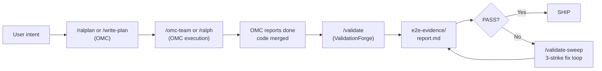

# Using ValidationForge with oh-my-claudecode (OMC)

OMC excels at multi-agent orchestration and execution loops. VF excels at evidence-based validation. Together they form a build-then-prove workflow: OMC's ralph, autopilot, ultrawork, and team modes coordinate N specialized agents to ship a feature, and ValidationForge then proves that the shipped artifact actually behaves correctly against the real system — with screenshots, API bodies, and logs to back every PASS or FAIL.

This guide shows how to pair the two plugins without stepping on each other's hooks, how to hand off cleanly from OMC's "report done" moment to VF's `/validate` or `/validate-sweep`, and how to resolve the small number of real conflicts (test-file gates, execution-loop overlap, rule precedence). It assumes OMC v4.7.7 or later and ValidationForge v1.x. Inventory numbers are as of April 2026.

## Quick Reference

Use this table to decide which plugin owns which phase of the loop. The rule of thumb: OMC covers everything up to "the feature is written"; VF covers everything from "prove it works" onward.

| Task | Use OMC | Use VF | Use Both |
|------|:-------:|:------:|:--------:|
| Coordinate 5+ agents to build a feature (`/omc-team`, `/ralph`, `/autopilot`) | ✅ | | |
| Consensus planning with Planner/Architect/Critic (`/ralplan`) | ✅ | | |
| Route models by cost (haiku for drafts, opus for reasoning) | ✅ | | |
| Detect the platform and pick the right validators (iOS, Web, API, CLI, Design) | | ✅ | |
| Produce `e2e-evidence/` with cited screenshots, API bodies, and verdicts | | ✅ | |
| Autonomous fix-and-revalidate loop with 3-strike limit (`/validate-sweep`) | | ✅ | |
| Ship a REST endpoint with a team of agents, then prove it actually works | | | ✅ |
| Drive a design-to-code implementation, then score visual fidelity against the mock | | | ✅ |
| Build with `/autopilot` overnight, then wake up to a PASS/FAIL evidence report | | | ✅ |

## Combined Workflow

The handoff lives at the "OMC reports done" boundary. OMC owns the build pipeline up to that point; VF owns the validate-and-ship pipeline after it. The same `e2e-evidence/` directory holds the proof, regardless of how the code got written.



**Step-by-step annotation:**

1. **Intent → Plan** — User describes the goal. OMC's `/ralplan` runs the Planner/Architect/Critic consensus loop and writes a plan.
2. **Plan → Build** — OMC's `/omc-team` or `/ralph` executes the plan, dispatching specialized agents (executor, architect, debugger) and routing models for cost.
3. **Build → Done** — OMC's verify stage reports completion. This is a "did the tasks complete?" signal, not a "does the system actually work?" signal.
4. **Done → Validate** — VF's `/validate` takes over. `platform-detector` identifies iOS/Web/API/CLI/Design layers, validators run real journeys, and evidence is captured under `e2e-evidence/`.
5. **Validate → Verdict** — VF's `verdict-writer` synthesizes evidence into PASS/FAIL per journey and writes `e2e-evidence/report.md`.
6. **Verdict → Ship or Sweep** — A PASS verdict moves to the production-readiness audit. A FAIL verdict triggers `/validate-sweep`, which fixes the real system and re-runs the journeys (up to 3 attempts per journey).

## Installation and Configuration

Install OMC first so its hooks register before VF's stricter gates take precedence. Both plugins are Claude Code plugins discovered from `~/.claude/plugins/`, so side-by-side installation is supported out of the box.

### Install both plugins

```bash
# 1. Install OMC (orchestration)
/plugin marketplace add oh-my-claudecode/oh-my-claudecode
/plugin install oh-my-claudecode@oh-my-claudecode

# 2. Run OMC setup so its MCP server and CLAUDE.md injections are wired
/omc-setup

# 3. Install ValidationForge (validation) — install LAST so VF's PreToolUse hooks are authoritative
/plugin marketplace add validationforge/validationforge
/plugin install validationforge@validationforge

# 4. Run VF setup so platform detection and e2e-evidence scaffolding are ready
/vf-setup
```

### settings.json coexistence

Both plugins merge their hook definitions into Claude Code's hook pipeline. VF's `block-test-files` (PreToolUse on Write/Edit) should fire **after** OMC's own file-op hooks so it can veto test-file writes that OMC's `tdd-guide` or `test-engineer` agents might attempt. The default install order above produces this ordering. If you have a custom `.claude/settings.json`, verify VF's hooks appear after OMC's:

```json
{
  "hooks": {
    "PreToolUse": [
      { "plugin": "oh-my-claudecode", "matcher": "Write|Edit|MultiEdit" },
      { "plugin": "validationforge",   "matcher": "Write|Edit|MultiEdit" }
    ],
    "PostToolUse": [
      { "plugin": "oh-my-claudecode", "matcher": "Bash" },
      { "plugin": "validationforge",   "matcher": "Bash" }
    ]
  }
}
```

### Enforcement level

If you are running OMC's `tdd-guide` or `test-engineer` agents, start with VF's `permissive` enforcement so evaluation of OMC's test-file outputs produces warnings rather than hard blocks:

```bash
/vf-setup --config permissive
```

Switch to `standard` or `strict` once the OMC-owned TDD phase is complete and you are ready for VF's gates to be fully binding.

## Worked Example

Feature: add a `POST /api/reports` endpoint to an existing Node/Express service, with input validation and a 201 response that echoes the saved record.

### Phase 1 — OMC builds the feature

```bash
# Consensus plan
/ralplan "Add POST /api/reports that accepts {title, body} and returns 201 with the saved record."

# Execute with a 3-agent team: executor, architect, debugger
/omc-team --agents executor,architect,debugger --plan .omc/plans/reports-endpoint.md
```

OMC's team stages run `plan → prd → exec → verify → fix`. After the verify stage passes, OMC reports:

```text
[omc-team] Stage 'verify' PASSED.
[omc-team] Shipping artifact: src/routes/reports.ts, src/schemas/report.ts
[omc-team] Done.
```

At this point OMC considers the task complete. **It has not run the endpoint against the real server or captured any evidence.** That is VF's job.

### Phase 2 — VF proves the endpoint works

```bash
# Full validation pipeline: detect → plan → preflight → execute → analyze → verdict → ship
/validate
```

VF's `platform-detector` identifies the service as an API platform, loads the `api-validation` skill, and produces a plan that includes journeys like:

- `create-report-happy-path` — POST valid body, expect 201 + echoed record.
- `create-report-missing-title` — POST `{body: "x"}`, expect 400 with a clear error.
- `create-report-invalid-json` — POST malformed JSON, expect 400.

Preflight boots the dev server, confirms it is reachable, and runs each journey against the live process. Evidence is captured per journey:

```text
e2e-evidence/
  create-report-happy-path/
    step-01-post-valid-body.json       # request + response with status, headers, body
    step-02-assert-201.txt              # quoted response line "HTTP/1.1 201 Created"
    evidence-inventory.txt
  create-report-missing-title/
    step-01-post-missing-title.json
    step-02-assert-400.txt
  create-report-invalid-json/
    step-01-post-invalid-json.json
    step-02-assert-400.txt
  report.md                              # PASS/FAIL verdicts with evidence citations
```

### Phase 3 — Ship or sweep

If `report.md` is all PASS, the production-readiness audit runs and the feature ships. If any journey FAILs, `/validate-sweep` runs up to 3 fix-and-revalidate attempts on the real code:

```bash
/validate-sweep
```

Sweep writes each attempt's evidence to `e2e-evidence/attempt-N/` so the trail of what was tried and what changed is preserved.

## Evidence of Coexistence

The following snippets show both plugins active in the same session. They are illustrative, copy-pasteable reconstructions grounded in documented OMC and VF behavior, not live runtime captures.

### Both command sets available

```text
> /help
Available commands:

OMC:
  /omc-setup            Set up oh-my-claudecode
  /ralph                Persistent execution loop
  /autopilot            Idea-to-code autopilot
  /ultrawork            Maximum-parallelism execution
  /omc-team             Coordinated multi-agent team
  /ralplan              Consensus planning loop
  ... (32 more)

ValidationForge:
  /vf-setup             Initialize ValidationForge
  /validate             Full validation pipeline
  /validate-plan        Plan only (no execution)
  /validate-audit       Read-only audit
  /validate-fix         Fix FAIL verdicts (3-strike)
  /validate-sweep       Autonomous fix-and-revalidate loop
  /validate-team        Multi-agent parallel platform validation
  /validate-benchmark   Measure validation posture
  ... (7 more)
```

### Hook firings during a combined run

```text
[PreToolUse][omc-team/state-guard]      Allowing Write: src/routes/reports.ts
[PreToolUse][vf/block-test-files]       Allowing Write: src/routes/reports.ts (not a test file)
[PostToolUse][omc-team/execution-log]   Recorded change: src/routes/reports.ts
[PostToolUse][vf/mock-detection]        No mock patterns detected in src/routes/reports.ts
[PostToolUse][vf/evidence-quality]      Silent (file is source code, not evidence)

[PreToolUse][omc-team/state-guard]      Allowing Write: tests/reports.test.ts  ← OMC tdd-guide
[PreToolUse][vf/block-test-files]       DENIED Write: tests/reports.test.ts
                                        Reason: matches test-file pattern /\.test\./
                                        (VF Iron Rule 2: never create test files)
```

When both plugins are installed with the recommended order, VF's test-file gate remains authoritative even when OMC's `tdd-guide` agent attempts to synthesize tests.

### Shared filesystem

```bash
$ ls -la
.omc/                    # OMC state, plans, notepad
.claude/
  settings.json          # Merged hook registrations (OMC + VF)
  rules/                 # VF rules (OMC injects into CLAUDE.md, not .claude/rules/)
e2e-evidence/            # VF-owned evidence directory (OMC does not write here)
src/                     # Application source (both plugins read/write here)
```

OMC and VF write to disjoint control directories (`.omc/` vs `e2e-evidence/`), so there is no evidence-directory collision.

## Troubleshooting

### OMC's tdd-guide writes test files that VF blocks

**Symptom:** `/omc-team` fails during the exec stage with `PreToolUse hook 'block-test-files' denied Write: tests/foo.test.ts`.

**Resolution options, in order of preference:**

1. **Skip OMC's TDD agents.** Run `/omc-team --agents executor,architect,debugger` — omit `tdd-guide` and `test-engineer`. VF's evidence-based journeys replace the TDD layer.
2. **Stage TDD in a worktree.** Run OMC's TDD cycle in a dedicated git worktree where VF is not installed, merge the resulting code into main, and validate with `/validate` on main. This preserves OMC's TDD discipline for teams that want it while keeping VF's gates authoritative on main.
3. **Switch VF to permissive.** `/vf-setup --config permissive` downgrades `block-test-files` from a hard block to a warning for the duration of the OMC TDD phase. Switch back to `standard` before running `/validate`.

### OMC's ralph and VF's validate-sweep both loop

Both commands are autonomous loops. They must not be run concurrently on the same repo — they will fight over the file system.

**Resolution:** use `/ralph` for the build phase, wait for it to report done, then run `/validate-sweep` sequentially. VF's sweep has a hard 3-attempt cap per journey; OMC's ralph is open-ended, so always gate ralph behind a completion condition before handing off.

### Hook ordering is wrong after a manual settings edit

**Symptom:** OMC's `tdd-guide` writes a test file successfully because VF's block-test-files fired first and was overridden by OMC's later hook.

**Resolution:** Re-run `/vf-setup` — it reorders VF's hooks to the end of the relevant hook lists. Alternatively, edit `.claude/settings.json` manually so VF's entries appear after OMC's under each hook event.

### OMC injects CLAUDE.md rules that conflict with VF's Iron Rules

**Symptom:** OMC's injected rules say "write thorough unit tests," VF's Iron Rules say "never create mocks, stubs, test doubles, or test files." Claude hits a contradiction.

**Resolution:** VF's Iron Rules take precedence during the validation phase (Iron Rule 2 is binding once `/validate` is invoked). During the OMC build phase, OMC's injected guidance wins. The guides-level policy: **OMC's advice governs build; VF's Iron Rules govern validate-and-ship.** If your project's CLAUDE.md is ambiguous, add a `## Validation Phase` section that explicitly hands the floor to VF.

## Related Resources

- [oh-my-claudecode repository](https://github.com/oh-my-claudecode) — OMC source, command reference, and setup docs.
- [ValidationForge competitive analysis](../competitive-analysis.md) — Side-by-side feature matrix of VF, OMC, and ECC, plus recommended complementary usage.
- [ValidationForge architecture](../ARCHITECTURE.md) — Hook execution flow, evidence data model, and how `/validate-sweep`'s fix loop preserves per-attempt evidence.
- [ValidationForge README](../../README.md) — Full command, skill, agent, hook, and rule inventory.
- [Ecosystem integrations index](./README.md) — Companion guides for pairing VF with [ECC](./vf-with-ecc.md) and [Superpowers](./vf-with-superpowers.md).
