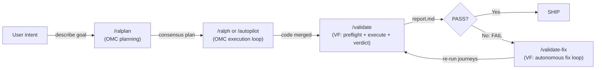

# Using ValidationForge with oh-my-claudecode (OMC)

OMC excels at multi-agent orchestration and execution loops. VF excels at evidence-based validation. Together they form a build-then-prove workflow: OMC's ralph, autopilot, ultrawork, and team modes coordinate N specialized agents to ship a feature, and ValidationForge then proves that the shipped artifact actually behaves correctly against the real system — with screenshots, API bodies, and logs to back every PASS or FAIL. For high-stakes features where a single validator isn't enough, VF's `/validate-consensus` spawns N independent validators and synthesizes them into a confidence-scored verdict — a natural fit when OMC's multi-agent build loop has just shipped a critical path.

This guide shows how to pair the two plugins without stepping on each other's hooks, how to hand off cleanly from OMC's "report done" moment to VF's `/validate` or `/validate-sweep`, and how to resolve the small number of real conflicts (test-file gates, execution-loop overlap, rule precedence). It assumes OMC v4.7.7 or later and ValidationForge v1.x. Inventory numbers are as of April 2026.

## Quick Reference

Use this table to decide which plugin owns which phase of the loop. The rule of thumb: OMC covers everything up to "the feature is written"; VF covers everything from "prove it works" onward.

| Task | Use OMC | Use VF | Use Both |
|------|:-------:|:------:|:--------:|
| Coordinate 5+ agents to build a feature (`/omc-team`, `/ralph`, `/autopilot`) | ✅ | | |
| Consensus planning with Planner/Architect/Critic (`/ralplan`) | ✅ | | |
| Route models by cost (haiku for drafts, opus for reasoning) | ✅ | | |
| Detect the platform and pick the right validators (iOS, Web, API, CLI, Design) | | ✅ | |
| Produce `e2e-evidence/` with cited screenshots, API bodies, and verdicts | | ✅ | |
| Autonomous fix-and-revalidate loop with 3-strike limit (`/validate-sweep`) | | ✅ | |
| Ship a REST endpoint with a team of agents, then prove it actually works | | | ✅ |
| Drive a design-to-code implementation, then score visual fidelity against the mock | | | ✅ |
| Build with `/autopilot` overnight, then wake up to a PASS/FAIL evidence report | | | ✅ |

## Combined Workflow

The handoff lives at the "OMC reports done" boundary. OMC owns the build pipeline up to that point; VF owns the validate-and-ship pipeline after it. The same `e2e-evidence/` directory holds the proof, regardless of how the code got written.



**Step-by-step annotation (edges labeled on the diagram):**

1. **describe goal** (U → `/ralplan`) — User describes the goal. OMC's `/ralplan` runs the Planner/Architect/Critic consensus loop and writes a plan.
2. **consensus plan** (`/ralplan` → `/ralph` or `/autopilot`) — OMC's execution loop dispatches specialized agents (executor, architect, debugger) and routes models for cost. Use `/ralph` for persistent loops or `/autopilot` for idea-to-code runs.
3. **code merged** (`/ralph`/`/autopilot` → `/validate`) — OMC's verify stage reports completion. This is a "did the tasks complete?" signal, not a "does the system actually work?" signal. VF's `/validate` takes over and runs the full preflight → execute → verdict sequence: `platform-detector` identifies iOS/Web/API/CLI/Design layers, validators run real journeys, and `verdict-writer` synthesizes evidence.
4. **report.md** (`/validate` → PASS?) — VF writes `e2e-evidence/report.md` with PASS/FAIL verdicts per journey, each backed by cited evidence.
5. **Yes** (PASS? → SHIP) — A PASS verdict moves to the production-readiness audit and the feature ships.
6. **No: FAIL** (PASS? → `/validate-fix`) — A FAIL verdict triggers VF's autonomous fix loop, which fixes the real system in place (no mocks) with a 3-strike cap per journey.
7. **re-run journeys** (`/validate-fix` → `/validate`) — After each fix attempt, `/validate-fix` re-invokes the validate pipeline against the real system and captures fresh evidence under `e2e-evidence/attempt-N/`.

## Installation and Configuration

Install OMC first so its hooks register before VF's stricter gates take precedence. Both plugins are Claude Code plugins discovered from `~/.claude/plugins/`, so side-by-side installation is supported out of the box. The two install flows are deliberately different — OMC is published to a Claude Code plugin marketplace, so `/plugin install` is the idiomatic path. VF ships with a `install.sh` script that clones the repo to `~/.claude/plugins/validationforge`, copies its eight rules to `~/.claude/rules/vf-*.md`, and scaffolds `e2e-evidence/` when run inside a git repo. Installing via the script preserves VF's rule layout and evidence scaffolding, which `/plugin install` does not do.

### Install both plugins (side-by-side)

```bash
# 1. Install OMC (orchestration) via Claude Code's plugin marketplace
/plugin marketplace add oh-my-claudecode/oh-my-claudecode
/plugin install oh-my-claudecode@oh-my-claudecode

# 2. Run OMC setup so its MCP server and CLAUDE.md injections are wired
/omc-setup

# 3. Install ValidationForge (validation) via install.sh — installs LAST so
#    VF's PreToolUse hooks are authoritative, and runs the rule copy + evidence scaffold
curl -fsSL https://raw.githubusercontent.com/krzemienski/validationforge/main/install.sh | bash
# Or the local-symlink path when the repo is not yet public:
# ln -s /path/to/local/validationforge ~/.claude/plugins/validationforge

# 4. Run VF setup so platform detection and e2e-evidence scaffolding are ready
/vf-setup
```

Restart Claude Code after both installs — plugins (hooks, skills, commands) are loaded at session startup and will not be active in the session where you ran the installers.

### Sample `.claude/settings.json` with both plugins registered

Both plugins merge their hook definitions into Claude Code's hook pipeline and both are registered under the top-level `plugins` array. A minimal, conflict-free `~/.claude/settings.json` that registers both looks like:

```json
{
  "plugins": [
    { "name": "oh-my-claudecode", "path": "~/.claude/plugins/oh-my-claudecode" },
    { "name": "validationforge",  "path": "~/.claude/plugins/validationforge" }
  ],
  "hooks": {
    "PreToolUse": [
      { "plugin": "oh-my-claudecode", "matcher": "Write|Edit|MultiEdit" },
      { "plugin": "validationforge",  "matcher": "Write|Edit|MultiEdit" }
    ],
    "PostToolUse": [
      { "plugin": "oh-my-claudecode", "matcher": "Bash" },
      { "plugin": "validationforge",  "matcher": "Bash" }
    ]
  }
}
```

Each plugin keeps its own `.claude-plugin/plugin.json` manifest under its install root; they do not conflict because their `name` fields (`oh-my-claudecode` vs `validationforge`) are distinct. Claude Code auto-discovers plugins from the `~/.claude/plugins/` directory and reads each plugin's manifest independently. For reference, the two manifests look like this when placed side-by-side:

```json
// ~/.claude/plugins/oh-my-claudecode/.claude-plugin/plugin.json
{
  "name": "oh-my-claudecode",
  "version": "4.7.7",
  "description": "Multi-agent orchestration, consensus planning, and execution loops for Claude Code."
}

// ~/.claude/plugins/validationforge/.claude-plugin/plugin.json
{
  "name": "validationforge",
  "version": "1.0.0",
  "description": "No-mock validation platform for Claude Code. Ship verified code, not 'it compiled' code."
}
```

Because the `name` fields differ, Claude Code loads both plugins side-by-side. Commands, skills, hooks, agents, and rules are namespaced by plugin name, so `/omc-setup` and `/vf-setup` never collide even though both appear in `/help`.

### Recommended hook ordering: VF fires AFTER OMC

**Rule:** VF's hooks must fire **after** OMC's execution hooks on every hook event they share (PreToolUse, PostToolUse). This is not a preference — it is what makes the build-then-prove contract work.

Why: OMC's execution hooks mutate intermediate state. Its `state-guard`, `execution-log`, and `tdd-guide` hooks run during iterations of `/ralph`, `/autopilot`, and `/omc-team` and frequently allow transient writes (scaffolding files, draft routes, partial schemas). If VF's `block-test-files`, `mock-detection`, and `evidence-quality-check` hooks fired **first**, they would be evaluating those intermediate writes and either blocking work that OMC intends to later revise, or approving writes that OMC has not yet finalized. With VF ordered **last**, VF always sees the final state that OMC has committed to on that tool call, and its veto applies to the artifact that will actually reach the validator — not to scratch work.

The default install order above (OMC first, VF last) produces the correct ordering because Claude Code registers hooks in install order. If you have a hand-edited `.claude/settings.json`, verify VF's hook entries appear **after** OMC's under each event (the sample above is correctly ordered). Re-running `/vf-setup` repairs the order if it drifts.

### Environment variables

**None of VF's variables interact with OMC's, and OMC exports no variables that VF reads.** Call this out explicitly because it is the question people ask first when combining two shell-driven tools, and the answer is the short, clean one: *there are no interacting environment variables between the two plugins*.

| Variable | Plugin | Purpose | Interaction with the other plugin |
|----------|:------:|---------|-----------------------------------|
| `VF_SOURCE` | VF | Override the `install.sh` git source URL | None — install-time only, does not affect OMC |
| `VF_INSTALL_DIR` | VF | Override the `install.sh` target directory (must be under `$HOME` or a temp path) | None — install-time only, does not affect OMC |
| (OMC exports none that VF reads) | OMC | — | — |
| (VF exports none that OMC reads) | VF | — | — |

In short: both plugins are pure-runtime through Claude Code's settings pipeline; there is no shared env-var surface, no `PATH`-ordering concern, and no overlapping variable names. You can export whatever OMC needs for its own subprocesses without worrying about VF, and vice versa. If a future version of either plugin introduces an env var that the other reads, it will be called out in this guide's changelog — until then, assume zero interaction.

### Enforcement level

If you are running OMC's `tdd-guide` or `test-engineer` agents, start with VF's `permissive` enforcement so evaluation of OMC's test-file outputs produces warnings rather than hard blocks:

```bash
/vf-setup --config permissive
```

Switch to `standard` or `strict` once the OMC-owned TDD phase is complete and you are ready for VF's gates to be fully binding.

## Worked Example

Feature: add a `POST /api/reports` endpoint to an existing Node/Express service, with input validation and a 201 response that echoes the saved record.

### Phase 1 — OMC builds the feature

```bash
# Consensus plan
/ralplan "Add POST /api/reports that accepts {title, body} and returns 201 with the saved record."

# Execute with a 3-agent team: executor, architect, debugger
/omc-team --agents executor,architect,debugger --plan .omc/plans/reports-endpoint.md
```

OMC's team stages run `plan → prd → exec → verify → fix`. After the verify stage passes, OMC reports:

```text
[omc-team] Stage 'verify' PASSED.
[omc-team] Shipping artifact: src/routes/reports.ts, src/schemas/report.ts
[omc-team] Done.
```

At this point OMC considers the task complete. **It has not run the endpoint against the real server or captured any evidence.** That is VF's job.

### Phase 2 — VF proves the endpoint works

```bash
# Full validation pipeline: detect → plan → preflight → execute → analyze → verdict → ship
/validate
```

VF's `platform-detector` identifies the service as an API platform, loads the `api-validation` skill, and produces a plan that includes journeys like:

- `create-report-happy-path` — POST valid body, expect 201 + echoed record.
- `create-report-missing-title` — POST `{body: "x"}`, expect 400 with a clear error.
- `create-report-invalid-json` — POST malformed JSON, expect 400.

Preflight boots the dev server, confirms it is reachable, and runs each journey against the live process. Evidence is captured per journey:

```text
e2e-evidence/
  create-report-happy-path/
    step-01-post-valid-body.json       # request + response with status, headers, body
    step-02-assert-201.txt              # quoted response line "HTTP/1.1 201 Created"
    evidence-inventory.txt
  create-report-missing-title/
    step-01-post-missing-title.json
    step-02-assert-400.txt
  create-report-invalid-json/
    step-01-post-invalid-json.json
    step-02-assert-400.txt
  report.md                              # PASS/FAIL verdicts with evidence citations
```

### Phase 3 — Ship or sweep

If `report.md` is all PASS, the production-readiness audit runs and the feature ships. If any journey FAILs, `/validate-sweep` runs up to 3 fix-and-revalidate attempts on the real code:

```bash
/validate-sweep
```

Sweep writes each attempt's evidence to `e2e-evidence/attempt-N/` so the trail of what was tried and what changed is preserved.

After the sweep settles on PASS, run `/validate-dashboard` to render the evidence tree into a single HTML + markdown summary — handy when the PR reviewer of OMC's shipped code wants to see verdicts without crawling `e2e-evidence/` themselves. VF's `preflight` skill also now acts as a strict CLEAR / WARN / BLOCKED gate (Iron Rule 4): if OMC's verify stage reports done but the service won't boot, VF short-circuits to BLOCKED rather than fabricating a verdict.

## Expanded Worked Example — Shipping `POST /api/users`

This second walkthrough goes deeper into the handoff for a realistic, second-service feature: adding a `POST /api/users` endpoint with email-uniqueness enforcement. It expands the previous example with full command invocations for both plugins, illustrative session transcripts, a complete evidence directory tree, and a sample final verdict. Every transcript below is marked as illustrative — it reconstructs documented OMC and VF behavior for readers and is not a live runtime capture, per the evidence-of-coexistence strategy for this guide.

### 1. Command invocations

The full command sequence for this feature looks like this. Commands are intentionally minimal — both plugins take care of wiring the rest.

```bash
# Phase 1 — OMC: consensus plan + execution loop
/ralplan "Add POST /api/users endpoint with email uniqueness. Accept {email, name, password}, return 201 with the new user record (no password), return 409 if email already exists, return 400 on malformed input."

# Kick off OMC's persistent execution loop to implement the plan
/ralph

# Phase 2 — VF: validate against the real API platform
/validate --platform api

# Phase 3 — If any journey FAILs, hand off to the autonomous fix loop
/validate-sweep
```

`/ralplan` runs OMC's Planner/Architect/Critic consensus loop and writes `.omc/plans/users-endpoint.md`. `/ralph` picks up that plan and runs until the verify stage reports done. `/validate --platform api` forces the API validation path even if auto-detection would have picked something else; this is useful when the repository also contains a Web frontend and you want to scope this run to the new endpoint.

### 2. Illustrative session transcripts

#### OMC `/ralplan` output (illustrative session output)

```text
# Illustrative session output — OMC /ralplan
> /ralplan "Add POST /api/users endpoint with email uniqueness..."

[ralplan][planner]   Drafting plan for POST /api/users...
[ralplan][architect] Reviewing for architectural fit: repository already has src/routes/reports.ts, db layer uses Prisma, auth middleware exists.
[ralplan][critic]    Two concerns: (1) password hashing algorithm not specified, (2) 409 vs 422 for duplicate email.
[ralplan][planner]   Revised plan: use bcrypt (cost 12) for password hashing; use 409 Conflict for duplicate email per RFC 7231.
[ralplan][consensus] PASSED after 1 revision round.
[ralplan] Wrote .omc/plans/users-endpoint.md (plan v1, 4 tasks).
```

#### OMC `/ralph` execution loop (illustrative session output)

```text
# Illustrative session output — OMC /ralph
> /ralph

[ralph] Loaded plan: .omc/plans/users-endpoint.md (4 tasks).
[ralph] Iteration 1: executor creates src/schemas/user.ts (Zod schema: email, name, password).
[ralph] Iteration 2: executor creates src/routes/users.ts (POST handler + email-unique check via Prisma).
[ralph] Iteration 3: executor wires src/routes/users.ts into src/app.ts router.
[ralph] Iteration 4: architect reviews; flags missing password hashing. Debugger patches to add bcrypt.hash(pw, 12).
[ralph] Iteration 5: verify stage runs `pnpm tsc --noEmit` → 0 errors; `pnpm build` → success.
[ralph] Stage 'verify' PASSED. Reporting done.
[ralph] Shipping artifacts: src/routes/users.ts, src/schemas/user.ts, src/app.ts
[ralph] Done. Hand off to validation.
```

At this point OMC has built and compiled the feature but has not hit the running endpoint even once. VF takes over next.

#### VF `/validate --platform api` run (illustrative session output)

```text
# Illustrative session output — VF /validate --platform api
> /validate --platform api

[validate][phase 0 research]   Loaded api-validation skill, RFC 7231 status-code guidance.
[validate][phase 1 plan]       Journeys drafted:
                                 - create-user-happy-path
                                 - create-user-duplicate-email
                                 - create-user-missing-email
                                 - create-user-malformed-json
                                 - create-user-password-not-echoed
[validate][phase 2 preflight]  pnpm build → success. pnpm dev → listening on :3000. /health → 200 OK.
[validate][phase 3 execute]    Running 5 journeys against http://localhost:3000 ...
  ✓ create-user-happy-path           POST → 201, body echoes {id, email, name} (no password). Evidence: e2e-evidence/create-user-happy-path/
  ✓ create-user-duplicate-email      POST same email twice → 409 Conflict + {"error":"email_exists"}.
  ✓ create-user-missing-email        POST without email → 400 + zod error detail.
  ✓ create-user-malformed-json       POST "not-json" → 400 + parse-error detail.
  ✓ create-user-password-not-echoed  Response body audited: no `password` key present.
[validate][phase 4 analyze]    No FAILs to analyze.
[validate][phase 5 verdict]    All 5 journeys PASS. Writing e2e-evidence/report.md.
[validate][phase 6 ship]       Production-readiness audit: OK. Ready to ship.
```

### 3. Sample evidence directory tree

VF captures every request, response, and assertion under `e2e-evidence/`, one subdirectory per journey. The tree below shows what `/validate --platform api` would produce for the five `/api/users` journeys above.

```text
e2e-evidence/
  create-user-happy-path/
    step-01-post-valid-body.json           # full curl request: headers, body {email, name, password}
    step-02-response-201.json              # status line + response headers + body {id, email, name}
    step-03-assert-no-password.txt         # jq '.password' → null, quoted inline
    evidence-inventory.txt                 # journey checklist: 3/3 steps captured
  create-user-duplicate-email/
    step-01-post-first-user.json
    step-02-response-201.json
    step-03-post-same-email.json
    step-04-response-409.json              # quoted: "HTTP/1.1 409 Conflict" + body {"error":"email_exists"}
    evidence-inventory.txt
  create-user-missing-email/
    step-01-post-no-email.json
    step-02-response-400.json              # body has zod issues[] array, quoted
    evidence-inventory.txt
  create-user-malformed-json/
    step-01-post-garbage.txt               # raw request body "not-json"
    step-02-response-400.json              # express json-parser error, quoted
    evidence-inventory.txt
  create-user-password-not-echoed/
    step-01-audit-response.json            # reuses happy-path response
    step-02-jq-filter.txt                  # `jq 'has("password")'` → false, quoted
    evidence-inventory.txt
  report.md                                # unified PASS/FAIL verdict with citations
```

Every file under `e2e-evidence/` is non-empty and contains the actual response body or log line — per VF's evidence quality rule, `0-byte files are INVALID evidence`.

### 4. Sample final verdict

`report.md` is what ships with the PR. It cites evidence files for every claim. The excerpt below is illustrative but matches the format `verdict-writer` produces in the real pipeline.

```text
# Illustrative session output — e2e-evidence/report.md
# Validation Report — POST /api/users

**Overall verdict:** PASS (5/5 journeys)
**Platform:** api
**Run date:** 2026-04-16
**Build:** src/routes/users.ts @ a1b2c3d

## Journey verdicts

| Journey | Verdict | Evidence |
|---------|:-------:|----------|
| create-user-happy-path          | PASS | `create-user-happy-path/step-02-response-201.json` — status `HTTP/1.1 201 Created`, body contains `{id, email, name}`, no `password` key. |
| create-user-duplicate-email     | PASS | `create-user-duplicate-email/step-04-response-409.json` — status `HTTP/1.1 409 Conflict`, body `{"error":"email_exists"}`. |
| create-user-missing-email       | PASS | `create-user-missing-email/step-02-response-400.json` — status `400`, body `issues:[{path:["email"],message:"Required"}]`. |
| create-user-malformed-json      | PASS | `create-user-malformed-json/step-02-response-400.json` — status `400`, body references express.json parser error. |
| create-user-password-not-echoed | PASS | `create-user-password-not-echoed/step-02-jq-filter.txt` — `jq 'has("password")'` emitted `false`. |

## Ship decision

PASS verdict → production-readiness audit → **SHIP**.
```

If any journey had returned FAIL, the verdict row would cite the specific evidence file and line that contradicted the PASS criterion, and the ship decision would flip to `DO NOT SHIP — run /validate-sweep`. Example FAIL row for illustration:

```text
# Illustrative session output — FAIL row (what the same report would look like if the duplicate-email check regressed)
| create-user-duplicate-email | **FAIL** | `create-user-duplicate-email/step-04-response-409.json` — expected `HTTP/1.1 409 Conflict`, observed `HTTP/1.1 500 Internal Server Error` with body `"PrismaClientKnownRequestError: Unique constraint failed"`. Root cause: handler catches nothing; the raw Prisma error leaks to the client. Fix: wrap insert in try/catch and translate `P2002` to 409. |
```

All transcripts, tree listings, and report excerpts in this expanded example are **illustrative session output** — they reconstruct documented OMC and VF behavior for readers of this guide. The real evidence written by `/validate` on your own repo will cite your real response bodies, your real file paths, and your real timestamps.

## Evidence of Coexistence

The following snippets show both plugins active in the same session. They are illustrative, copy-pasteable reconstructions grounded in documented OMC and VF behavior, not live runtime captures.

### Both command sets available

```text
> /help
Available commands:

OMC:
  /omc-setup            Set up oh-my-claudecode
  /ralph                Persistent execution loop
  /autopilot            Idea-to-code autopilot
  /ultrawork            Maximum-parallelism execution
  /omc-team             Coordinated multi-agent team
  /ralplan              Consensus planning loop
  ... (32 more)

ValidationForge:
  /vf-setup                  Initialize ValidationForge
  /validate                  Full validation pipeline
  /validate-plan             Plan only (no execution)
  /validate-audit            Read-only audit
  /validate-fix              Fix FAIL verdicts (3-strike)
  /validate-sweep            Autonomous fix-and-revalidate loop
  /validate-team             Multi-agent parallel platform validation
  /validate-team-dashboard   Aggregate team validation posture dashboard
  /validate-consensus        Multi-agent CONSENSUS validation, confidence-scored
  /validate-dashboard        HTML + markdown evidence summary after a run
  /validate-benchmark        Measure validation posture
  /validate-ci               Non-interactive CI/CD mode with exit codes
  ... (1 more)
```

### Hook firings during a combined run

```text
[PreToolUse][omc-team/state-guard]      Allowing Write: src/routes/reports.ts
[PreToolUse][vf/block-test-files]       Allowing Write: src/routes/reports.ts (not a test file)
[PostToolUse][omc-team/execution-log]   Recorded change: src/routes/reports.ts
[PostToolUse][vf/mock-detection]        No mock patterns detected in src/routes/reports.ts
[PostToolUse][vf/evidence-quality]      Silent (file is source code, not evidence)

[PreToolUse][omc-team/state-guard]      Allowing Write: tests/reports.test.ts  ← OMC tdd-guide
[PreToolUse][vf/block-test-files]       DENIED Write: tests/reports.test.ts
                                        Reason: matches test-file pattern /\.test\./
                                        (VF Iron Rule 2: never create test files)
```

When both plugins are installed with the recommended order, VF's test-file gate remains authoritative even when OMC's `tdd-guide` agent attempts to synthesize tests.

### Shared filesystem

```bash
$ ls -la
.omc/                    # OMC state, plans, notepad
.claude/
  settings.json          # Merged hook registrations (OMC + VF)
  rules/                 # VF rules (OMC injects into CLAUDE.md, not .claude/rules/)
e2e-evidence/            # VF-owned evidence directory (OMC does not write here)
src/                     # Application source (both plugins read/write here)
```

OMC and VF write to disjoint control directories (`.omc/` vs `e2e-evidence/`), so there is no evidence-directory collision.

## Troubleshooting

### OMC's tdd-guide writes test files that VF blocks

**Symptom:** `/omc-team` fails during the exec stage with `PreToolUse hook 'block-test-files' denied Write: tests/foo.test.ts`.

**Resolution options, in order of preference:**

1. **Skip OMC's TDD agents.** Run `/omc-team --agents executor,architect,debugger` — omit `tdd-guide` and `test-engineer`. VF's evidence-based journeys replace the TDD layer.
2. **Stage TDD in a worktree.** Run OMC's TDD cycle in a dedicated git worktree where VF is not installed, merge the resulting code into main, and validate with `/validate` on main. This preserves OMC's TDD discipline for teams that want it while keeping VF's gates authoritative on main.
3. **Switch VF to permissive.** `/vf-setup --config permissive` downgrades `block-test-files` from a hard block to a warning for the duration of the OMC TDD phase. Switch back to `standard` before running `/validate`.

### OMC's ralph and VF's validate-sweep both loop

Both commands are autonomous loops. They must not be run concurrently on the same repo — they will fight over the file system.

**Resolution:** use `/ralph` for the build phase, wait for it to report done, then run `/validate-sweep` sequentially. VF's sweep has a hard 3-attempt cap per journey; OMC's ralph is open-ended, so always gate ralph behind a completion condition before handing off.

### Hook ordering is wrong after a manual settings edit

**Symptom:** OMC's `tdd-guide` writes a test file successfully because VF's block-test-files fired first and was overridden by OMC's later hook.

**Resolution:** Re-run `/vf-setup` — it reorders VF's hooks to the end of the relevant hook lists. Alternatively, edit `.claude/settings.json` manually so VF's entries appear after OMC's under each hook event.

### OMC injects CLAUDE.md rules that conflict with VF's Iron Rules

**Symptom:** OMC's injected rules say "write thorough unit tests," VF's Iron Rules say "never create mocks, stubs, test doubles, or test files." Claude hits a contradiction.

**Resolution:** VF's Iron Rules take precedence during the validation phase (Iron Rule 2 is binding once `/validate` is invoked). During the OMC build phase, OMC's injected guidance wins. The guides-level policy: **OMC's advice governs build; VF's Iron Rules govern validate-and-ship.** If your project's CLAUDE.md is ambiguous, add a `## Validation Phase` section that explicitly hands the floor to VF.

## Related Resources

- [oh-my-claudecode repository](https://github.com/oh-my-claudecode) — OMC source, command reference, and setup docs.
- [ValidationForge competitive analysis](../competitive-analysis.md) — Side-by-side feature matrix of VF, OMC, and ECC, plus recommended complementary usage.
- [ValidationForge architecture](../ARCHITECTURE.md) — Hook execution flow, evidence data model, and how `/validate-sweep`'s fix loop preserves per-attempt evidence.
- [ValidationForge README](../../README.md) — Full command, skill, agent, hook, and rule inventory.
- [Ecosystem integrations index](./README.md) — Companion guides for pairing VF with [ECC](./vf-with-ecc.md) and [Superpowers](./vf-with-superpowers.md).
