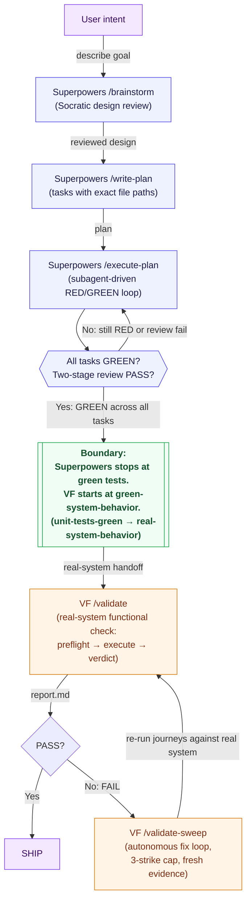

# Using ValidationForge with Superpowers

Superpowers enforces disciplined red/green TDD and Socratic brainstorming, producing well-tested code with high unit-test coverage. VF complements this with real-system validation: the unit tests pass AND the system actually works under live conditions. Superpowers protects against logic bugs in isolation; VF protects against integration failures, mock drift, and behavior the unit tests cannot see.

This guide shows how to pair the two plugins so each keeps its strengths. Superpowers owns the `brainstorm → write-plan → execute-plan` loop: its subagent-driven RED/GREEN cycle produces compile-clean code with passing unit tests, and its two-stage code review (spec compliance, then code quality) keeps the unit layer disciplined. ValidationForge then takes the artifact Superpowers hands over and proves — with screenshots, response bodies, console logs, and cited evidence files — that the assembled system actually behaves the way the unit tests *claim* it does. Mocks pass, integrations break; that gap is exactly where VF lives. This guide assumes Superpowers installed from `obra/superpowers-marketplace` (requires Claude Code v2.0.13+) and ValidationForge v1.x. Inventory numbers are as of April 2026. The canonical Superpowers command list (`/brainstorm`, `/write-plan`, `/execute-plan`) and skill catalog referenced throughout this guide come from [`docs/integrations/.research-notes.md`](./.research-notes.md) — a local contributor working document that tracks the source-of-truth URLs for each fact cited here.

## Quick Reference

Use this table to decide which plugin owns which phase of the loop. The rule of thumb: Superpowers owns everything up to "the unit tests are green"; VF owns everything from "prove the system actually works with real dependencies" onward.

| Task | Use Superpowers | Use VF | Use Both |
|------|:---------------:|:------:|:--------:|
| Socratic brainstorm that turns a rough idea into a reviewed design (`/brainstorm`) | ✅ | | |
| Decompose a reviewed design into 2–5-minute tasks with exact file paths (`/write-plan`) | ✅ | | |
| Dispatch fresh subagents per task and run the RED/GREEN TDD cycle (`/execute-plan`) | ✅ | | |
| Two-stage code review (spec compliance, then code quality) on each subagent's output | ✅ | | |
| Parallel TDD loops across isolated git worktrees (`dispatching-parallel-agents` skill) | ✅ | | |
| Produce `e2e-evidence/` with cited screenshots, API bodies, and per-journey verdicts | | ✅ | |
| Detect the platform and route to the right validators (iOS, Web, API, CLI, Design) | | ✅ | |
| Autonomous fix-and-revalidate loop with a 3-strike cap (`/validate-sweep`) | | ✅ | |
| Benchmark validation posture (coverage, evidence quality, enforcement, speed) | | ✅ | |
| Ship a feature whose unit tests are green **and** whose real integration points work | | | ✅ |
| Catch the case where the mocked `fetch` passes but the real API returns a different shape | | | ✅ |
| Catch the case where the unit tests pass but the deployed environment is misconfigured | | | ✅ |

## Combined Workflow

The handoff lives at the "Superpowers' `/execute-plan` reports GREEN across all tasks" boundary. Superpowers owns the plan-and-execute TDD loop up to that point; VF owns the validate-against-the-real-system pipeline after it. The explicit boundary: **Superpowers stops at unit-tests-green. VF starts at real-system behavior.**



**Step-by-step annotation (edges labeled on the diagram):**

1. **describe goal** (User → `/brainstorm`) — User describes a rough idea. Superpowers' `/brainstorm` runs a Socratic review loop: it asks clarifying questions, explores alternatives, and presents the refined design in sections for validation before any plan is written.
2. **reviewed design** (`/brainstorm` → `/write-plan`) — Once the design is agreed, `/write-plan` decomposes it into "bite-sized tasks (2–5 minutes each)" with exact file paths, complete code, and verification steps per task. The plan is the contract between the parent agent and the subagents.
3. **plan** (`/write-plan` → `/execute-plan`) — `/execute-plan` dispatches a fresh subagent per task so each subagent's context is clean. Each subagent runs Superpowers' `test-driven-development` skill: write a failing test (RED), watch it fail, write minimal code to pass (GREEN), commit, then refactor. The parent agent reviews each subagent's output in two stages: spec compliance first, then code quality. Code written before a test is deleted — that is the skill's explicit rule.
4. **Gate check** (`/execute-plan` → all tasks GREEN?) — `/execute-plan` loops until every task reports GREEN and passes the two-stage review. If anything is still RED or fails review, execution returns to the plan for the specific task.
5. **Boundary: Superpowers stops at unit-tests-green. VF starts at real-system behavior.** — When every task is GREEN and every review is PASS, Superpowers considers the plan executed. This is the explicit handoff line. Compilation success is not validation (Iron Rule 8). Superpowers does not boot the service, hit endpoints, render UI, or compare against a real database — it reasons about code and tests.
6. **real-system handoff** (Boundary → VF `/validate`) — VF's `/validate` takes over as a real-system functional check: `platform-detector` identifies the stack, preflight boots the service, validators run real journeys against the live process, and `verdict-writer` synthesizes evidence into `e2e-evidence/report.md`.
7. **report.md** (`/validate` → PASS?) — VF writes PASS/FAIL verdicts per journey, each backed by cited evidence (response bodies, screenshots, logs with timestamps).
8. **Yes** (PASS? → SHIP) — A PASS verdict moves to the production-readiness audit and the feature ships.
9. **No: FAIL** (PASS? → VF `/validate-sweep`) — A FAIL verdict triggers VF's autonomous fix loop, which fixes the real system in place (no mocks) with a 3-strike cap per journey.
10. **re-run journeys against real system** (`/validate-sweep` → `/validate`) — After each fix attempt, the sweep re-invokes the validate pipeline against the real system and captures fresh evidence under `e2e-evidence/attempt-N/` (Iron Rule 7 — no reused evidence across attempts).

## Installation and Configuration

Superpowers is installed via the Claude Code plugin marketplace; VF is installed via its own `install.sh` script. Install Superpowers first so its hooks register before VF's stricter gates take precedence. Both plugins are Claude Code plugins, discovered from `~/.claude/plugins/`, so side-by-side installation is supported out of the box.

### Install both plugins (side-by-side)

```bash
# 1. Install Superpowers via Claude Code's plugin marketplace (requires CC v2.0.13+)
/plugin marketplace add obra/superpowers-marketplace
/plugin install superpowers@superpowers-marketplace

# 2. Install ValidationForge — installs LAST so VF's PreToolUse hooks are authoritative,
#    and runs the rule copy + e2e-evidence scaffold in one shot
curl -fsSL https://raw.githubusercontent.com/krzemienski/validationforge/main/install.sh | bash
# Or the local-symlink path when the repo is not yet public:
# ln -s /path/to/local/validationforge ~/.claude/plugins/validationforge

# 3. Run VF setup so platform detection and e2e-evidence scaffolding are ready
/vf-setup
```

Restart Claude Code after both installs — plugins (hooks, skills, commands) are loaded at session startup and will not be active in the session where you ran the installers. Superpowers also adds a session-start hook that loads its `using-superpowers` skill on every session, so that skill is live from the first turn in the next session.

### Sample `.claude/settings.json` with both plugins registered

Both plugins merge their hook definitions into Claude Code's hook pipeline and both are registered under the top-level `plugins` array. A minimal, conflict-free `~/.claude/settings.json` that registers both looks like:

```json
{
  "plugins": [
    { "name": "superpowers",     "path": "~/.claude/plugins/superpowers" },
    { "name": "validationforge", "path": "~/.claude/plugins/validationforge" }
  ],
  "hooks": {
    "SessionStart": [
      { "plugin": "superpowers" }
    ],
    "PreToolUse": [
      { "plugin": "superpowers",     "matcher": "Write|Edit|MultiEdit" },
      { "plugin": "validationforge", "matcher": "Write|Edit|MultiEdit" }
    ],
    "PostToolUse": [
      { "plugin": "superpowers",     "matcher": "Write|Edit|MultiEdit|Bash" },
      { "plugin": "validationforge", "matcher": "Write|Edit|MultiEdit|Bash" }
    ]
  }
}
```

Each plugin keeps its own `.claude-plugin/plugin.json` manifest under its install root; they do not conflict because their `name` fields (`superpowers` vs `validationforge`) are distinct. Commands, skills, hooks, agents, and rules are namespaced by plugin name, so `/brainstorm` and `/validate` never collide even though both appear in `/help`.

### Sample `marketplace.json` registering both plugins

The `/plugin install` flow in the [Install both plugins](#install-both-plugins-side-by-side) block uses the upstream `obra/superpowers-marketplace` for Superpowers and VF's own `install.sh` for VF. Teams that prefer to distribute both plugins through a single internal marketplace (for example, a private `team-marketplace` repo that pins versions for everyone on the team) can merge the two entries into one `marketplace.json`. The VF [`.claude-plugin/marketplace.json`](../../.claude-plugin/marketplace.json) is the minimal single-plugin reference — the sample below adds Superpowers alongside it, referenced by its upstream `github:` source so Claude Code still pulls the canonical Superpowers plugin from `obra/superpowers` at install time. Pin `version` to the exact release you have tested both plugins against:

```json
{
  "name": "team-marketplace",
  "owner": {
    "name": "Your Team",
    "url": "https://github.com/your-team"
  },
  "plugins": [
    {
      "name": "superpowers",
      "source": "github:obra/superpowers",
      "description": "Plan-and-execute TDD with RED/GREEN subagents and Socratic brainstorming.",
      "version": "1.0.0"
    },
    {
      "name": "validationforge",
      "source": "github:krzemienski/validationforge",
      "description": "No-mock functional validation for Claude Code. Ship verified code, not 'it compiled' code.",
      "version": "1.0.0"
    }
  ]
}
```

Drop this file at `.claude-plugin/marketplace.json` in the team-marketplace repo, then the end-user install flow becomes a single command pair that mirrors the upstream recipe but points at the team marketplace:

```bash
/plugin marketplace add your-team/team-marketplace
/plugin install superpowers@team-marketplace
/plugin install validationforge@team-marketplace
```

The plugin order in the `plugins` array is cosmetic — install order, not array order, decides hook precedence, and install order is governed by the two `/plugin install` lines above. Keep Superpowers installed first so VF's hooks fire last (see [Recommended hook ordering](#recommended-hook-ordering-vf-fires-after-superpowers)).

### Recommended hook ordering: VF fires AFTER Superpowers

**Rule:** VF's hooks must fire **after** Superpowers' execution hooks on every hook event they share (PreToolUse, PostToolUse). This is not a preference — it is what makes the build-then-prove contract work.

Why: Superpowers' RED phase deliberately writes failing tests before any implementation exists. During that phase the subagent's intermediate writes include test files under `test/`, `tests/`, or `__tests__/`. If VF's `block-test-files`, `mock-detection`, and `evidence-quality-check` hooks fired **first** on the same `Write` tool call, they would deny the write before the subagent finishes its TDD step. With VF ordered **last**, VF sees the write only after Superpowers has registered intent, and the allowlist or configuration choices described below get a chance to apply.

The default install order above (Superpowers first, VF last) produces the correct ordering because Claude Code registers hooks in install order. If you have a hand-edited `.claude/settings.json`, verify VF's hook entries appear **after** Superpowers' under each event (the sample above is correctly ordered). Re-running `/vf-setup` repairs the order if it drifts.

### Environment variables

**None of VF's variables interact with Superpowers', and Superpowers exports no variables that VF reads.** This is the same clean surface as the OMC and ECC integrations — both plugins are pure-runtime through Claude Code's settings pipeline, so there is no shared env-var surface, no `PATH`-ordering concern, and no overlapping variable names.

| Variable | Plugin | Purpose | Interaction with the other plugin |
|----------|:------:|---------|-----------------------------------|
| `VF_SOURCE` | VF | Override the `install.sh` git source URL | None — install-time only, does not affect Superpowers |
| `VF_INSTALL_DIR` | VF | Override the `install.sh` target directory (must be under `$HOME` or a temp path) | None — install-time only, does not affect Superpowers |
| (Superpowers exports none that VF reads) | Superpowers | — | — |
| (VF exports none that Superpowers reads) | VF | — | — |

## Configuration — resolving the test-file-blocking conflict

The single sharpest edge between the two plugins is this: **Superpowers' `test-driven-development` skill writes test files during its RED phase; VF's `block-test-files` hook blocks them.** The hook is wired into the `PreToolUse` pipeline for `Write|Edit|MultiEdit`, so any attempt to create a path matching the test-file pattern is denied before it reaches the filesystem. The two enforcement levels shipped with VF make the tension explicit:

- `config/standard.json` — `block_test_files: true` and `hooks.block-test-files: "enabled"` (hard block).
- `config/permissive.json` — `block_test_files: false` and `hooks.block-test-files: "warn"` (warning only).

Pick one of the three resolution paths below based on how you want the two plugins to share a working tree. Path (a) is the most idiomatic for Superpowers users because Superpowers already treats git worktrees as a first-class primitive via the `using-git-worktrees` and `dispatching-parallel-agents` skills.

### Path (a) — Worktree isolation (recommended, maps cleanly to Superpowers' model)

Run Superpowers' RED/GREEN loop in a dedicated git worktree where VF is **not installed**, then merge the resulting branch into the main worktree where VF lives. Superpowers' own `using-git-worktrees` and `finishing-a-development-branch` skills are designed for exactly this flow — the VF pairing adds only one new step at the end (run `/validate` on the merged branch).

```bash
# Main worktree — ValidationForge installed with standard (or strict) defaults
curl -fsSL https://raw.githubusercontent.com/krzemienski/validationforge/main/install.sh | bash
/vf-setup --config standard

# Create a sibling worktree for the Superpowers TDD cycle
git worktree add ../myproject-tdd -b feature/user-onboarding
cd ../myproject-tdd

# In this worktree only, install Superpowers (no VF registered here)
/plugin marketplace add obra/superpowers-marketplace
/plugin install superpowers@superpowers-marketplace

# Do the brainstorm → write-plan → execute-plan loop here — tests are freely created
/brainstorm "Onboarding flow: email signup, verify, first-run dashboard."
/write-plan
/execute-plan

# Commit + merge back to the main worktree
git add . && git commit -m "Superpowers: onboarding flow (RED/GREEN GREEN across all tasks)"
cd -
git merge feature/user-onboarding

# Now run VF on the main worktree — no new test-file writes, so block-test-files never fires
/validate
```

The test files were written in the Superpowers worktree where no VF hook existed; the main worktree never sees a `Write` tool call targeting `tests/`, so `block-test-files` stays asleep. Both plugins stay at their intended strictness, and Superpowers' `dispatching-parallel-agents` skill can still run multiple TDD loops across additional sibling worktrees if you want more parallelism.

### Path (b) — Hybrid: keep `block-test-files` enabled, but allowlist the Superpowers test output

If you want a single worktree where both plugins run simultaneously, add an explicit allowlist to VF's config so the paths Superpowers' subagents write into are exempt from the block. This preserves the hook's protective intent (it still blocks *ad hoc* test-file writes by the model outside the allowlist) while carving out the directory Superpowers owns. Superpowers writes into conventional test roots (`test/`, `tests/`, `__tests__/`, and the Go `_test.go` suffix); confirm the exact path your project uses before locking down the allowlist.

```json
{
  "name": "permissive-superpowers-hybrid",
  "description": "Permissive VF config with Superpowers' TDD output directories allowlisted so RED/GREEN test files coexist with system validation.",
  "strictness": "permissive",
  "evidence_dir": "e2e-evidence",
  "ci_mode": false,
  "rules": {
    "block_test_files": true,
    "block_test_files_allowlist": [
      "test/**/*",
      "tests/**/*",
      "__tests__/**/*",
      "**/*_test.go",
      "**/*.spec.ts",
      "**/*.spec.tsx",
      "**/*.spec.js",
      "**/*.test.ts",
      "**/*.test.tsx",
      "**/*.test.js"
    ],
    "block_mock_patterns": true,
    "require_evidence_on_completion": true,
    "require_validation_plan": false,
    "require_preflight": false,
    "require_baseline": false,
    "max_recovery_attempts": 3,
    "fail_on_missing_evidence": false,
    "require_screenshot_review": false
  },
  "hooks": {
    "block-test-files": "enabled",
    "evidence-gate-reminder": "enabled",
    "validation-not-compilation": "enabled",
    "completion-claim-validator": "enabled",
    "mock-detection": "enabled"
  }
}
```

Drop the config in place and re-run `/vf-setup` so VF picks up the new allowlist on next session start:

```bash
mkdir -p .vf && cp config/permissive.json .vf/config.json
# …then edit .vf/config.json to add the block_test_files_allowlist patterns above.
/vf-setup --config .vf/config.json
```

The allowlist is additive — anything outside the glob patterns still trips the hard block, so the model cannot sneak test files under an unrelated path like `src/inline.spec.ts` unless you explicitly allow it. Keep the allowlist tight: every new pattern is one more place a stray test can appear.

### Path (c) — Sequential: Superpowers first in permissive, then flip VF to standard

If your team is comfortable treating TDD and validation as serial phases, run Superpowers' loop with VF's `block-test-files` hook demoted to a warning, commit, then switch VF into its gated configuration for the validation phase:

```bash
# 1. Both plugins installed
/plugin marketplace add obra/superpowers-marketplace
/plugin install superpowers@superpowers-marketplace
curl -fsSL https://raw.githubusercontent.com/krzemienski/validationforge/main/install.sh | bash

# 2. Superpowers phase — VF in permissive mode so RED/GREEN writes test files freely
/vf-setup --config permissive
/brainstorm "Add a password-reset flow."
/write-plan
/execute-plan                     # writes tests/*.spec.ts, block-test-files is warn-only

# 3. Commit the Superpowers-authored code + tests before flipping strictness
git add src tests && git commit -m "Superpowers: password-reset flow (RED/GREEN GREEN)"

# 4. VF phase — switch to standard (or strict) so block-test-files is a hard block again
/vf-setup --config standard
/validate                         # no new test files written; real-system evidence captured
```

The flip between `permissive` and `standard` is a single command. Commit between the two so the Superpowers-authored test files are saved before VF's gate returns to its hard-block posture.

### Choosing between (a), (b), and (c)

| Situation | Preferred path |
|-----------|----------------|
| Teams already using Superpowers' `using-git-worktrees` / `dispatching-parallel-agents` skills | (a) Worktree isolation |
| Single worktree, both plugins run every session | (b) Hybrid config with allowlist |
| Single worktree, TDD and validation run as serial phases | (c) Sequential workflow |
| CI job that runs `/validate` on a Superpowers-authored main branch | (a) or (c) |

All three paths preserve Superpowers' RED/GREEN test files on disk and keep VF's validation evidence under `e2e-evidence/`; they differ only in how the two plugins negotiate the write pipeline during a session.

## Resolving the `verification-before-completion` skill name collision

Superpowers ships a `verification-before-completion` skill; VF ships a skill with the same name but different content. Both are opinions about when to declare "done" — Superpowers' version focuses on the TDD cycle (did every RED test actually fail, did every GREEN test actually pass, was the code written before a test deleted), while VF's version focuses on evidence-based completion (personally examined evidence, specific citations, acceptance-criteria match, no regressions, final state captured).

The conflict is not that one is wrong; it is that each skill answers the same question for a different phase of the loop. The guides-level policy mirrors the workflow diagram:

- **Superpowers' `verification-before-completion` governs the TDD cycle.** During `/execute-plan`, the skill the subagent must use to declare a task GREEN is Superpowers' version. That is the right gate for "did the RED/GREEN cycle actually happen."
- **VF's `verification-before-completion` governs the validation phase.** Once `/validate` runs, the skill Claude must use to declare a journey PASS is VF's version. That is the right gate for "is the cited evidence real and does it match the criterion."
- **Phase boundary is the switch.** The explicit `Boundary` node in the combined-workflow diagram is the moment the mandatory skill switches from Superpowers' version to VF's version. If Claude is unclear which skill applies, the answer is always "whichever plugin is in charge of the current phase."

If your project's CLAUDE.md is ambiguous, add an explicit `## Validation Phase` section that hands the floor to VF once `/validate` is invoked. Mandatory-skill semantics mean Claude *must* use the relevant skill — making which-is-relevant unambiguous is the only work required.

## Worked Example — JWT refresh-token endpoint

Feature: add a `POST /api/auth/refresh` endpoint that accepts a refresh token, validates it, rotates it (invalidates the old token, issues a new one), and returns a fresh 15-minute access token. Replay of a used refresh token revokes the entire token family. This scenario is drawn directly from the [README's unit-tests-vs-ValidationForge matrix](../../README.md#why-not-unit-tests) — specifically the row *"JWT expiry reduced to 15 min — Unit Tests: PASS (mock time, never wait). ValidationForge: FAIL (real token expires, refresh fails)"*. Superpowers drives the `brainstorm → write-plan → execute-plan` TDD loop; VF then proves the endpoint's runtime behavior against a real server with a real wall clock.

### Phase 1 — Superpowers brainstorms, plans, and executes

```bash
/brainstorm 'JWT refresh flow: accept refresh token, rotate it, issue 15-min access token, reject expired or reused refresh tokens.'
/write-plan
/execute-plan
```

Illustrative session output — Superpowers' `/brainstorm`:

```text
# Illustrative session output — Superpowers /brainstorm
[brainstorm] Clarifying question 1: Should a replayed (already-used) refresh token invalidate the entire token family?
[brainstorm]   Proposed: yes — replay is a strong theft signal; revoke all descendants under the same parent_jti.
[brainstorm]   Decision: accepted.
[brainstorm] Clarifying question 2: Access token TTL?
[brainstorm]   Proposed: 15 minutes (matches OWASP JWT guidance; bounds the blast radius of a compromised token).
[brainstorm]   Decision: accepted — 15m access, 30-day refresh.
[brainstorm] Clarifying question 3: Should the refresh-token store be a per-user list or a revocable family graph?
[brainstorm]   Decision: family graph (parent_jti pointer) so replay detection can cascade down descendants.
[brainstorm] Design summary:
  - POST /api/auth/refresh {refresh_token}
  - Valid, unused refresh → 200 {access_token (exp=+900s), refresh_token (exp=+30d)}; mark old refresh used.
  - Valid, reused refresh → revoke entire token family; return 401 generic message.
  - Expired/invalid refresh → 401 generic message (no enumeration signal).
[brainstorm] Review: APPROVED. Handing off to /write-plan.
```

Illustrative session output — Superpowers' `/write-plan`:

```text
# Illustrative session output — Superpowers /write-plan
[write-plan] Task 1 — Refresh-token store + family graph (src/auth/refresh-store.ts).
[write-plan] Task 2 — JWT signer/verifier with 15m access TTL, 30d refresh TTL (src/auth/jwt.ts).
[write-plan] Task 3 — Rotate + replay-detect logic (src/auth/rotate.ts).
[write-plan] Task 4 — Handler: validate → rotate → respond (src/routes/auth/refresh.ts).
[write-plan] Task 5 — Wire route into src/app.ts.
[write-plan] Tasks sized 2–5 min each, exact file paths + complete code + verification per task.
[write-plan] Plan written to .superpowers/plans/jwt-refresh.md.
```

Illustrative session output — Superpowers' `/execute-plan` with subagent-driven RED/GREEN (the "green TDD output"):

```text
# Illustrative session output — Superpowers /execute-plan
[execute-plan][subagent-1/task-1] RED: wrote tests/auth/refresh-store.spec.ts (7 cases, all failing).
[execute-plan][subagent-1/task-1] GREEN: implemented src/auth/refresh-store.ts; 7/7 pass.
[execute-plan][review/spec-compliance][task-1] PASS.
[execute-plan][review/code-quality][task-1]    PASS.
[execute-plan][subagent-2/task-2] RED: wrote tests/auth/jwt.spec.ts (6 cases — includes a time-mocked 15m-expiry case using jest.useFakeTimers()).
[execute-plan][subagent-2/task-2] GREEN: 6/6 pass. Access-token exp asserted at issuedAt + 900s against the mocked clock.
[execute-plan][subagent-3/task-3] RED: wrote tests/auth/rotate.spec.ts (8 cases including replay detection + family-cascade revocation).
[execute-plan][subagent-3/task-3] GREEN: 8/8 pass. Cascade verified against the in-memory store.
[execute-plan][subagent-4/task-4] RED: wrote tests/routes/auth/refresh.spec.ts (5 cases).
[execute-plan][subagent-4/task-4] GREEN: handler returns 200+{access,refresh} on happy path, 401 on replay/expiry. 5/5 pass.
[execute-plan][subagent-5/task-5] RED: wrote tests/app.spec.ts (1 case mounts /api/auth/refresh; fails).
[execute-plan][subagent-5/task-5] GREEN: wired app.post('/api/auth/refresh', ...); 1/1 pass.
[execute-plan] All 5 tasks GREEN. Two-stage review: PASS. Handing off.
```

Superpowers has now produced compile-clean code with 27 unit tests green across 5 files, plus two-stage review sign-off. **It has not issued a real JWT, waited 15 real minutes, or verified that a wall-clock-expired token is actually rejected by the live endpoint.** The time-mocked tests in `jwt.spec.ts` fast-forward the clock inside the test process and assert directly on `decoded.exp`; they never observe what the running server does when a real token's `exp` claim lands in the past on a real clock. That gap is the slice of the work VF is designed to challenge.

### Phase 2 — VF proves the endpoint behaves correctly under real conditions

```bash
/validate --platform api
```

Illustrative session output — VF's `/validate`:

```text
# Illustrative session output — /validate --platform api
[validate][phase 0 research]   Loaded api-validation skill, OWASP JWT guidance, condition-based-waiting.
[validate][phase 1 plan]       Journeys drafted:
                                 - refresh-happy-path-returns-new-access-and-refresh
                                 - refresh-rotates-old-token-single-use
                                 - refresh-replay-revokes-family
                                 - access-token-rejected-after-real-15m-wait
                                 - refresh-expired-after-30d-returns-401
[validate][phase 2 preflight]  pnpm build → success. pnpm dev → listening on :3000. /health → 200 OK.
[validate][phase 3 execute]    Running 5 journeys against http://localhost:3000 ...
  ✓ refresh-happy-path-returns-new-access-and-refresh
      POST /api/auth/refresh → 200; decoded access_token.exp = iat + 900s. ✓
  ✓ refresh-rotates-old-token-single-use
      Old refresh token, 2nd use → 401 (single-use enforced).
  ✓ refresh-replay-revokes-family
      Replay of old token → 401; subsequent children under the same parent_jti also 401.
  ✗ access-token-rejected-after-real-15m-wait
      Journey waited 15m 1s (real wall clock via condition-based-waiting), then GET /api/me with the issued access token.
      Expected: 401 Unauthorized (token has expired).
      Observed: 200 OK with user payload.
      Root cause: src/auth/jwt.ts signs with exp = iat + 900, but the verifier in src/auth/verify.ts calls
        jsonwebtoken.verify(token, secret, { ignoreExpiration: true }) — a copy-paste from a dev-tools config.
        The time-mocked unit tests passed because they inspected decoded.exp directly; they never exercised
        the verifier's ignoreExpiration branch.
      Evidence:
        e2e-evidence/access-token-rejected-after-real-15m-wait/step-01-issue-token.json
        e2e-evidence/access-token-rejected-after-real-15m-wait/step-02-15m-wait-timestamp.txt
        e2e-evidence/access-token-rejected-after-real-15m-wait/step-03-use-expired-token-200.json
  ✓ refresh-expired-after-30d-returns-401
      (Fixture refresh token with exp 31 days in the past.) → 401.
[validate][phase 4 analyze]    FAIL root-caused: jsonwebtoken.verify called with ignoreExpiration: true.
[validate][phase 5 verdict]    4/5 PASS, 1/5 FAIL. Writing e2e-evidence/report.md.
```

> **README callout — "JWT expiry reduced to 15 min."**
>
> The README's unit-tests-vs-ValidationForge matrix lists this row exactly: *"JWT expiry reduced to 15 min — Unit Tests: PASS (mock time, never wait). ValidationForge: FAIL (real token expires, refresh fails)."* The run above is that row in practice. Superpowers' `jwt.spec.ts` stubbed the clock with `jest.useFakeTimers()` and asserted on `decoded.exp`; it never routed a real token through the actual verifier path. VF hit the real endpoint with a real clock, waited the real 15 minutes (VF's `condition-based-waiting` skill), and caught the `ignoreExpiration: true` misconfiguration the time-mocked unit tests were structurally blind to. This is the structural gap the pairing exists to close: Superpowers proves the logic; VF proves the wall-clock behavior.

`/validate-sweep` then removes `ignoreExpiration: true` from the verifier, re-runs the journey against the live server, captures fresh evidence under `e2e-evidence/attempt-2/access-token-rejected-after-real-15m-wait/` (Iron Rule 7 — no reused evidence across attempts), and returns PASS.

### Sample evidence tree

```text
e2e-evidence/
├── refresh-happy-path-returns-new-access-and-refresh/
│   ├── step-01-request.json
│   ├── step-02-response-200.json
│   ├── step-03-decoded-access-exp.txt        # exp = iat + 900s
│   └── evidence-inventory.txt
├── refresh-rotates-old-token-single-use/
│   ├── step-01-first-refresh-200.json
│   ├── step-02-second-refresh-401.json
│   └── evidence-inventory.txt
├── refresh-replay-revokes-family/
│   ├── step-01-parent-refresh-200.json
│   ├── step-02-replay-401.json
│   ├── step-03-child-of-parent-jti-401.json
│   └── evidence-inventory.txt
├── access-token-rejected-after-real-15m-wait/
│   ├── step-01-issue-token.json              # captured at t=0
│   ├── step-02-15m-wait-timestamp.txt        # t=900s marker (real wall clock)
│   ├── step-03-use-expired-token-200.json    # FAIL evidence — body + headers
│   └── evidence-inventory.txt
├── refresh-expired-after-30d-returns-401/
│   ├── step-01-fixture-token-31d-old.json
│   ├── step-02-response-401.json
│   └── evidence-inventory.txt
├── attempt-2/                                # Fresh evidence after /validate-sweep (Iron Rule 7)
│   └── access-token-rejected-after-real-15m-wait/
│       ├── step-01-issue-token.json
│       ├── step-02-15m-wait-timestamp.txt
│       ├── step-03-use-expired-token-401.json   # PASS after fix
│       └── evidence-inventory.txt
└── report.md                                 # 5/5 PASS after sweep; attempt-1 FAIL + attempt-2 PASS cited
```

### Phase 3 — Ship

Once the sweep's second attempt returns PASS on the real-wait journey, `report.md` shows all 5/5 PASS and the production-readiness audit runs. Superpowers' 27 unit tests live under `tests/` as the unit-layer safety net; VF's 5 journey verdicts live under `e2e-evidence/` as the system-layer proof. Both layers ship together — and the one defect that only surfaced when a real token met a real clock is now caught in regression on every future `/validate` run.

For high-stakes features like this JWT refresh flow, it is worth adding a third layer after TDD + single-validator `/validate`: run `/validate-consensus` to spawn N independent validators and synthesize their verdicts into a single confidence-scored CONSENSUS verdict. CONSENSUS is a natural complement to Superpowers' RED/GREEN discipline — the TDD cycle proves the logic, `/validate` proves the single-validator runtime contract, and CONSENSUS proves that multiple independent validators agree on that contract. Follow up with `/validate-dashboard` to render the evidence tree into an HTML + markdown summary the PR reviewer can skim at a glance. VF's `preflight` skill now acts as a strict CLEAR / WARN / BLOCKED gate (Iron Rule 4): if the Superpowers-authored code compiles and unit-tests green but the service fails to boot, preflight short-circuits to BLOCKED rather than running journeys against a broken environment.

## Evidence of Coexistence

The snippets below show both plugins active in the same session. They are illustrative, copy-pasteable reconstructions grounded in documented Superpowers and VF behavior, not live runtime captures.

### Both command sets available

```text
> /help
Available commands:

Superpowers:
  /brainstorm           Socratic design review before writing a plan
  /write-plan           Decompose a reviewed design into 2–5-minute tasks
  /execute-plan         Dispatch subagents per task, RED/GREEN with two-stage review

ValidationForge:
  /vf-setup                  Initialize ValidationForge
  /validate                  Full validation pipeline
  /validate-plan             Plan only (no execution)
  /validate-audit            Read-only audit with severity classification
  /validate-fix              Fix FAIL verdicts (3-strike)
  /validate-sweep            Autonomous fix-and-revalidate loop
  /validate-team             Multi-agent parallel platform validation
  /validate-team-dashboard   Aggregate team validation posture dashboard
  /validate-consensus        Multi-agent CONSENSUS validation, confidence-scored
  /validate-dashboard        HTML + markdown evidence summary after a run
  /validate-benchmark        Measure validation posture
  /validate-ci               Non-interactive CI/CD mode with exit codes
  ... (1 more)
```

### Both skill catalogs available (including the name collision)

```text
> (session-start hook)
[superpowers][session-start] Loaded using-superpowers skill.
[superpowers] Skills discovered: test-driven-development, systematic-debugging, verification-before-completion,
              brainstorming, writing-plans, executing-plans, dispatching-parallel-agents, requesting-code-review,
              receiving-code-review, using-git-worktrees, finishing-a-development-branch, subagent-driven-development,
              writing-skills, using-superpowers.
[vf]        Skills discovered: api-validation, web-validation, design-validation, verification-before-completion,
              gate-validation-discipline, no-mocking-validation-gates, preflight, sequential-analysis,
              ... (33 more).
[vf]        NOTE: skill name collision detected — verification-before-completion exists in both plugins.
              Superpowers' version governs the TDD cycle; VF's version governs the validation phase.
              See docs/integrations/vf-with-superpowers.md#resolving-the-verification-before-completion-skill-name-collision.
```

### Hook firings during a combined run (worktree-isolation path)

```text
# Inside the Superpowers worktree (no VF registered here)
[PreToolUse][superpowers/tdd-guard]     Allowing Write: tests/routes/password-reset.spec.ts (RED phase)
[PostToolUse][superpowers/tdd-guard]    Verified test fails as expected; proceeding to GREEN.
[PreToolUse][superpowers/tdd-guard]     Allowing Write: src/routes/password-reset.ts (GREEN phase)
[PostToolUse][superpowers/tdd-guard]    Verified test passes; marking task GREEN.

# Back on main worktree after merge (VF registered here)
[PreToolUse][vf/block-test-files]       Allowing Write: src/app.ts (not a test file)
[PostToolUse][vf/mock-detection]        No mock patterns detected in src/app.ts
[PostToolUse][vf/evidence-quality]      Silent (file is source code, not evidence)

# During /validate, VF captures real responses as evidence (no test files written)
[PostToolUse][vf/evidence-gate-reminder] Reminder: capture cited evidence under e2e-evidence/<journey-slug>/.
```

### Hook firings during a combined run (hybrid allowlist path)

```text
# Single worktree, block_test_files_allowlist applied
[PreToolUse][superpowers/tdd-guard]     Allowing Write: tests/schemas/password-reset.spec.ts (RED)
[PreToolUse][vf/block-test-files]       Allowing Write: tests/schemas/password-reset.spec.ts (matches allowlist: tests/**/*)
[PostToolUse][superpowers/tdd-guard]    Verified test fails as expected.

[PreToolUse][superpowers/tdd-guard]     Allowing Write: src/schemas/password-reset.ts (GREEN)
[PreToolUse][vf/block-test-files]       Allowing Write: src/schemas/password-reset.ts (not a test file)
[PostToolUse][vf/mock-detection]        No mock patterns detected.

# Model tries to sneak a test file outside the allowlist — VF blocks
[PreToolUse][superpowers/tdd-guard]     Allowing Write: src/routes/password-reset.ad-hoc.spec.ts
[PreToolUse][vf/block-test-files]       DENIED Write: src/routes/password-reset.ad-hoc.spec.ts
                                        Reason: matches test-file pattern /\.spec\./ and NOT in allowlist
                                        (VF Iron Rule 2: never create test files outside the allowlisted directories)
```

### Shared filesystem

```bash
$ ls -la
.superpowers/                 # Superpowers state, plans (e.g. plans/password-reset.md)
.claude/
  settings.json               # Merged hook registrations (Superpowers + VF)
  rules/                      # VF rules (vf-*.md); Superpowers attaches via skills, not rules
tests/                        # Superpowers' unit-test layer (owned by /execute-plan subagents)
e2e-evidence/                 # VF's system-validation layer (owned by /validate)
src/                          # Application source (both plugins read/write here)
```

Superpowers writes into `.superpowers/` and `tests/`; VF writes into `e2e-evidence/`. The two evidence directories never collide — they are different layers of the same pipeline.

## Troubleshooting

### Superpowers' RED phase writes test files that VF blocks

**Symptom:** `/execute-plan` fails during a subagent's RED step with `PreToolUse hook 'block-test-files' denied Write: tests/foo.spec.ts` (VF Iron Rule 2).

**This is the single most important conflict between the two plugins, and it is expected.** Superpowers' `test-driven-development` skill is opinionated about writing a failing test *first*; VF's `block-test-files` hook is opinionated about never creating test files during the validation phase. Resolutions, in order of preference:

1. **Worktree isolation (recommended).** Run Superpowers in a dedicated git worktree where VF is not installed; merge the resulting branch into the VF-enabled worktree and run `/validate` there. Superpowers' own `using-git-worktrees` and `dispatching-parallel-agents` skills are designed for this flow.
2. **Hybrid allowlist.** Drop the `block_test_files_allowlist` config from the [Configuration section](#configuration--resolving-the-test-file-blocking-conflict) into `.vf/config.json` and re-run `/vf-setup`. The hook continues to block *ad hoc* test files outside the allowlisted directories.
3. **Sequential workflow.** `/vf-setup --config permissive` downgrades `block-test-files` from a hard block to a warning for the duration of the Superpowers phase. Switch back to `standard` before running `/validate`.

### The `verification-before-completion` skill collision causes Claude to hesitate

**Symptom:** Claude asks which `verification-before-completion` skill to apply, or picks the wrong one for the current phase.

**Resolution:** Make the active phase explicit. During `/execute-plan`, Superpowers' version governs (it knows about RED-then-GREEN); during `/validate`, VF's version governs (it knows about cited evidence and acceptance-criteria match). If Claude is uncertain, it is typically because your project's CLAUDE.md does not name which plugin owns the current phase. Add a short `## Validation Phase` section to CLAUDE.md that hands the floor to VF once `/validate` is invoked. See [Resolving the `verification-before-completion` skill name collision](#resolving-the-verification-before-completion-skill-name-collision) for the full policy.

### Superpowers and VF both want to run autonomous loops

Superpowers' `/execute-plan` is an autonomous loop; VF's `/validate-sweep` is also an autonomous loop. They must not be run concurrently on the same repo — they will fight over the file system and both may attempt to write (or, in VF's case, block) overlapping paths.

**Resolution:** run them sequentially. Let `/execute-plan` reach "all tasks GREEN" and exit; then run `/validate`. If that returns FAIL, run `/validate-sweep` — which has a hard 3-attempt cap per journey. Superpowers' loop is plan-bounded (it exits when the plan is done); VF's sweep is attempt-bounded (3 strikes). Neither loop is open-ended, so sequential execution always terminates.

### Hook ordering is wrong after a manual settings edit

**Symptom:** A test file slips through VF's gate because Superpowers' later hook allowed the write.

**Resolution:** Re-run `/vf-setup` — it reorders VF's hooks to the end of the relevant hook lists. Alternatively, edit `.claude/settings.json` manually so VF's entries appear after Superpowers' under each hook event (see the sample in [Sample `.claude/settings.json`](#sample-claudesettingsjson-with-both-plugins-registered)).

### "Code written before a test is deleted" surprises me

Superpowers' `test-driven-development` skill explicitly deletes any implementation code that was written before its corresponding failing test. This is documented behavior, not a bug — but pair-programming with `/execute-plan` for the first time can be disorienting if you expect a more lenient TDD stance.

**Resolution:** treat this as a feature of the Superpowers phase. If you want to hand in hand-written code that wasn't RED-first, do it in a separate commit before invoking `/execute-plan`, or carry it in a different branch and merge after Superpowers is done. VF does not care which branch the code came from; it only cares whether the running system behaves correctly.

### `dispatching-parallel-agents` + `/validate-sweep` overlap

Superpowers' `dispatching-parallel-agents` skill runs multiple TDD loops across sibling worktrees. VF's `/validate-sweep` also benefits from parallelism but expects to own the file system for the target branch.

**Resolution:** use Superpowers' parallelism for the build phase only. Let each worktree's `/execute-plan` finish, merge all branches into a single integration branch, and run `/validate-sweep` once against the integrated branch. Parallel validation is VF's `/validate-team` command, which is coordinated under a single evidence tree rather than across sibling worktrees.

## Related Resources

- [Superpowers repository](https://github.com/obra/superpowers) — Commands (`/brainstorm`, `/write-plan`, `/execute-plan`), skills directory, and installation path via the marketplace.
- [Superpowers announcement post](https://blog.fsck.com/2025/10/09/superpowers/) — Author's description of the skill model and the "must use a relevant skill" discipline.
- [ValidationForge competitive analysis](../competitive-analysis.md) — Side-by-side feature matrix of VF, OMC, and ECC, plus recommended complementary usage.
- [ValidationForge architecture](../ARCHITECTURE.md) — Hook execution flow, evidence data model, and how `/validate-sweep`'s fix loop preserves per-attempt evidence.
- [ValidationForge README](../../README.md) — Full command, skill, agent, hook, and rule inventory, including the eight Iron Rules that govern VF's validation phase.
- [Ecosystem integrations index](./README.md) — Companion guides for pairing VF with [OMC](./vf-with-omc.md) and [ECC](./vf-with-ecc.md).
